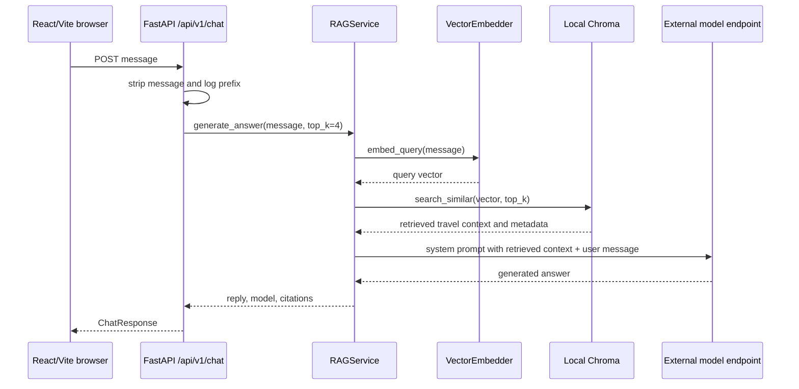
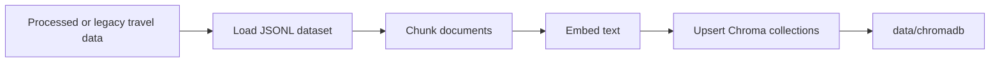
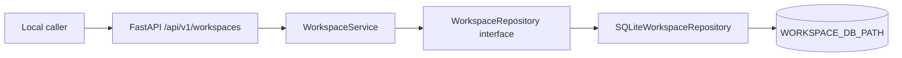

# Architecture

## Scope

This document is the high-level architecture gateway for the current Travel
Agent prototype. It describes implemented components and configured local
development paths only. It is not the final target architecture and does not
replace approved specifications, implementation plans, or ADRs.

Codebase Memory was checked at Verify tier for the material backend and RAG
paths used here. Coverage returned `no_recorded_issue` and `metadata_match` for
the cited code paths at generation `2026-08-31T00:12:09Z`; that is a
best-effort signal, not proof of semantic completeness. Exact source and
configuration files were also read directly.

## Detailed Architecture

Use these Package 3 architecture documents for deeper review:

1. [Current-state Architecture](docs/architecture/current-state.md) records the
   evidence-backed implemented baseline.
2. [Target-state Architecture](docs/architecture/target-state.md) describes the
   proposed workspace-first layered-memory architecture.
3. [Data Model](docs/architecture/data-model.md) defines the conceptual target
   model for workspaces, memory, retrieval, and evaluation traces.

## Current Components

| Component | Current responsibility | Evidence |
| --- | --- | --- |
| React/Vite client | Sends a chat `message` to the backend API and renders the returned response | `frontend/src/services/api.js`, `frontend/package.json` |
| FastAPI application | Mounts `/health`, `/api/v1/chat`, and `/api/v1/workspaces`, configures local CORS, and attempts RAG pre-warm during startup | `backend/app/main.py` |
| Health route | Returns service health metadata for local inspection | `backend/app/api/health.py` |
| Chat route | Validates one stripped message, logs a message prefix, calls the process-global RAG service, and returns reply/model/citations | `backend/app/api/chat.py`, `backend/app/schemas/chat.py` |
| Workspace routes | Create, retrieve, and list local trip workspace records behind the workspace service; construct no RAG, embedding, or model-provider dependency | `backend/app/api/workspaces.py`, `backend/app/schemas/workspaces.py` |
| Workspace module | Owns `TripWorkspace` contracts, validation, identity generation, timestamps, and the storage interface | `backend/workspaces/models.py`, `backend/workspaces/service.py`, `backend/workspaces/repository.py` |
| Local SQLite workspace store | Initializes schema version 1 and persists workspace records at `WORKSPACE_DB_PATH`; the only module aware of SQLite | `backend/workspaces/sqlite_repository.py` |
| RAG generation service | Embeds the user message, retrieves Chroma context, builds the model prompt, calls the configured external model endpoint, and formats citations | `backend/rag/generation/rag_service.py` |
| Vector embedder | Lazily loads `BAAI/bge-m3` when sentence-transformers is available, with a deterministic fallback when it is not installed | `backend/rag/embedding/embedder.py` |
| Chroma vector store | Creates or opens persistent local Chroma collections under `data/chromadb` by default | `backend/rag/retrieval/vector_store.py` |
| Offline indexing script | Loads travel data, chunks it, embeds it, and upserts baseline and parent-child Chroma collections | `backend/rag/indexing.py` |
| Docker Compose stack | Defines local backend and frontend services, ports, bind mounts, `.env`, and model cache mount | `docker-compose.yml` |
| External model service | Receives chat-completions requests through an OpenAI-compatible client configured from backend settings | `backend/app/config.py`, `backend/rag/generation/rag_service.py` |

## Online Request Flow

The browser posts to `${VITE_API_URL}/api/v1/chat`, defaulting to
`http://localhost:8000`. The backend strips the incoming message and rejects an
empty value. The current route requests up to four retrieval results, then the
RAG service sends both the user message and retrieved travel context to the
configured external model endpoint.

## Offline Data Flow

Offline data preparation is opt-in and state-changing. The indexing script
selects processed data paths when present, falls back to legacy data paths,
loads travel documents, creates baseline fixed-size chunks and parent-child
chunks, embeds text with `BAAI/bge-m3`, and upserts vectors into persistent
Chroma collections.

This flow may read and write local data, use model cache, and require network
access if the embedding model is not already available.

## Local Workspace Flow

Milestone `R3` adds a backend-only trip workspace path beside chat.
`TripWorkspace` is the primary product container per ADR 0002, and local SQLite is
an adapter behind the repository boundary per ADR 0003.

Route handlers hold no SQL, table DDL, path creation, or connection management.
The service owns validation, identity generation, and timestamps. Only the
adapter imports `sqlite3`.

This path is independent of RAG: workspace routes construct no embedder, Chroma
collection, or model-provider client, and `backend/rag` imports no workspace
module. It is unauthenticated local development behavior and must not be exposed
publicly.

## Trust Boundaries

| Boundary | Current implication |
| --- | --- |
| Browser to local API | Local browser requests cross into the FastAPI process through permissive local CORS configuration that includes `*` |
| Caller to workspace routes | Workspace routes are unauthenticated. `owner_user_id` is a caller-supplied local development scope label, not authentication, authorization, or tenant isolation, so these routes must not be exposed publicly |
| Local process to model provider | User message and retrieved travel context leave the local process for the configured external model endpoint |
| Local files, model cache, and vector store | Data, Chroma state, and model cache are local development assets, not isolated production stores |
| Local workspace database | The SQLite file at `WORKSPACE_DB_PATH` holds user-entered trip content as local development state, with no production retention, backup, restore, or deletion contract |
| Retrieved travel content to prompt | Retrieved text is untrusted data and should not be treated as an instruction source |
| Environment to backend settings | Credential names are read from environment; real secret values must stay out of logs and docs |

## Current Invariants

- The public chat request contract contains one required `message` string.
- The chat response contract contains `reply`, `model`, and `citations`.
- The backend mounts chat and workspace routes under `/api/v1` and health at
  `/health`.
- Workspace routes are additive; the chat route performs no workspace lookup and
  accepts no `workspace_id`.
- Workspace identity is server-generated and prefixed `tw_`.
- `R3` creates workspace records with `retention_state` `active` only and
  implements no update, archive, or deletion route.
- SQLite access is confined to `backend/workspaces/sqlite_repository.py`.
- RAG and evaluation modules do not import workspace modules.
- The RAG service is process-global after first construction.
- Chroma uses persistent local storage under `data/chromadb` by default.
- Health readiness is narrower than chat readiness, and it does not signal
  workspace storage readiness.
- Startup attempts to pre-warm the RAG service and converts pre-warm failures
  to warnings.

## Known Gaps

- No user, trip, conversation, or memory identifier exists in the bounded chat
  request contract.
- No implemented agent memory exists yet.
- Trip workspace records exist as a local `R3` backend component, but there is
  no authenticated user, workspace-aware chat, conversation persistence,
  itinerary state, planner behavior, workspace UI, or workspace lifecycle
  transition.
- Workspace routes are unauthenticated and `owner_user_id` is a local scope
  label rather than an authorization control.
- Local workspace SQLite storage settles no production database, migration,
  backup, restore, concurrency, retention, or deletion policy.
- There is no current multi-service data platform.
- Local CORS is permissive.
- The chat path logs a prefix of the user message.
- Current CI masks backend and frontend test failures, so green CI is not proof
  of passing tests.
- Production security, privacy guarantees, data deletion, authorization,
  tenant isolation, SLOs, and deployment topology are not established by this
  prototype.

Repository-wide security/privacy policy and current public-production blockers
are owned by [SECURITY.md](SECURITY.md). Deployment readiness, promotion, and
rollback questions route to
[docs/runbooks/deployment.md](docs/runbooks/deployment.md). These documents are
gates and operating policy; they do not mean the missing runtime controls above
are implemented.

## Future Direction

The repository direction is an evaluated travel assistant with trip planning,
trip workspaces, and layered memory. That direction is governed by approved
specifications, implementation plans, and future ADRs, not by unqualified prose
in this gateway.

Use [docs/specs/README.md](docs/specs/README.md) before proposing a material
change, [docs/plans/README.md](docs/plans/README.md) after a spec is approved,
and [docs/adr/README.md](docs/adr/README.md) for durable architecture decisions.

## Architecture Change Rules

Architecture-changing work starts from an approved specification. Level 3 work
also requires architecture approval and the ADRs identified by the approved
design. Update this gateway only when the implemented high-level component map,
trust boundary, request flow, or known gap list changes.
