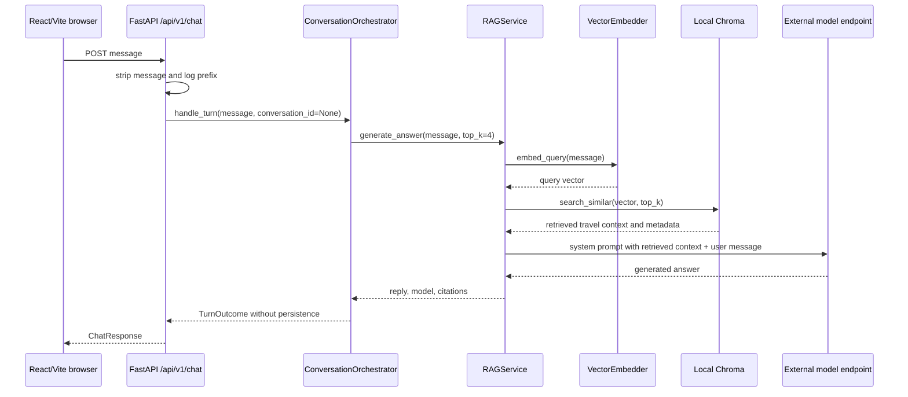
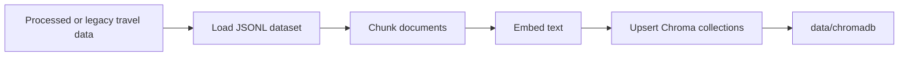
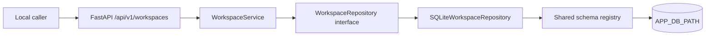
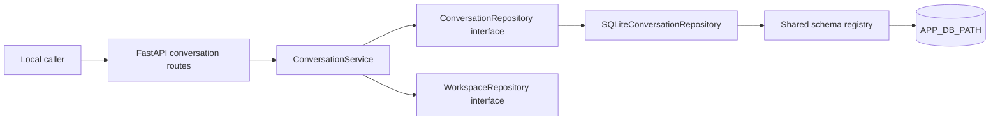
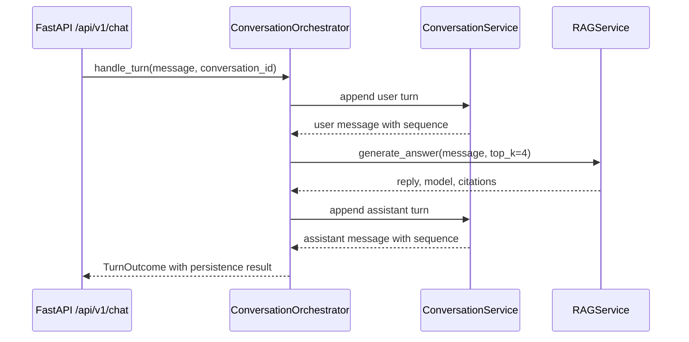
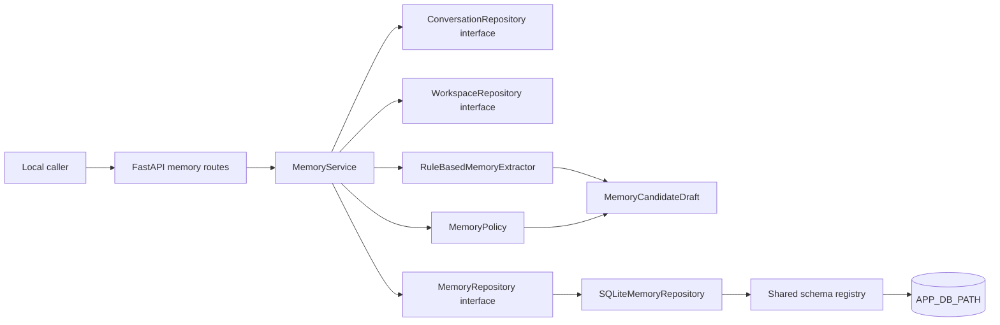

# Architecture

## Scope

This document is the high-level architecture gateway for the current Travel
Agent prototype. It describes implemented components and configured local
development paths only. It is not the final target architecture and does not
replace approved specifications, implementation plans, or ADRs.

Codebase Memory was checked at Verify tier for the material backend and RAG
paths used here. Coverage returned `no_recorded_issue` and `metadata_match` for
the cited code paths at generation `2026-08-31T00:12:09Z`; that is a
best-effort signal, not proof of semantic completeness. Exact source and
configuration files were also read directly.

## Detailed Architecture

Use these Package 3 architecture documents for deeper review:

1. [Current-state Architecture](docs/architecture/current-state.md) records the
   evidence-backed implemented baseline.
2. [Target-state Architecture](docs/architecture/target-state.md) describes the
   proposed workspace-first layered-memory architecture.
3. [Data Model](docs/architecture/data-model.md) defines the conceptual target
   model for workspaces, memory, retrieval, and evaluation traces.

## Current Components

| Component | Current responsibility | Evidence |
| --- | --- | --- |
| React/Vite client | Sends a chat `message` to the backend API and renders the returned response | `frontend/src/services/api.js`, `frontend/package.json` |
| FastAPI application | Mounts `/health`, `/api/v1/chat`, `/api/v1/workspaces`, and the `/api/v1` conversation routes, configures local CORS, and attempts RAG pre-warm during startup | `backend/app/main.py` |
| Health route | Returns service health metadata for local inspection | `backend/app/api/health.py` |
| Chat route | Validates one stripped message, logs a message prefix, delegates one turn to the conversation orchestrator, and returns reply/model/citations plus an optional `conversation` object | `backend/app/api/chat.py`, `backend/app/schemas/chat.py` |
| Workspace routes | Create, retrieve, and list local trip workspace records behind the workspace service; construct no RAG, embedding, or model-provider dependency | `backend/app/api/workspaces.py`, `backend/app/schemas/workspaces.py` |
| Conversation routes | Create and inspect conversations and append and read messages behind the conversation service; enforce the public role restriction; construct no RAG, embedding, or model-provider dependency | `backend/app/api/conversations.py`, `backend/app/schemas/conversations.py` |
| Workspace module | Owns `TripWorkspace` contracts, validation, identity generation, timestamps, and the storage interface | `backend/workspaces/models.py`, `backend/workspaces/service.py`, `backend/workspaces/repository.py` |
| Conversation module | Owns `Conversation` and `Message` contracts, the governed role, source, trace-visibility and retention vocabularies, validation, identity generation, timestamps, cursor resolution, and the storage interface | `backend/conversations/models.py`, `backend/conversations/service.py`, `backend/conversations/repository.py` |
| Conversation orchestrator | Coordinates conversation persistence with RAG generation for one chat turn and reports the persistence outcome truthfully | `backend/orchestration/conversation_orchestrator.py` |
| Memory routes | Trigger manual shadow extraction runs and list run/candidate evidence for a workspace or conversation; construct no RAG, embedding, or model-provider dependency | `backend/app/api/memory.py`, `backend/app/schemas/memory.py` |
| Memory module | Owns `MemoryCandidate` and `MemoryExtractionRun` contracts, deterministic rule-based extraction, policy decisions, service use cases, and the storage interface | `backend/memory/models.py`, `backend/memory/extraction.py`, `backend/memory/policy.py`, `backend/memory/service.py`, `backend/memory/repository.py` |
| Memory evaluation | Replays tracked synthetic fixtures end to end and writes a shadow report with result state and hard-gate evidence | `backend/memory/evaluation/runner.py`, `backend/memory/evaluation/cli.py` |
| Shared schema registry | Owns the `PRAGMA user_version` store marker and the `schema_versions` table, registers or verifies one module's schema version, and fails closed on unknown ownership or an unsupported version | `backend/storage/schema_registry.py` |
| Shared local application store | One local SQLite file at `APP_DB_PATH` holding trip workspace, conversation, and message records with per-module schema versions | `backend/workspaces/sqlite_repository.py`, `backend/conversations/sqlite_repository.py` |
| RAG generation service | Embeds the user message, retrieves Chroma context, builds the model prompt, calls the configured external model endpoint, and formats citations | `backend/rag/generation/rag_service.py` |
| Vector embedder | Lazily loads `BAAI/bge-m3` when sentence-transformers is available, with a deterministic fallback when it is not installed | `backend/rag/embedding/embedder.py` |
| Chroma vector store | Creates or opens persistent local Chroma collections under `data/chromadb` by default | `backend/rag/retrieval/vector_store.py` |
| Offline indexing script | Loads travel data, chunks it, embeds it, and upserts baseline and parent-child Chroma collections | `backend/rag/indexing.py` |
| Docker Compose stack | Defines local backend and frontend services, ports, bind mounts, `.env`, and model cache mount | `docker-compose.yml` |
| External model service | Receives chat-completions requests through an OpenAI-compatible client configured from backend settings | `backend/app/config.py`, `backend/rag/generation/rag_service.py` |

## Online Request Flow

The browser posts to `${VITE_API_URL}/api/v1/chat`, defaulting to
`http://localhost:8000`. The backend strips the incoming message and rejects an
empty value. The route requests up to four retrieval results, then the RAG service
sends both the user message and retrieved travel context to the configured
external model endpoint.

This is the unbound path, which is what the browser still sends. It performs no
persistence and resolves no conversation storage. The bound variant is shown in
[Local Conversation Flow](#local-conversation-flow).

## Offline Data Flow

Offline data preparation is opt-in and state-changing. The indexing script
selects processed data paths when present, falls back to legacy data paths,
loads travel documents, creates baseline fixed-size chunks and parent-child
chunks, embeds text with `BAAI/bge-m3`, and upserts vectors into persistent
Chroma collections.

This flow may read and write local data, use model cache, and require network
access if the embedding model is not already available.

## Local Workspace Flow

Milestone `R3` adds a backend-only trip workspace path beside chat.
`TripWorkspace` is the primary product container per ADR 0002, and local SQLite is
an adapter behind the repository boundary per ADR 0003.

Route handlers hold no SQL, table DDL, path creation, or connection management.
The service owns validation, identity generation, and timestamps. Only the
adapter and the shared schema registry import `sqlite3`.

This path is independent of RAG: workspace routes construct no embedder, Chroma
collection, or model-provider client, and `backend/rag` imports no workspace
module. It is unauthenticated local development behavior and must not be exposed
publicly.

## Local Conversation Flow

Milestone `R4` adds conversation and message persistence beside workspaces, and
introduces the `Conversation Orchestrator` seam that the target architecture
already named. One shared local SQLite file holds every relational product record
with per-module schema versions per ADR 0004.

A chat turn that opts in follows a second path, in which coordination lives in the
orchestrator rather than in the route or in the RAG module per ADR 0005:

The user turn is persisted before generation, so a caller is never charged for an
unrecorded turn. An assistant-turn write failure returns the reply with
`persisted` `false` rather than hiding the gap. An unbound turn resolves no
conversation service at all, which is what keeps the pre-`R4` chat contract and
its failure modes unchanged.

Message `content` is stored, never logged, and never deleted by `R4`.

## Shadow Memory Flow

Milestone `R5` adds backend-only shadow memory extraction beside workspaces
and conversations. Candidates are measured but never used in answers, per
ADR 0006.

The service validates workspace, conversation, and scope provenance before
extraction, persists a `MemoryExtractionRun` with per-status counts, and
persists the decided `MemoryCandidate` rows. Extraction proposes; policy
decides `accepted`, `rejected`, `needs_user_action`, or `invalid`. `accepted`
means accepted into the shadow candidate set for evaluation only.

A separate evaluation command replays tracked synthetic fixtures under
`docs/evaluation/fixtures/memory/` through the same service and writes a
report with result state (`PASS`, `FAIL`, `INCONCLUSIVE`, `INVALID`) and
hard-gate evidence. Candidate `text` is excluded from HTTP responses;
reports carry identifiers, counts, and controlled reason codes only.

This path is independent of RAG: memory routes construct no embedder, Chroma
collection, or model-provider client, `backend/rag` imports no memory module,
and no candidate enters `ContextBundle`, prompt assembly, retrieval, or
generated answers. It is unauthenticated local development behavior and must
not be exposed publicly.

## Trust Boundaries

| Boundary | Current implication |
| --- | --- |
| Browser to local API | Local browser requests cross into the FastAPI process through permissive local CORS configuration that includes `*` |
| Caller to workspace routes | Workspace routes are unauthenticated. `owner_user_id` is a caller-supplied local development scope label, not authentication, authorization, or tenant isolation, so these routes must not be exposed publicly |
| Caller to conversation routes | Conversation routes are unauthenticated. Conversations inherit scope from their parent workspace and carry no owner field, so `R4` claims no cross-user or cross-workspace isolation beyond deterministic repository filtering. The public append route accepts only `user` and `system_event`, so a caller cannot forge an assistant turn. These routes must not be exposed publicly |
| Caller to memory routes | Memory routes are unauthenticated and inherit workspace scope through the parent conversation. The trigger route always creates a `manual` run and rejects any caller-supplied `trigger`. These routes must not be exposed publicly |
| Memory candidate evidence to callers and reports | Candidate `text` is excluded from HTTP responses; reports carry identifiers, counts, controlled reason codes, and redacted summaries only. Secret-like spans are redacted before persistence, and raw message content is never logged |
| Local process to model provider | User message and retrieved travel context leave the local process for the configured external model endpoint |
| Local files, model cache, and vector store | Data, Chroma state, and model cache are local development assets, not isolated production stores |
| Local application database | The SQLite file at `APP_DB_PATH` holds user-entered trip content and full message content as local development state, with no production retention, backup, restore, or deletion contract |
| Retrieved travel content to prompt | Retrieved text is untrusted data and should not be treated as an instruction source |
| Environment to backend settings | Credential names are read from environment; real secret values must stay out of logs and docs |

## Current Invariants

- The public chat request contract requires one `message` string and accepts one
  optional additive `conversation_id`.
- The chat response contract contains `reply`, `model`, and `citations`, plus a
  `conversation` object that is absent, not null, unless the caller opted in.
- The backend mounts chat, workspace, and conversation routes under `/api/v1` and
  health at `/health`.
- Workspace routes are additive; the chat route performs no workspace lookup and
  accepts no `workspace_id`.
- Workspace identity is server-generated and prefixed `tw_`; conversation identity
  is prefixed `cv_` and message identity `ms_`. Memory extraction-run identity
  is prefixed `mer_` and candidate identity `mc_`.
- Message order within a conversation is a stored `sequence` integer starting at
  `1`, unique per conversation, assigned by the adapter inside the write
  transaction and never supplied by a caller.
- Appending a message advances its parent conversation's `updated_at` in the same
  transaction.
- `R3` creates workspace records with `retention_state` `active` only and
  implements no update, archive, or deletion route. `R4` creates conversations
  `active` only, implements no retention transition, and implements no deletion
  path for either record.
- Assistant and tool turns are writable only through the orchestrator.
- SQLite access is confined to `backend/storage/schema_registry.py`,
  `backend/workspaces/sqlite_repository.py`, and
  `backend/conversations/sqlite_repository.py`. `PRAGMA user_version` is confined
  to the schema registry.
- Schema versions are recorded per module in `schema_versions`, so workspace,
  conversation, and memory modules coexist in one database file without
  version contention.
- RAG and evaluation modules do not import workspace, conversation, memory, or
  orchestration modules, and `backend/workspaces` does not import conversation,
  memory, or orchestration modules. `backend/memory` does not import RAG or
  orchestration modules, and no memory candidate enters `ContextBundle`, prompt
  assembly, RAG retrieval, or generated answers.
- The RAG service is process-global after first construction.
- Chroma uses persistent local storage under `data/chromadb` by default, and no
  conversation or message record is written to any vector database.
- Health readiness is narrower than chat readiness, and it does not signal
  workspace or conversation storage readiness.
- Startup attempts to pre-warm the RAG service and converts pre-warm failures
  to warnings.

## Known Gaps

- No user, trip, or memory identifier exists in the bounded chat request
  contract. `conversation_id` is the only implemented identifier, and it is
  optional.
- No answer-eligible agent memory exists yet. `R5` persists shadow candidates
  and measures extraction quality, but implements no `MemoryRecord` promotion,
  no memory retrieval, and no personalization in answers.
- Trip workspace and conversation records exist as local backend components, but
  there is no authenticated user, workspace-aware chat, itinerary state, planner
  behavior, workspace or conversation UI, or workspace lifecycle transition.
- **The frontend is unchanged, so real browser traffic is not persisted.** `R4`
  delivers the capability to persist a turn; the browser still holds its visible
  transcript in volatile React state. Frontend work was explicitly deferred.
- **No conversation summarization exists.** `summary` has no column and no
  producer; it is deferred with the rest of memory work.
- **No deletion semantics exist for any record.** The retention vocabulary admits
  `summarized`, `archived`, `deletion_requested`, and `deleted`, but no producer
  moves a record into any of them, and hard deletion versus tombstoning is an
  open security-hardening decision.
- No request body size limit exists, and message `content` is deliberately
  unbounded, so request size limiting remains an API-boundary gap.
- Workspace and conversation routes are unauthenticated, and `owner_user_id` is a
  local scope label rather than an authorization control.
- Local SQLite storage settles no production database, migration, backup,
  restore, concurrency, retention, or deletion policy, and offers no concurrency
  safety beyond a single local process.
- There is no current multi-service data platform.
- Local CORS is permissive.
- The chat path logs a prefix of the user message. `R4` neither extends nor
  removes that behavior; removing it is owned by a security-hardening milestone.
- Current CI masks backend and frontend test failures, so green CI is not proof
  of passing tests.
- Production security, privacy guarantees, data deletion, authorization,
  tenant isolation, SLOs, and deployment topology are not established by this
  prototype.

Repository-wide security/privacy policy and current public-production blockers
are owned by [SECURITY.md](SECURITY.md). Deployment readiness, promotion, and
rollback questions route to
[docs/runbooks/deployment.md](docs/runbooks/deployment.md). These documents are
gates and operating policy; they do not mean the missing runtime controls above
are implemented.

## Future Direction

The repository direction is an evaluated travel assistant with trip planning,
trip workspaces, and layered memory. That direction is governed by approved
specifications, implementation plans, and future ADRs, not by unqualified prose
in this gateway.

Use [docs/specs/README.md](docs/specs/README.md) before proposing a material
change, [docs/plans/README.md](docs/plans/README.md) after a spec is approved,
and [docs/adr/README.md](docs/adr/README.md) for durable architecture decisions.

## Architecture Change Rules

Architecture-changing work starts from an approved specification. Level 3 work
also requires architecture approval and the ADRs identified by the approved
design. Update this gateway only when the implemented high-level component map,
trust boundary, request flow, or known gap list changes.
