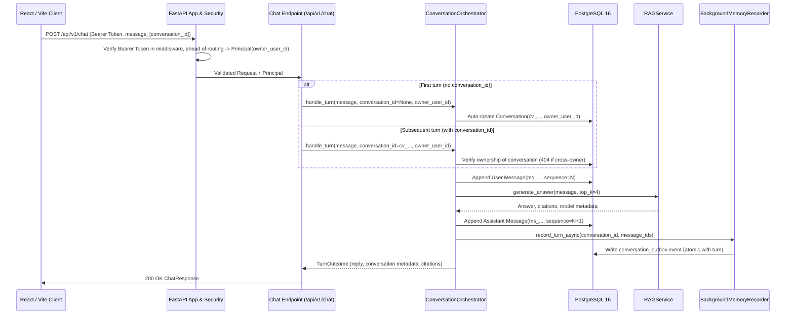

# Architecture

## Scope

This document is the high-level architecture gateway for the Travel Agent application following the clean-break baseline per ADRs 0018–0022 and the governing design specification `docs/specs/2026-09-10-authenticated-chat-postgresql-clean-break-design.md`.

It describes the mounted components, runtime flows, and storage boundaries implemented in this repository. Legacy prototypes (Workspace containers, Planner state, legacy memory, and local SQLite persistence) have been cleanly retired.

## Detailed Architecture

Use these architecture documents for deeper review:

1. [Current-state Architecture](docs/architecture/current-state.md) records the evidence-backed implemented baseline.
2. [Target-state Architecture](docs/architecture/target-state.md) outlines future capability directions.
3. [Data Model](docs/architecture/data-model.md) defines conceptual entities.

## Active Runtime Components

The application is structured around a single composition root (`RuntimeContainer`) and mounts exactly 8 endpoints:

| Component | Current Responsibility | Evidence |
| --- | --- | --- |
| **React/Vite client** | Browser UI sending authenticated chat requests to backend API | `frontend/src/services/api.js`, `frontend/package.json` |
| **FastAPI application** | Lifespan management, security middleware, content-free error handling, and router mounting | `backend/app/main.py` |
| **RuntimeContainer** | Composition root managing application dependencies, engine disposal, repository lifecycle, and observability probes | `backend/app/runtime_container.py` |
| **Health route** | Public service health check (`/health`) | `backend/app/api/health.py` |
| **Ops readiness route** | Authenticated readiness probe checking PostgreSQL, Alembic head, Chroma, and model provider (`/api/v1/ops/readiness`) | `backend/app/api/ops.py`, `backend/observability/readiness.py` |
| **Chat route** | Authenticated endpoint (`/api/v1/chat`) auto-creating or continuing conversations, orchestrating RAG generation, and asynchronously capturing outbox events | `backend/app/api/chat.py`, `backend/orchestration/conversation_orchestrator.py` |
| **Conversation routes** | Standalone conversation CRUD and history API (`/api/v1/conversations`) owned directly by authenticated users | `backend/app/api/conversations.py`, `backend/conversations/service.py` |
| **PostgreSQL conversation store** | Persists standalone conversations, sequential messages, and conversation outbox entries atomically under PostgreSQL | `backend/conversations/postgres_repository.py` |
| **Security boundary** | Mandatory local bearer token authentication enforced ahead of routing, principal extraction, tenant isolation, body size limiting, and restricted CORS | `backend/security/` |
| **BackgroundMemoryRecorder** | Decoupled post-turn background recorder seam capturing memory extraction candidates into the transactional outbox | `backend/orchestration/conversation_orchestrator.py` |
| **Basic Semantic Memory Write Pipeline** | Versioned assertions, authority ranking, row-level locking, idempotent commits, and background shadow worker | `backend/memory/write_pipeline/` |
| **RAG generation service** | Embeds user queries (`BAAI/bge-m3`), searches Chroma vector store, formats prompts, and calls the configured model endpoint | `backend/rag/generation/rag_service.py` |
| **Observability & redaction** | Correlated request IDs (`X-Request-ID`, `rq_...`), structured redaction of tokens/paths/content, and audit logging | `backend/observability/` |

## Retired Capabilities

The following legacy prototypes have been removed from active runtime per ADRs 0018–0022:
- **Workspace Containers**: `workspaces` table dropped; conversations are standalone and owned directly by `owner_user_id`.
- **Trip Planner State**: Planner routes, schemas, and state tables retired.
- **Legacy Memory**: In-process rule-based memory extraction and promotion routes retired in favor of the decoupled basic semantic memory write pipeline.
- **SQLite Storage**: Local SQLite files (`APP_DB_PATH`, `WORKSPACE_DB_PATH`) and SQLite repository adapters retired; PostgreSQL 16 is the sole database.
- **Unauthenticated Compatibility Mode**: historical `AUTH_REQUIRED=false` bypass removed; all product routes strictly enforce Bearer authentication.

## Online Request Flow

## Storage Architecture

PostgreSQL 16 is the sole relational storage engine, managed via Alembic migrations up to head revision `20260912_02` (`20260912_02_worker_column_grants`). `ALEMBIC_HEAD` in `backend/storage/postgres.py` is the authoritative value.

### Active Relational Tables
1. `conversations`: Standalone conversations (`conversation_id`, `owner_user_id` NOT NULL, `title`, `retention_state`, `deletion_epoch`, timestamps).
2. `messages`: Sequential conversation messages (`message_id`, `conversation_id`, `sequence`, `role`, `content`, `source`, `trace_visibility`, `created_at`).
3. `conversation_outbox`: Transactional outbox events for asynchronous candidate extraction (`outbox_id`, `conversation_id`, `message_id`, `owner_user_id`, `event_type`, `payload`, `status`, `lease_owner`, `lease_until`, `attempt_count`).
4. Basic Semantic Memory Write Pipeline tables (`memory_assertions`, `memory_versions`, `memory_evidence` with `invalidated_at`, `memory_decisions`, `memory_candidates`, `memory_events`, `memory_outbox`, `memory_write_idempotency`).

### Concurrency and Isolation
- **Row-Level Security (RLS)**: Tenant policies (`app.tenant = owner_user_id`) bound on every conversation-repository transaction, `FORCE`d on `conversations` and `messages` so the table owner is also constrained.
- **Least-Privilege Runtime Role**: The backend connects as `travel_app` (`NOSUPERUSER`, `NOBYPASSRLS`); migrations keep using the bootstrap superuser through a separate `PG_DSN`.
- **Deletion Propagation**: Conversation delete atomically tombstones, cancels pending/leased outbox events, invalidates dependent memory evidence, and bumps the deletion epoch; memory commits verify the fence (active conversation, matching epoch, live lease) in the same transaction and fail closed otherwise.
- **FOR UPDATE SKIP LOCKED**: Outbox workers claim distinct conversations concurrently without contention.
- **One Active Version Constraint**: Partial unique index ensures assertion integrity.

## Trust Boundaries

| Boundary | Implemented Security Control |
| --- | --- |
| **Browser to API** | Explicit CORS allowlist; wildcard origins are prohibited when authentication is active. |
| **API Authentication** | Mandatory Bearer token authentication on all `/api/v1` routes; unauthenticated requests receive generic `401 Unauthorized`. |
| **Tenant Isolation** | Cross-owner resource access returns content-free `404 Not Found` without disclosing resource existence. |
| **Request Size Limit** | Enforced up to `MAX_REQUEST_BODY_BYTES` (1,048,576 bytes default); oversized payloads receive `413 Request body too large.`. |
| **Error Handling** | Content-free validation errors (`422`) and unhandled exception details (`500`) with correlated `X-Request-ID`. No prompts, tokens, or stack traces are leaked. |
| **Observability** | Content-free structured JSON events with pre-serialization redaction of tokens, secrets, content, and file paths. |

## Current Invariants

1. **8 Mounted Routes Only**: Health (`/health`), Ops readiness (`/api/v1/ops/readiness`), Chat (`/api/v1/chat`), and Conversation CRUD (`/api/v1/conversations`).
2. **Conversation Auto-Creation & Continuation**: Omitting `conversation_id` on the first turn auto-creates an owned conversation; providing it on subsequent turns continues the transcript.
3. **Sequential Message Ordering**: Messages within a conversation are assigned unique contiguous `sequence` integers starting at 1.
4. **Decoupled Outbox Processing**: Memory extraction runs asynchronously via outbox events and never blocks the chat response.
5. **Alembic Migration Head**: Relational schema matches head `20260912_02`.

## Known Gaps

- Production deployment topology, managed secret storage, and TLS termination remain to be established for public cloud deployment.
- Frontend transcript state currently remains in React memory; persisting UI transcripts via the conversation API is a planned enhancement.
- RAG answer quality is subject to formal evaluation benchmarks.
