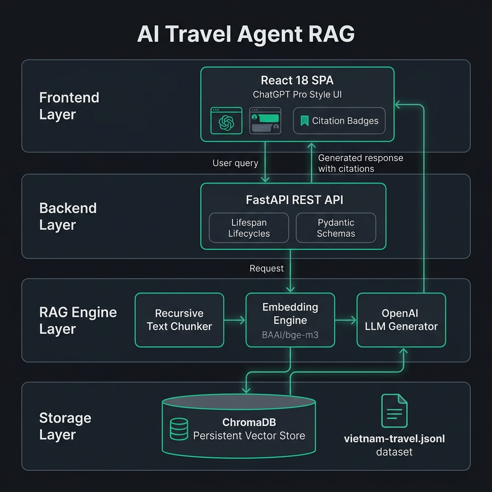

<h1 align="center">Vietnam Travel Agent RAG System</h1>

<p align="center">
  <b>A Production-Grade Full-Stack RAG System for Vietnam Travel Guidance</b>
</p>

<p align="center">
  
  
  
  
  
  
</p>

---

## Overview

The **Vietnam Travel Agent RAG System** is an enterprise-ready, Retrieval-Augmented Generation (RAG) platform designed to deliver precise, source-cited travel guidance across Vietnam. Built upon a Modular Monolith architecture following Layered Domain-Driven Design (DDD), the system combines a high-performance **FastAPI** backend, a persistent **ChromaDB** vector store, dense **BAAI/bge-m3** multilingual embeddings, and a modern **React UI** with source citations.

The dataset comprises **281 curated travel guide articles** covering destinations, cultural highlights, accommodations, and culinary experiences in Vietnam.

---

## System Architecture

The overall pipeline executes a complete Data Ingestion, Vector Indexing, Similarity Retrieval, and Augmented Generation workflow:

<p align="center">
  
</p>

### End-to-End Workflow

1. **Data Crawling & Preprocessing**: Source HTML articles are scraped from official tourism channels, cleaned, and standardized into JSONL format (`data/vietnam-travel.jsonl`).
2. **Document Loading & Recursive Chunking**: The `DocumentChunker` splits full-length articles into overlapping chunks (~1000 characters, 150 overlap) while preserving sentence boundaries and metadata.
3. **Dense Embedding Generation**: Text chunks are transformed into 1024-dimensional dense vectors using the HuggingFace `BAAI/bge-m3` multilingual Transformer model.
4. **Persistent Vector Storage**: Embeddings, documents, and rich metadata (`doc_id`, `url`, `title`, `source_domain`) are upserted into ChromaDB (`data/chromadb/`).
5. **Similarity Retrieval & RAG Prompting**: User queries are vectorized and matched against ChromaDB using Cosine Similarity (Top-4 chunks). Context is injected into the System Prompt for `gpt-4o-mini`.
6. **Augmented Response & Source Citations**: The backend streams the generated answer along with clickable source citations (`title`, `url`) to the React UI rendered via `react-markdown`.

---

## Key Features

- **Recursive Character Splitting**: Preserves natural paragraph and sentence boundaries with trailing overlap for context retention.
- **Multilingual Vector Retrieval**: Leverages `BAAI/bge-m3` to support both Vietnamese and English natural language queries.
- **Source Citation Verification**: Every AI response includes clickable, verified external source links to original travel guide articles.
- **FastAPI Pre-Warming**: Lifespan startup handlers pre-load embedding models into RAM, ensuring sub-second response latency.
- **ChatGPT Pro Minimalist Interface**: Built using Tailwind CSS, featuring rich markdown rendering, glassmorphic headers, and micro-interactions.
- **Production Containerization**: Multi-stage Docker Compose setup optimized with CPU-only PyTorch, reducing image size from 6GB down to 700MB.

---

## Tech Stack

| Layer | Technology / Framework | Description |
|---|---|---|
| **Frontend** | React 18, Vite, Tailwind CSS, React Markdown | ChatGPT-style SPA with citations and dark mode |
| **Backend API** | FastAPI, Pydantic, Uvicorn, Python 3.11 | Asynchronous RESTful API services |
| **Vector Database** | ChromaDB PersistentClient | Embedded vector database stored at `data/chromadb/` |
| **Embedding Engine** | HuggingFace SentenceTransformers (`BAAI/bge-m3`) | 1024-dimensional dense multilingual embeddings |
| **LLM Provider** | OpenAI API (`gpt-4o-mini` via GitHub Models) | Context-grounded response generation |
| **DevOps / CI** | Docker, Docker Compose, Pytest | Containerized orchestration & automated testing |

---

## Directory Structure

```text
travel-agent/
├── backend/
│   ├── app/
│   │   ├── api/             # FastAPI routers (health, chat)
│   │   ├── schemas/         # Pydantic request/response schemas
│   │   ├── config.py        # Centralized settings & environment variables
│   │   └── main.py          # Application entrypoint & lifespan handlers
│   ├── preprocessing/       # Web crawler engine & CLI entry points
│   ├── rag/
│   │   ├── chunking/        # Document loader & recursive text chunker
│   │   ├── embedding/       # BAAI/bge-m3 vector embedder
│   │   ├── retrieval/       # ChromaDB vector store wrapper
│   │   ├── generation/      # RAG prompt builder & LLM orchestration
│   │   └── indexing.py      # Offline data ingestion & vector indexing pipeline
│   ├── tests/               # Pytest automated test suite
│   ├── Dockerfile           # Backend container build specification
│   └── requirements.txt     # Backend production dependencies
├── frontend/
│   ├── src/
│   │   ├── components/      # ChatInput, ChatMessage, Header, Sidebar, WelcomeView
│   │   ├── services/        # Axios API client
│   │   └── App.jsx          # Main application container
│   ├── Dockerfile           # Frontend container build specification
│   └── package.json         # Node.js dependencies
├── data/
│   ├── chromadb/            # Local persistent ChromaDB vector store
│   └── vietnam-travel.jsonl # Preprocessed travel articles dataset (281 items)
├── docs/
│   └── images/              # Architecture diagrams & visual assets
├── docker-compose.yml       # Full-stack container orchestration
├── README.md                # Project documentation
└── requirements.txt         # Workspace Python dependencies
```

---

## Quickstart Guide

### Prerequisites

- Docker Engine 24+ & Docker Compose v2+
- Python 3.11+ (for local development)
- Node.js 18+ & npm (for local frontend development)

---

### Method 1: Running with Docker Compose (Recommended)

1. **Clone the Repository**:
   ```bash
   git clone https://github.com/Nnguyen-dev2805/travel-agent.git
   cd travel-agent
   ```

2. **Configure Environment Variables**:
   Create a `.env` file in the root directory:
   ```env
   PROJECT_NAME="Vietnam Travel Agent"
   GITHUB_TOKEN=your_github_models_api_token_here
   GITHUB_MODELS_URL=https://models.inference.ai.azure.com
   LLM_MODEL=gpt-4o-mini
   ```

3. **Launch Containers**:
   ```bash
   docker compose up --build -d
   ```

4. **Access Applications**:
   - **Frontend UI**: `http://localhost:5173`
   - **FastAPI Interactive Docs**: `http://localhost:8000/docs`

---

### Method 2: Local Virtual Environment Development

1. **Setup Python Environment**:
   ```bash
   python3 -m venv .venv
   source .venv/bin/activate
   pip install -r requirements.txt
   ```

2. **Run Vector Indexing Pipeline**:
   ```bash
   PYTHONPATH=. python backend/rag/indexing.py
   ```

3. **Run Elasticsearch BM25 Indexing for Hybrid Search**:
   ```bash
   docker compose up -d elasticsearch
   PYTHONPATH=. python backend/rag/index_elasticsearch.py --recreate
   ```

   Hybrid retrieval is enabled with:
   ```env
   RETRIEVER_MODE=hybrid
   ELASTICSEARCH_URL=http://localhost:9200
   ELASTICSEARCH_INDEX=travel_child_chunks_v1
   ```

4. **Start FastAPI Backend**:
   ```bash
   uvicorn backend.app.main:app --reload --port 8000
   ```

5. **Start Frontend Dev Server**:
   ```bash
   cd frontend
   npm install
   npm run dev
   ```

---

## API Reference

### 1. Health Check
- **Endpoint**: `GET /health`
- **Response**:
  ```json
  {
    "status": "healthy",
    "project": "Vietnam Travel Agent",
    "version": "1.0.0"
  }
  ```

### 2. Chat Query (RAG Endpoint)
- **Endpoint**: `POST /api/v1/chat`
- **Request Body**:
  ```json
  {
    "message": "Top 7 rooftop bars in Vietnam?"
  }
  ```
- **Response Body**:
  ```json
  {
    "reply": "Here are the top rooftop bars in Vietnam:\n\n1. **Skylight Nha Trang** - Located on the 43rd floor...",
    "model": "gpt-4o-mini",
    "citations": [
      {
        "title": "7 stunning rooftop bars in Vietnam | Vietnam Tourism",
        "url": "https://vietnam.travel/things-to-do/7-stunning-rooftop-bars-vietnam"
      }
    ]
  }
  ```

---

## Automated Verification & Testing

Execute the unit test suite using Pytest:

```bash
source .venv/bin/activate
PYTHONPATH=. python -m pytest backend/tests/ -v
```

Expected output:
```text
============================= test session starts ==============================
backend/tests/test_api.py::test_health_check_endpoint PASSED             [ 14%]
backend/tests/test_api.py::test_chat_empty_message PASSED                [ 28%]
backend/tests/test_chunker.py::test_loader_real_dataset PASSED           [ 42%]
backend/tests/test_chunker.py::test_chunker_basic_splitting PASSED       [ 57%]
backend/tests/test_chunker.py::test_chunker_empty_document PASSED        [ 71%]
backend/tests/test_vector_store.py::test_embedder_generation PASSED      [ 85%]
backend/tests/test_vector_store.py::test_chroma_vector_store_add_and_search PASSED [100%]

======================== 7 passed, 2 warnings in 0.44s =========================
```

---

## License

This project is licensed under the **MIT License**.
