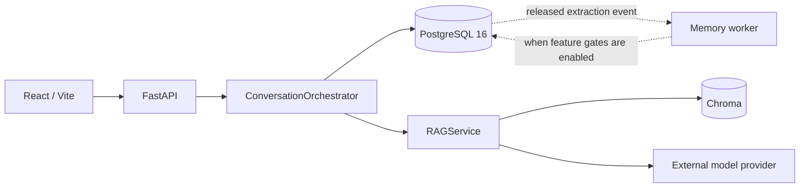

# Current-state Architecture

## Purpose

This document describes behavior implemented by the checked-out code. It is not
a roadmap and does not treat future Memory design as current capability.

The runtime today is an authenticated standalone Chat application backed by
PostgreSQL 16 and RAG. It also contains a feature-gated semantic Memory
write-side pipeline. Workspace containers, Planner routes/state, SQLite
application persistence, and a public Memory-management API are not part of the
mounted runtime.

For implementation truth, source code, migrations, tests, configuration, and
fresh runtime evidence take precedence over this document.

## Runtime at a Glance



`RuntimeContainer` is the API composition root. The Memory worker is a separate
process with its own database credential boundary; it is not constructed by the
API container.

## Mounted HTTP Surface

The FastAPI application mounts four routers containing eight routes:

| Method | Path | Authentication | Purpose |
| --- | --- | --- | --- |
| `GET` | `/health` | No | Process liveness |
| `GET` | `/api/v1/ops/readiness` | Bearer | Structured runtime readiness |
| `POST` | `/api/v1/chat` | Bearer | Run one chat turn |
| `POST` | `/api/v1/conversations` | Bearer | Create a conversation |
| `GET` | `/api/v1/conversations` | Bearer | List owned conversations |
| `GET` | `/api/v1/conversations/{conversation_id}` | Bearer | Read one owned conversation |
| `GET` | `/api/v1/conversations/{conversation_id}/messages` | Bearer | Read paged message history |
| `DELETE` | `/api/v1/conversations/{conversation_id}` | Bearer | Tombstone one owned conversation |

There are no mounted Workspace, Planner, or public Memory routes.

## Chat Turn Flow

A chat request is owner-scoped from authentication through persistence.

```mermaid
sequenceDiagram
    participant Client
    participant API as FastAPI
    participant Orch as ConversationOrchestrator
    participant PG as PostgreSQL
    participant RAG as RAGService

    Client->>API: POST /api/v1/chat
    API->>Orch: message + principal + optional conversation_id
    alt first turn
        Orch->>PG: create conversation + user message + pending assistant
    else existing conversation
        Orch->>PG: verify owner + append user/pending assistant pair
    end
    opt MEMORY_SHADOW_EXTRACT_ENABLED
        Note over Orch,PG: extraction outbox event is persisted with the turn
    end
    Orch->>RAG: generate_answer(message, top_k=4)
    RAG-->>Orch: reply + citations + model
    alt generation succeeds
        Orch->>PG: complete_turn(reply)
        Note over PG: assistant becomes COMPLETE; turn outbox event is released
        Orch-->>API: persisted TurnOutcome
    else generation fails
        Orch->>PG: fail_turn()
        Note over PG: assistant becomes FAILED; turn outbox event is cancelled
        Orch-->>API: failure
    end
```

Important invariants:

- the first turn can create its conversation automatically;
- an existing conversation is checked in the authenticated owner's scope;
- the user message and pending assistant row are opened together;
- generation runs outside the persistence transaction;
- terminal success releases that turn's extraction event;
- terminal generation failure cancels it;
- an unreleased extraction event is not claimable by the Memory worker.

## RAG Boundary

`RAGService` owns travel-knowledge retrieval and answer generation. The online
path embeds the query, retrieves Chroma results, assembles prompt context, calls
the configured model provider, and returns citations derived from retrieved
travel evidence.

The current RAG path is independent from canonical Memory state. The chat
orchestrator currently calls `RAGService.generate_answer(...)` directly; it does
not yet run a Memory Read/Use phase before generation.

## PostgreSQL and Migration State

PostgreSQL is the canonical relational store. The code-level Alembic head is:

```text
20260915_04
```

Current conversation persistence centers on:

- `conversations` — directly owned by `owner_user_id`;
- `messages` — ordered user/assistant records with terminal status;
- `conversation_outbox` — background events with release, lease, retry, and
  terminal state.

The production Memory persistence adapter currently references:

- `memory_assertions`;
- `memory_versions`;
- `memory_evidence`;
- `memory_decisions`;
- `memory_events`;
- `memory_outbox`;
- `memory_write_idempotency`.

The migration also defines `memory_candidates`, `memory_summaries`,
`memory_episodes`, and `memory_deletion_ledger`. Their presence is schema
scaffolding, not evidence of an active runtime capability: current production
modules do not reference those four tables directly. Candidate objects exist in
the write pipeline, but the current PostgreSQL adapter does not persist them to
`memory_candidates`.

## Current Semantic Memory Slice

The implemented write-side registry is `semantic-registry-v2` and currently
contains eight governed keys — four `SINGLE` and four `SET`:

| Key | Cardinality |
| --- | --- |
| `travel.preference.hotel_atmosphere` | `SINGLE` |
| `travel.preference.travel_pace` | `SINGLE` |
| `travel.constraint.budget_level` | `SINGLE` |
| `travel.profile.default_departure_city` | `SINGLE` |
| `travel.preference.accommodation_type` | `SET` |
| `travel.preference.transport_mode` | `SET` |
| `travel.preference.activity_style` | `SET` |
| `travel.preference.food_style` | `SET` |

Each key owns its normalized values, cardinality, allowed scopes, sensitivity
floor, and per-value English/Vietnamese synonyms; the registry is a closed
contract, so unknown keys and unknown values raise. The former single-key
constants (`HOTEL_ATMOSPHERE_KEY`, `HotelAtmosphere`, `HOTEL_ATMOSPHERE_SYNONYMS`)
survive only as compatibility aliases onto the same data, not as a second source
of truth.

Its implemented properties are:

| Property | Current implementation |
| --- | --- |
| Cardinality | `SINGLE` and `SET` (a `SET` key holds a canonical, sorted, deduplicated tuple) |
| Scope | user or conversation |
| Version status | `ACTIVE`, `SHADOW`, `SUPERSEDED`, `REVOKED` |
| Write operations | `ADD`, `REINFORCE`, `SUPERSEDE`, `ADD_EXCEPTION`, `PENDING_CONFLICT`, `REJECT`, `NOOP`, `REVOKE` |

Because `SET` keys are live, the set-valued machinery (`REVOKE`, desired-member
resolution, and set-union change computation) is active and governed, not
speculative scaffolding.

The write pipeline includes model-assisted candidate extraction, deterministic
registry/policy checks, deterministic resolution, PostgreSQL persistence,
idempotency, evidence/decision records, and an asynchronous worker.

Two relevant feature gates default to disabled:

```text
MEMORY_WRITE_PIPELINE_ENABLED=false
MEMORY_SHADOW_EXTRACT_ENABLED=false
```

Therefore "implemented" and "enabled in the default runtime" are intentionally
separate claims.

## Security and Concurrency Boundaries

The current implementation includes these material controls:

- Bearer authentication is required for `/api/v1/*` product/ops routes;
- owner identifiers come from the authenticated principal rather than request
  data for authorization decisions;
- PostgreSQL tenant context and row-level security protect owner-scoped data;
- cross-owner conversation reads are exposed as not-found behavior;
- wildcard CORS origins are rejected by configuration;
- request bodies are limited by `MAX_REQUEST_BODY_BYTES` (default 1 MiB);
- API and Memory worker database credentials are kept in separate process
  boundaries and privileged/BYPASSRLS roles fail closed unless explicitly
  allowed for throwaway local development;
- outbox claim/retry logic uses leases and a release barrier so unfinished chat
  turns cannot be processed as Memory evidence;
- Memory persistence rechecks owner scope and uses bounded concurrency handling
  instead of treating a stale write as success.

## What Is Not Implemented Yet

The following belong to the target architecture and must not be inferred from
schema names, response placeholders, or old design history:

- chat-native explicit `remember`, `correct`, `forget`, or `inspect` behavior;
- a governed Memory Read/Use engine feeding selected Memory into chat generation
  (the engine code exists but stays gated off and shadow-only by default);
- the target retention/suppression lifecycle including product forget and
  no-resurrection generations;
- active Episodic Memory and Working Memory vertical slices;
- system-owned Procedural Memory publication;
- Memory full-text or vector retrieval projections.

### Implemented but shadow-only by default

`DialogueStateResolver`, `TurnUnderstanding`, `ActionRouter`, and the
`ContextPlanner` runtime are fully implemented and are instantiated
unconditionally and invoked on every turn by `ConversationOrchestrator`. They
are not stubs. They run as shadow evidence only: with the shipped defaults the
planner does not enforce its proposal
(`CONTEXT_PLANNER_ENFORCEMENT_ENABLED=false`), so generation short-circuits to
`RAGService.generate_answer(message, top_k=4)` and the effective behavior is
still `persist -> RAG -> complete/fail`. The distinction is that the target
Stage-1 pipeline is present and exercised in shadow, not absent.

The multi-key/set-valued semantic registry is also implemented — see
[Current Semantic Memory Slice](#current-semantic-memory-slice), which documents
`semantic-registry-v2` with its four `SET` keys.

See [Target-state Architecture](target-state.md) for the intended evolution and
[Data Model](data-model.md) for target Memory concepts.
