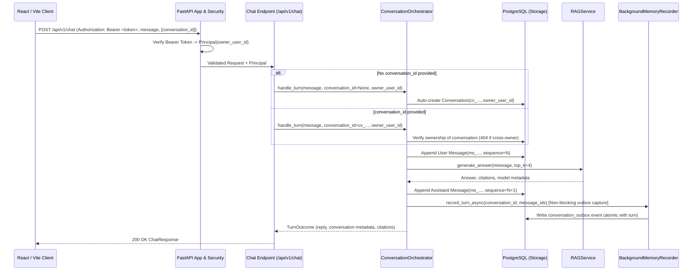

# Current-state Architecture

## Scope

This document records the implemented Travel Agent architecture following the approved clean break per ADRs 0018–0022 and the governing design specification `docs/specs/2026-09-10-authenticated-chat-postgresql-clean-break-design.md`.

The system baseline provides authenticated standalone Chat with Retrieval-Augmented Generation (RAG) and basic semantic memory write pipeline capabilities backed by PostgreSQL 16. Legacy prototypes including Workspace containers, Planner state, SQLite-first persistence, dual-write migrations, and unauthenticated compatibility modes have been cleanly retired.

Use this document when comparing proposed work against what is implemented today.

## Superseded Specifications and Decisions

Per the clean break architecture decision records (ADRs 0018–0022), the following legacy documents and decisions are **superseded**:

| Legacy Reference | Superseding Decision | Rationale |
| --- | --- | --- |
| **ADR 0002** (SQLite-first persistence) | **ADR 0018** & **ADR 0022** (PostgreSQL Clean Break) | SQLite removed from backend runtime; PostgreSQL 16 is the sole relational database. |
| **ADR 0003** (Workspace-scoped conversation layout) | **ADR 0021** (Standalone Owned Conversations) | `workspace_id` removed; conversations are owned directly by `owner_user_id`. |
| **ADR 0004** (Shared local SQLite file) | **ADR 0018** & **ADR 0022** (PostgreSQL Clean Break) | Historical `APP_DB_PATH` and `WORKSPACE_DB_PATH` retired; centralized PostgreSQL connection via `DATABASE_URL`. |
| **ADR 0008** (Legacy shadow memory extraction) | **ADR 0020** (Decoupled Semantic Memory Pipeline) | Legacy shadow memory routes and SQLite stores retired in favor of decoupled asynchronous write pipeline. |
| **ADR 0010** (Planner state machine) | Clean Break Specification | Planner routes, contracts, and SQLite store retired; out of scope for clean chat baseline. |
| **ADR 0015** (Local token auth compatibility mode) | **ADR 0019** (Mandatory Bearer Token Authentication) | Historical `AUTH_REQUIRED=false` compatibility mode eliminated; bearer authentication is strictly required for all product routes. |
| **ADR 0017** (Dual-write migration) | **ADR 0022** (Direct PostgreSQL Clean Break) | Phased dual-writing dropped in favor of direct PostgreSQL clean cutover. |

## Runtime Components

The active runtime is composed via `RuntimeContainer` at startup and exposes exactly 8 mounted routes across 4 routers.

| Component | Implemented Responsibility | Evidence |
| --- | --- | --- |
| **React/Vite client** | Browser UI sending authenticated chat requests to backend API | `frontend/src/services/api.js`, `frontend/package.json` |
| **FastAPI application** | Application lifecycle management via lifespan, security middleware, content-free error handling, and router mounting | `backend/app/main.py` |
| **RuntimeContainer** | Composition root managing application dependencies, engine disposal, repository lifecycle, and observability probes | `backend/app/runtime_container.py` |
| **Health route** | Public endpoint returning process liveness and service metadata (`/health`) | `backend/app/api/health.py` |
| **Ops readiness route** | Authenticated endpoint (`/api/v1/ops/readiness`) returning structured readiness for PostgreSQL, Alembic migration head, Chroma, and model provider | `backend/app/api/ops.py`, `backend/observability/readiness.py` |
| **Chat route** | Authenticated endpoint (`/api/v1/chat`) auto-creating or continuing conversations, orchestrating RAG generation, and asynchronously capturing outbox events | `backend/app/api/chat.py`, `backend/orchestration/conversation_orchestrator.py` |
| **Conversation routes** | Authenticated endpoints (`/api/v1/conversations`) managing standalone conversations and message histories with strict tenant isolation | `backend/app/api/conversations.py`, `backend/conversations/service.py` |
| **PostgreSQL conversation store** | Persists standalone conversations, sequential messages, and conversation outbox entries atomically under PostgreSQL | `backend/conversations/postgres_repository.py` |
| **Security boundary** | Mandatory local bearer token authentication, principal extraction, tenant isolation, body size limiting, and restricted CORS | `backend/security/` |
| **BackgroundMemoryRecorder** | Decoupled post-turn background recorder seam capturing memory extraction candidates into the transactional outbox | `backend/orchestration/conversation_orchestrator.py` |
| **Basic Semantic Memory Write Pipeline** | Versioned assertions, authority ranking, row-level locking, idempotent commits, and background shadow worker | `backend/memory/write_pipeline/` |
| **RAG generation service** | Generates contextual answers using Chroma vector retrieval, query embedding (`BAAI/bge-m3`), and model completion | `backend/rag/generation/rag_service.py` |
| **Observability & redaction** | Correlated request IDs (`X-Request-ID`, `rq_...`), structured redaction of tokens/paths/content, and audit logging | `backend/observability/` |

## Mounted Routes (8 Total)

Only the following 8 routes are mounted in `backend/app/main.py`:

| Method | Path | Auth Required | Description |
| --- | --- | --- | --- |
| `GET` | `/health` | No | Service liveness probe |
| `GET` | `/api/v1/ops/readiness` | Yes (Bearer) | Component readiness snapshot (PostgreSQL, Alembic head, Chroma, Model) |
| `POST` | `/api/v1/chat` | Yes (Bearer) | Authenticated chat turn with conversation auto-creation/continuation |
| `POST` | `/api/v1/conversations` | Yes (Bearer) | Create a new standalone conversation |
| `GET` | `/api/v1/conversations` | Yes (Bearer) | List conversations owned by authenticated user |
| `GET` | `/api/v1/conversations/{conversation_id}` | Yes (Bearer) | Retrieve conversation by ID (404 on cross-owner access) |
| `DELETE` | `/api/v1/conversations/{conversation_id}` | Yes (Bearer) | Soft-delete conversation (tombstone hiding) |
| `GET` | `/api/v1/conversations/{conversation_id}/messages` | Yes (Bearer) | Paged message history in sequence order |

All legacy routes (`/api/v1/workspaces/*`, `/api/v1/planner/*`, `/api/v1/memory/*`, and direct `/api/v1/conversations/{id}/messages` POST) are completely unmounted and retired.

## Composition Root: RuntimeContainer

Per ADR 0018, `RuntimeContainer` in `backend/app/runtime_container.py` acts as the single composition root for the application:
1. **Lifespan Integration**: Instantiated during FastAPI `lifespan` startup, stored on `app.state.container`, and cleanly shuts down on termination.
2. **PostgreSQL Engine Management**: Owns the SQLAlchemy `Engine` initialized from `DATABASE_URL` (with pooled connections, statement pre-ping, and graceful disposal on shutdown).
3. **Dependency Injection Seam**: Provides thread-safe, memoized factories for `PostgresConversationRepository`, `ConversationService`, `ConversationOrchestrator`, and `OpsReadinessProbe`.
4. **Decoupled Architecture**: Routes receive dependencies via FastAPI dependency injection helpers (`get_conversation_service`, `get_orchestrator`, `get_readiness_probe`) without instantiating global singletons or storage adapters directly.

## Online Authenticated Chat Flow

Key runtime invariants:
- **Conversation Auto-Creation**: If `conversation_id` is omitted on the first turn, the orchestrator auto-creates an owned conversation (`cv_...`) and returns its identifier in `conversation.conversation_id`.
- **Conversation Continuation**: Providing `conversation_id` on subsequent turns appends messages in sequential order.
- **Cross-Owner Isolation**: Accessing another user's conversation immediately aborts with a content-free 404 (without revealing conversation existence).
- **Decoupled Outbox**: Memory extraction runs asynchronously via outbox events, ensuring the chat turn response latency is never degraded by LLM memory extraction.

## Data Model and Persistence

The storage tier is powered exclusively by PostgreSQL 16, governed by Alembic migrations with head revision `20260910_01` (`20260910_01_clean_break_remove_workspace`).

### Active PostgreSQL Tables
1. `conversations`: Standalone conversation records owned directly by `owner_user_id` (NOT NULL). Contains `conversation_id`, `owner_user_id`, `title`, `retention_state`, `created_at`, `updated_at`.
2. `messages`: Sequential conversation messages (`message_id`, `conversation_id`, `sequence`, `role`, `content`, `source`, `trace_visibility`, `created_at`).
3. `conversation_outbox`: Transactional outbox events for background worker processing (`outbox_id`, `conversation_id`, `message_id`, `owner_user_id`, `event_type`, `payload`, `status`, `lease_owner`, `lease_until`, `attempt_count`).
4. Memory Write Pipeline Tables:
   - `memory_assertions`: Canonical keys, subject keys, scopes.
   - `memory_versions`: Versioned assertion states with active version uniqueness constraint.
   - `memory_evidence`: Supporting citations and provenance.
   - `memory_decisions`: Recorded policy decisions (DIRECT_WRITE, SHADOW, etc.).
   - `memory_candidates`: Extracted raw memory candidates.
   - `memory_events`: Audit ledger of memory mutation events.
   - `memory_outbox`: Asynchronous memory event dispatch.
   - `memory_write_idempotency`: Deduplication keys for safe concurrent writes.
   - `memory_summaries`, `memory_episodes`, `memory_deletion_ledger`: Memory lifecycle tables.

### Security and Concurrency Controls
- **Row Level Security (RLS)**: Enabled across all owner tables with tenant isolation policies (`app.tenant = owner_user_id`).
- **FOR UPDATE SKIP LOCKED**: Outbox workers use PostgreSQL skip locked queries to process distinct conversations in parallel without deadlock or lock contention.
- **One Active Version Constraint**: `uq_memory_versions_current` partial unique index guarantees at most one active version per assertion.

## Security and Privacy Controls

1. **Mandatory Bearer Authentication**:
   - Every API endpoint under `/api/v1/` requires a valid Bearer token.
   - Unauthenticated requests return `401 Unauthorized` with a generic, content-free message.
   - Historical compatibility bypass mode (`AUTH_REQUIRED=false`) has been completely removed.
2. **CORS Hardening**:
   - Wildcard `*` CORS origins are prohibited when authentication is active. Startup fails closed if misconfigured.
   - Trusted local origins (`http://localhost:5173`, `http://127.0.0.1:5173`) are explicitly allowlisted.
3. **Request Body Limiting**:
   - Request bodies are enforced up to `MAX_REQUEST_BODY_BYTES` (default 64 KB). Oversized requests return `413 Request rejected.` with correlated request ID.
4. **Safe Error Handling**:
   - Validation failures (`422`) and unhandled exceptions (`500`) return content-free error envelopes containing only safe details and an `X-Request-ID` correlation header. No prompts, tokens, or stack traces are echoed.
5. **Observability Redaction**:
   - Event logger redacts all token-like, secret-like, content-like, and file-path values prior to serialization.
