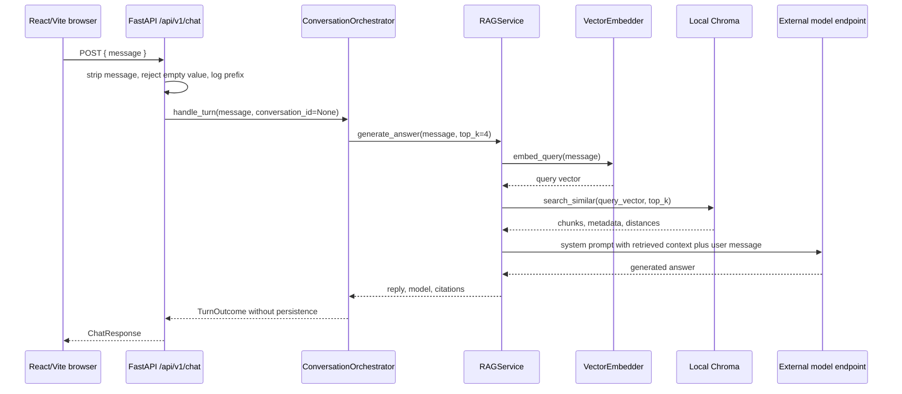
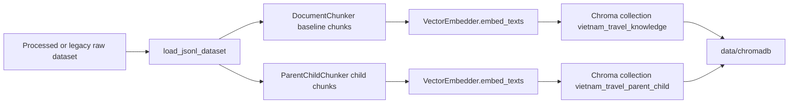

# Current-state Architecture

## Scope

This document records the implemented Travel Agent architecture at the current
repository state. It is an evidence-backed baseline for an early RAG prototype,
not a target design and not a production-readiness claim.

Use this document when a future package needs to compare proposed work against
what exists today. Use [Target-state Architecture](target-state.md) for the
approved direction and [Data Model](data-model.md) for the conceptual target
entities.

## Evidence Basis

Codebase Memory was checked at Verify tier for the source paths cited here.
The graph project was
`Users-tnhatnguyendev2805-Documents-Projects-travel-agent`; the refreshed
coverage generation was `2026-08-31T03:52:54Z`. The graph reported 713 nodes
and 1860 edges. Coverage for cited material paths returned
`no_recorded_issue` and `metadata_match`.

Coverage is a best-effort signal, not proof of semantic completeness. Exact
source and configuration files were also read directly. The index reported a
parse-partial range in `frontend/src/App.jsx` at line 76, but this document does
not rely on that file for material claims.

Material evidence paths:

| Path | Evidence used |
| --- | --- |
| [`../../backend/app/main.py`](../../backend/app/main.py) | FastAPI app setup, route mounting, CORS, startup RAG pre-warm behavior |
| [`../../backend/app/api/health.py`](../../backend/app/api/health.py) | `/health` response shape |
| [`../../backend/app/api/chat.py`](../../backend/app/api/chat.py) | Chat route validation, logging, process-global RAG service, `top_k=4` call |
| [`../../backend/app/schemas/chat.py`](../../backend/app/schemas/chat.py) | Current request and response schemas |
| [`../../frontend/src/services/api.js`](../../frontend/src/services/api.js) | Browser API origin and chat payload |
| [`../../backend/rag/generation/rag_service.py`](../../backend/rag/generation/rag_service.py) | RAG answer generation, prompt assembly, external model call |
| [`../../backend/rag/embedding/embedder.py`](../../backend/rag/embedding/embedder.py) | Embedding model, lazy load, deterministic fallback |
| [`../../backend/rag/retrieval/vector_store.py`](../../backend/rag/retrieval/vector_store.py) | Chroma persistence path, collection creation, add/search/count behavior |
| [`../../backend/rag/indexing.py`](../../backend/rag/indexing.py) | Offline indexing entry point and collections |
| [`../../backend/app/config.py`](../../backend/app/config.py) | Environment names, API prefix, model endpoint defaults |
| [`../../docker-compose.yml`](../../docker-compose.yml) | Local backend/frontend services, ports, bind mounts, env file, cache mount |
| [`../../backend/Dockerfile`](../../backend/Dockerfile) | Python 3.11 backend image and Uvicorn command |
| [`../../frontend/Dockerfile`](../../frontend/Dockerfile) | Node 18 frontend image and Vite command |
| [`../../frontend/package.json`](../../frontend/package.json) | Frontend development scripts and dependency names |
| [`../../.github/workflows/ci.yml`](../../.github/workflows/ci.yml) | CI commands and masked test failures |
| [`../../.env.example`](../../.env.example) | Empty example environment file |

## Runtime Components

| Component | Implemented responsibility | Evidence |
| --- | --- | --- |
| React/Vite client | Sends one chat `message` to the backend and returns response data to the UI caller | `frontend/src/services/api.js`, `frontend/package.json` |
| FastAPI application | Creates the application, configures local CORS, mounts `/health`, and mounts chat, workspace, and conversation routes under `/api/v1` | `backend/app/main.py` |
| Health route | Returns `status` and `service` metadata | `backend/app/api/health.py` |
| Chat route | Validates one stripped message, logs a prefix, delegates one turn to the conversation orchestrator, and returns typed response data with an optional `conversation` object | `backend/app/api/chat.py`, `backend/app/schemas/chat.py` |
| Workspace routes | Create, retrieve, and list local trip workspace records through the workspace service; construct no RAG, embedding, Chroma, or model-provider dependency | `backend/app/api/workspaces.py`, `backend/app/schemas/workspaces.py` |
| Conversation routes | Create, retrieve, and list conversations, append messages, and read paged history through the conversation service; enforce the public role restriction; construct no RAG, embedding, Chroma, or model-provider dependency | `backend/app/api/conversations.py`, `backend/app/schemas/conversations.py` |
| Workspace contracts and service | Own `TripWorkspace` value objects, planning/retention vocabularies, validation, server-generated `tw_` identity, UTC timestamps, and the storage interface | `backend/workspaces/models.py`, `backend/workspaces/service.py`, `backend/workspaces/repository.py` |
| Conversation contracts and service | Own `Conversation` and `Message` value objects, the role, source, trace-visibility and retention vocabularies, validation, server-generated `cv_` and `ms_` identity, UTC timestamps, workspace existence checks, cursor resolution, and the storage interface | `backend/conversations/models.py`, `backend/conversations/service.py`, `backend/conversations/repository.py` |
| Conversation orchestrator | Persists the user turn before generation, calls the injected RAG facade, persists the assistant turn, and reports the persistence outcome | `backend/orchestration/conversation_orchestrator.py` |
| Shared schema registry | Owns the `PRAGMA user_version` store marker and the `schema_versions` table, registers or verifies one module's version, and fails closed on unknown ownership or an unsupported version | `backend/storage/schema_registry.py` |
| Local SQLite workspace store | Registers `('workspaces', 1)` through the shared registry, persists and reads workspace records at `APP_DB_PATH`, and fails closed on an incompatible recorded version | `backend/workspaces/sqlite_repository.py` |
| Local SQLite conversation store | Registers `('conversations', 1)` through the shared registry, allocates `sequence` and bumps the parent `updated_at` inside one `BEGIN IMMEDIATE` transaction, and fails closed on a stored row outside the contract | `backend/conversations/sqlite_repository.py` |
| RAG generation service | Embeds the user message, retrieves Chroma context, builds the prompt, calls the configured external model endpoint, and formats citations | `backend/rag/generation/rag_service.py` |
| Vector embedder | Lazily loads `BAAI/bge-m3` through sentence-transformers when available, or returns deterministic 1024-dimensional fallback vectors | `backend/rag/embedding/embedder.py` |
| Chroma vector store | Creates or opens a persistent local Chroma collection, upserts baseline or parent-child chunks, searches by query embedding, and counts records | `backend/rag/retrieval/vector_store.py` |
| Offline indexing script | Loads travel datasets, chunks documents, embeds text, and upserts baseline and parent-child collections | `backend/rag/indexing.py` |
| Docker Compose stack | Defines local backend and frontend services only | `docker-compose.yml` |
| External model endpoint | Receives chat-completions calls through an OpenAI-compatible client configured by backend settings | `backend/app/config.py`, `backend/rag/generation/rag_service.py` |

## Online Chat Flow



The browser posts to `${VITE_API_URL}/api/v1/chat`; the default origin is
`http://localhost:8000`. The backend strips the incoming message, rejects empty
content, and since `R4` delegates the turn to
`ConversationOrchestrator.handle_turn`, which calls
`RAGService.generate_answer(user_message, top_k=4)`.

This is the unbound path, which is what the browser still sends. It resolves no
conversation storage and performs no persistence, so it does not create the local
database file and carries no storage failure mode.

Codebase Memory trace evidence found `chat_endpoint` calling `get_rag_service`,
`RAGService.generate_answer`, and `ChatResponse`. It found `generate_answer`
calling `VectorEmbedder.embed_query`, `ChromaVectorStore.search_similar`, and
`_get_llm_client`.

## Current Request and Response Contracts

The current public chat request contains one required field:

```json
{
  "message": "Chao ban, Ha Noi co gi dep?"
}
```

The current response contains:

```json
{
  "reply": "assistant answer",
  "model": "gpt-4o-mini",
  "citations": [
    {
      "title": "source title",
      "url": "source URL"
    }
  ]
}
```

There is no implemented user identifier, trip workspace identifier, memory
identifier, planner command, or evaluation run identifier in this bounded request
contract. Since `R4` the request additionally accepts an optional
`conversation_id`, and the response then carries an additive `conversation`
object; both are documented under
[Implemented Conversation Contracts](#implemented-conversation-contracts).

## Implemented Workspace Contracts

Milestone `R3` adds three backend-only workspace routes beside chat. The chat
contract above is unchanged: it accepts no `workspace_id` and performs no
workspace lookup.

| Route | Behavior |
| --- | --- |
| `POST /api/v1/workspaces` | Returns `201` with the created record; invalid input returns `422` and writes nothing |
| `GET /api/v1/workspaces/{workspace_id}` | Returns the record, or `404` when absent |
| `GET /api/v1/workspaces?owner_user_id=<value>` | Returns `{"workspaces": [...]}` for one owner scope label |

The implemented `TripWorkspace` record contains:

```json
{
  "workspace_id": "tw_2f8a1c",
  "owner_user_id": "local-user",
  "title": "Da Nang family trip",
  "destination_scope": "Da Nang and Hoi An",
  "date_window": { "start_date": "2026-12-20", "end_date": "2026-12-25" },
  "planning_status": "idea",
  "retention_state": "active",
  "created_at": "2026-09-03T00:00:00Z",
  "updated_at": "2026-09-03T00:00:00Z"
}
```

Implemented rules:

1. `workspace_id` is server-generated with the prefix `tw_` and is never accepted
   from caller input.
2. `owner_user_id` and `title` are required and trimmed; `title` is at most 120
   characters.
3. `destination_scope` is optional, trimmed when present, and at most 160
   characters; a blank value normalizes to absent.
4. `date_window` bounds are individually optional, but `end_date` must not precede
   `start_date`.
5. `planning_status` is one of `idea`, `planning`, `booked`, `active`,
   `completed`, `cancelled`, `archived`, defaulting to `idea`.
6. `retention_state` vocabulary is `active`, `archived`, `deletion_requested`,
   `deleted`; `R3` creates `active` records only and implements no transition.
7. Timestamps are server-generated timezone-aware UTC values.
8. List ordering is `updated_at` descending, then `created_at` descending, then
   `workspace_id` ascending.

Implemented module boundary:

```text
FastAPI workspace routes -> WorkspaceService -> WorkspaceRepository interface
                                             -> SQLiteWorkspaceRepository
```

`sqlite3`, table DDL, database path creation, and connection management appear
only in `backend/storage/schema_registry.py`,
`backend/workspaces/sqlite_repository.py`, and
`backend/conversations/sqlite_repository.py`. Since `R4` the workspace adapter
records `('workspaces', 1)` in the shared `schema_versions` table instead of in
`PRAGMA user_version`, and fails closed with a controlled error when the recorded
version differs or the file carries an unrecognized store marker. `backend/rag`
imports no workspace module, and workspace routes construct no embedder, Chroma
collection, or model-provider client.

`owner_user_id` is a local development scope label. It is not authentication,
authorization, a verified principal, or tenant isolation.

## Implemented Conversation Contracts

Milestone `R4` adds five backend-only conversation routes beside chat and
workspaces, and makes `conversation_id` optional on the chat request. Every R3
workspace route and the unbound chat contract are unchanged.

| Route | Behavior |
| --- | --- |
| `POST /api/v1/workspaces/{workspace_id}/conversations` | Returns `201` with the created record; a missing workspace returns `404`; invalid input returns `422` and writes nothing |
| `GET /api/v1/workspaces/{workspace_id}/conversations` | Returns `{"conversations": [...]}` scoped to that workspace; a missing workspace returns `404` |
| `GET /api/v1/conversations/{conversation_id}` | Returns the record, or `404` when absent |
| `POST /api/v1/conversations/{conversation_id}/messages` | Returns `201` with the server-assigned `sequence`; a restricted role returns `422`; a missing conversation returns `404` |
| `GET /api/v1/conversations/{conversation_id}/messages` | Returns `{"messages": [...], "next_cursor": ...}` in `sequence` ascending order |

The implemented `Conversation` and `Message` records contain:

```json
{
  "conversation_id": "cv_9d21ab",
  "workspace_id": "tw_2f8a1c",
  "title": "Da Nang food plan",
  "retention_state": "active",
  "created_at": "2026-09-04T00:00:00Z",
  "updated_at": "2026-09-04T00:00:00Z"
}
```

```json
{
  "message_id": "ms_4c77de",
  "conversation_id": "cv_9d21ab",
  "sequence": 1,
  "role": "user",
  "content": "Nen di Da Nang vao thang may?",
  "source": "ui",
  "trace_visibility": "excluded",
  "created_at": "2026-09-04T00:00:00Z"
}
```

Implemented rules:

1. `conversation_id` and `message_id` are server-generated with the prefixes `cv_`
   and `ms_` and are never accepted from caller input.
2. `workspace_id` is required and must reference an existing workspace at creation
   time. Conversations carry no owner field and inherit scope from that workspace.
3. `title` is optional, trimmed, at most 120 characters, and a blank value
   normalizes to absent.
4. `content` is required and trimmed non-empty, and deliberately has no maximum
   length, because the chat route already accepts an unbounded `message`.
5. `role` vocabulary is `user`, `assistant`, `tool`, `system_event`; the public
   append route accepts only `user` and `system_event`.
6. `source` vocabulary is `ui`, `tool`, `model`, `system`, `import`, defaulting to
   `ui`; the orchestrator writes `model` for assistant turns.
7. `trace_visibility` vocabulary is `excluded`, `included`, defaulting to
   `excluded`, so no stored message becomes evaluation input by default.
8. Conversation `retention_state` vocabulary is `active`, `summarized`,
   `archived`, `deletion_requested`, `deleted`; `R4` creates `active` records only
   and implements no transition. Messages carry no retention state of their own.
9. `sequence` starts at `1` per conversation, increments independently per
   conversation, is unique per conversation, and is assigned by the adapter inside
   the write transaction.
10. Appending a message advances the parent conversation's `updated_at` in the same
    transaction; a failed insert leaves it unchanged.
11. Timestamps are server-generated timezone-aware UTC values.
12. Conversation list ordering is `updated_at` descending, then `created_at`
    descending, then `conversation_id` ascending, excluding `deleted` records.
    Message ordering is `sequence` ascending, which is transcript reading order.
13. History `limit` defaults to `50` and is capped at `200`. `next_cursor` is the
    last returned `message_id` when the page was full and `null` otherwise. An
    unknown cursor, or one belonging to another conversation, returns `422`.

Implemented module boundary:

```text
FastAPI conversation routes -> ConversationService -> ConversationRepository interface
                                                   -> SQLiteConversationRepository
                                                   -> shared schema registry
                               ConversationService -> WorkspaceRepository interface

FastAPI chat route -> ConversationOrchestrator -> ConversationService
                                               -> injected RAG facade
```

The conversation service and the orchestrator hold no SQL and no HTTP concern. The
service reaches the workspace interface for existence checks only, under
`TYPE_CHECKING` at import level, so the conversation runtime graph contains no
workspace adapter and no `sqlite3`. `backend/rag`, the evaluation modules, and
`backend/workspaces` import no conversation or orchestration module.

Shared store and per-module registry:

```sql
schema_versions(module TEXT PRIMARY KEY, version INTEGER NOT NULL)
```

One local SQLite file at `APP_DB_PATH` holds `trip_workspaces`, `conversations`,
and `messages`. Each module records its own version, so a second module no longer
contends for the single `PRAGMA user_version` slot. The pragma instead carries the
store marker `1000`, which a pre-R4 build reads as neither `0` nor its expected
`1`, so an older build refuses the file rather than writing into a schema it does
not understand.

These routes are unauthenticated and must not be exposed publicly. `R4` claims no
cross-user or cross-workspace isolation beyond deterministic repository filtering.
Message `content` is stored, never logged, and never returned in an error body.

## RAG Module Shape

`RAGService` currently owns several responsibilities behind one method:

1. Normalize and validate user text.
2. Read the configured model name.
3. Embed the query through `VectorEmbedder`.
4. Retrieve similar chunks from `ChromaVectorStore`.
5. Build a context string and citation map.
6. Construct the Vietnamese system prompt.
7. Create an OpenAI-compatible client from `GITHUB_TOKEN` and
   `GITHUB_MODELS_URL`.
8. Call chat completions with `temperature=0.7` and `max_tokens=800`.
9. Return `reply`, `model`, and `citations`.

This is acceptable for a prototype baseline, but it is not yet split into the
target modules for orchestration, memory, knowledge retrieval, planning,
generation, and evaluation trace.

## Offline Data Preparation

Offline indexing is implemented as an opt-in script in `backend/rag/indexing.py`.
It is not part of the default Stage A startup path.



The script resolves processed dataset paths first and falls back to legacy
paths. It may read travel data, load or download the embedding model through
the configured environment, and mutate persistent Chroma state under
`data/chromadb`.

## Local Runtime and Configuration

| Concern | Current configuration |
| --- | --- |
| Backend runtime | `backend/Dockerfile` uses `python:3.11-slim` and starts `uvicorn backend.app.main:app --host 0.0.0.0 --port 8000` |
| Frontend runtime | `frontend/Dockerfile` uses `node:18-alpine` and starts `npm run dev -- --host 0.0.0.0` |
| Backend port | Docker Compose maps `8000:8000` |
| Frontend port | Docker Compose maps `5173:5173` |
| Backend environment file | Docker Compose references `.env` |
| Frontend API origin | Docker Compose sets `VITE_API_URL=http://localhost:8000` |
| Model credential name | `GITHUB_TOKEN` |
| Model name | `LLM_MODEL`, defaulting to `gpt-4o-mini` |
| Model endpoint URL | `https://models.inference.ai.azure.com` |
| Example environment file | `.env.example` is empty in this repository state |

`backend/app/main.py` allows CORS origins `http://localhost:5173`,
`http://127.0.0.1:5173`, and `*`.

## Current Data and Persistence

| Store | Current behavior | Limitation |
| --- | --- | --- |
| Chroma vector store | `ChromaVectorStore` creates or opens collections under `data/chromadb` by default | Stores travel knowledge vectors, not user or trip memory |
| Local application SQLite store | `SQLiteWorkspaceRepository` and `SQLiteConversationRepository` share one file at `APP_DB_PATH`, defaulting to `data/app/travel_agent.sqlite3`, registering `('workspaces', 1)` and `('conversations', 1)` through the shared schema registry | Local development adapter per ADR 0003 and ADR 0004; settles no production database, migration, backup, restore, concurrency, retention, or deletion policy |
| Hugging Face cache | Docker Compose mounts `~/.cache/huggingface` into the backend container | Cache state is local development infrastructure |
| Travel datasets | Indexing reads processed paths or legacy fallback paths | Dataset quality and freshness are not established by Package 3 |
| Application environment | Backend loads `.env` if present | `.env.example` is empty and no secret values are documented |

There is no implemented user profile store, memory store, planner state store, or
evaluation trace store in the bounded online architecture. The shared local store
holds trip container records, conversations, and messages only. No conversation or
message record is written to Chroma or any vector database.

## Current Tests and Verification Signals

Package 2 recorded the most recent development verification state:

1. Stage A Docker startup and `/health` passed in an escalated local shell.
2. The frontend production build passed.
3. Frontend lint failed because ESLint configuration was missing.
4. Frontend tests failed because `jsdom` was missing and Vitest hit sandbox
   port-binding limits.
5. CI contains shell fallbacks that can mask backend or frontend test failures.

These signals do not prove RAG answer quality, memory quality, planner
correctness, production readiness, privacy guarantees, or complete test health.

## Current Gaps and Risks

Current gaps:

1. No implemented memory read path.
2. No implemented memory write path.
3. No implemented user identity or authentication; workspace and conversation
   routes are unauthenticated and `owner_user_id` is a local scope label only.
4. No implemented conversation summarization: `summary` has no column and no
   producer.
5. No implemented planner module or itinerary state.
6. No implemented evaluation trace write in the bounded chat route.
7. No workspace-aware chat: the chat route performs no workspace lookup and
   accepts no `workspace_id`. It binds a turn to a conversation only when the
   caller supplies `conversation_id`.
8. No workspace update, archive, deletion, tombstoning, sharing, search, or
   pagination behavior, and no workspace UI.
9. No deletion, edit, redaction, export, or full-text search path for
   conversations or messages, and no retention transition producer.
10. No frontend work: the browser still holds its visible transcript in volatile
    React state, so real browser traffic is not persisted.
11. No request body size limit, and message `content` is deliberately unbounded.
12. No approved production storage decision for relational data, vector data, or
    trace data; local SQLite is a development adapter only, with no concurrency
    safety beyond a single local process.
13. Travel knowledge retrieval and prompt assembly are coupled inside
    `RAGService.generate_answer`.
14. Local CORS is permissive.
15. The chat route logs a prefix of the user message. `R4` neither extended nor
    removed that behavior.
16. Production security, privacy, tenant isolation, SLOs, and deployment
    topology are not established by this prototype.

## Compatibility Baseline

Future runtime work must preserve these current facts unless a separately
approved spec changes them:

1. Stage A health inspection remains `GET /health`.
2. The current chat route remains `POST /api/v1/chat`.
3. The chat request requires `message` and accepts one optional additive
   `conversation_id`.
4. The chat response remains `reply`, `model`, and `citations`, plus a
   `conversation` object that is absent, not null, unless the caller opted in.
5. Chroma remains the current local travel-knowledge vector store, and no
   conversation or message record is written to it.
6. `GITHUB_TOKEN`, `LLM_MODEL`, `VITE_API_URL`, and `APP_DB_PATH` remain the
   documented environment names, with `WORKSPACE_DB_PATH` retained only as a
   deprecated alias.
7. Offline indexing remains opt-in and state-changing.
8. Workspace identity remains a server-generated `tw_`-prefixed string;
   conversation identity `cv_` and message identity `ms_`.
9. The workspace and conversation list responses remain `{"workspaces": [...]}`
   and `{"conversations": [...]}` objects rather than bare arrays, and message
   history remains `{"messages": [...], "next_cursor": ...}`.
10. SQLite access remains confined to the shared schema registry and the two
    repository adapters, `PRAGMA user_version` remains confined to the registry,
    and RAG and evaluation modules continue to import no workspace, conversation,
    or orchestration module.
11. Message `sequence` remains a stored server-assigned integer starting at `1`
    per conversation, never supplied by a caller.
