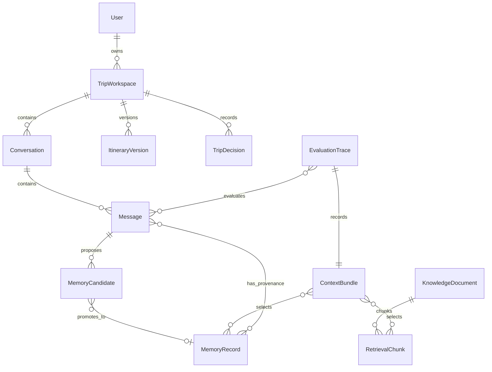

# Data Model

## Scope

This document defines the conceptual target model for Travel Agent. It is not a
physical database schema, migration plan, ORM model, API contract, or storage
vendor decision.

Use [Current-state Architecture](current-state.md) for implemented contracts
and [Target-state Architecture](target-state.md) for target modules and flows.
Physical storage ownership is deferred to ADRs.

## Current Implemented Contracts

The current implemented chat request contains only:

```json
{
  "message": "Chao ban, Ha Noi co gi dep?"
}
```

The current implemented chat response contains:

```json
{
  "reply": "assistant answer",
  "model": "gpt-4o-mini",
  "citations": [
    {
      "title": "source title",
      "url": "source URL"
    }
  ]
}
```

No implemented request or response field currently carries user, trip
workspace, conversation, memory, planner, or evaluation trace identifiers.

## Target Entity Overview

| Entity | Purpose | Scope |
| --- | --- | --- |
| User | Stable identity for a traveler and user-scoped preference memory | User |
| TripWorkspace | Product container for one planned trip. Partially implemented in `R3`; see [Implemented TripWorkspace Fields](#implemented-tripworkspace-fields-r3) | Trip workspace |
| Conversation | Ordered dialogue inside a workspace | Conversation |
| Message | User, assistant, tool, or system-visible event content | Conversation |
| ItineraryVersion | Structured snapshot of a proposed or accepted plan | Trip workspace |
| TripDecision | Accepted, rejected, or pending planning decision | Trip workspace |
| MemoryRecord | Durable remembered fact, preference, constraint, or episode | User, trip workspace, conversation, or evaluation run |
| MemoryCandidate | Proposed memory before policy promotion | Message or planner event |
| KnowledgeDocument | Source travel content before chunking | Global knowledge |
| RetrievalChunk | Searchable travel knowledge unit | Global knowledge |
| ContextBundle | Per-turn selected workspace state, memories, retrieval items, and planner context | Evaluation run |
| EvaluationTrace | Reproducible evidence for a request, response, selected context, scores, and failures | Evaluation run |

Every entity except `TripWorkspace` remains fully conceptual. `TripWorkspace` has
a bounded implemented subset from milestone `R3`; all other entities, including
every relationship that connects them to `TripWorkspace`, are still target
direction.

## Relationship Map



Core relationships:

| Relationship | Meaning |
| --- | --- |
| User to TripWorkspace | One user can own many trip workspaces |
| TripWorkspace to Conversation | A workspace can contain many planning conversations |
| Conversation to Message | A conversation contains ordered messages |
| Message to MemoryCandidate | Messages can propose memory candidates |
| MemoryCandidate to MemoryRecord | A candidate can be accepted into durable memory |
| MemoryRecord to Message | Durable memory keeps provenance back to source messages or explicit edits |
| EvaluationTrace to ContextBundle | A trace records exactly what context was selected for a run |

## User and Workspace Records

### User

Conceptual fields:

| Field | Purpose |
| --- | --- |
| `user_id` | Stable identifier for one traveler |
| `display_name` | Optional user-facing name |
| `created_at` | Creation timestamp |
| `updated_at` | Last update timestamp |
| `retention_state` | Active, deletion requested, deleted, or archived |

### TripWorkspace

Conceptual fields:

| Field | Purpose |
| --- | --- |
| `workspace_id` | Stable identifier for one planned trip |
| `owner_user_id` | User that owns the workspace |
| `title` | User-facing workspace name |
| `destination_scope` | Destination or region under planning |
| `date_window` | Planned or tentative travel dates |
| `planning_status` | Idea, planning, booked, active, completed, cancelled, or archived |
| `created_at` | Creation timestamp |
| `updated_at` | Last update timestamp |
| `retention_state` | Active, archived, deletion requested, deleted |

Package 3 does not define collaboration membership or authorization rules.

#### Implemented TripWorkspace Fields (R3)

Milestone `R3` implements this entity as a local backend record. Every field above
exists at runtime, with these implemented constraints:

| Field | Implemented rule |
| --- | --- |
| `workspace_id` | Server-generated opaque string prefixed `tw_`; never accepted from caller input |
| `owner_user_id` | Required, trimmed, non-empty. A local development scope label only, not a `User` foreign key, authentication, authorization, or tenant isolation |
| `title` | Required, trimmed, non-empty, at most 120 characters |
| `destination_scope` | Optional, trimmed when present, at most 160 characters; blank normalizes to absent |
| `date_window` | Optional `start_date` and `end_date` ISO dates, each independently optional; `end_date` must not precede `start_date` |
| `planning_status` | `idea`, `planning`, `booked`, `active`, `completed`, `cancelled`, `archived`; defaults to `idea` |
| `retention_state` | Vocabulary is `active`, `archived`, `deletion_requested`, `deleted`; `R3` creates `active` records only and implements no transition |
| `created_at`, `updated_at` | Server-generated timezone-aware UTC timestamps |

The `User` entity is not implemented, so `owner_user_id` currently references no
stored user record. Conversations, itinerary versions, trip decisions, memory
records, context bundles, and evaluation traces are not implemented and do not yet
reference `workspace_id`. `R3` implements creation and inspection only; update,
archive, deletion, and tombstoning require a later approved design because they
affect privacy, retention, and recovery semantics.

Physical storage for `R3` is a local SQLite file behind a repository interface per
ADR 0003. That remains a local development adapter, not the production storage
decision deferred in [Deferred Physical Storage Decisions](#deferred-physical-storage-decisions).

## Conversation and Message Records

### Conversation

Conceptual fields:

| Field | Purpose |
| --- | --- |
| `conversation_id` | Stable identifier for one dialogue |
| `workspace_id` | Parent trip workspace |
| `title` | Optional summary label |
| `summary` | Rolling faithful summary for local continuity |
| `created_at` | Creation timestamp |
| `updated_at` | Last update timestamp |

### Message

Conceptual fields:

| Field | Purpose |
| --- | --- |
| `message_id` | Stable identifier for one event |
| `conversation_id` | Parent conversation |
| `role` | User, assistant, tool, or system-visible event |
| `content` | Message content or event payload |
| `created_at` | Creation timestamp |
| `source` | UI, tool, model, system, or import |
| `trace_visibility` | Whether the message can be used in evaluation traces |

Message content may be sensitive. Later implementation must define redaction
and retention behavior before production privacy claims are made.

## Trip Planning Records

### ItineraryVersion

Conceptual fields:

| Field | Purpose |
| --- | --- |
| `itinerary_version_id` | Stable identifier for one itinerary snapshot |
| `workspace_id` | Parent workspace |
| `version_number` | Monotonic version within the workspace |
| `status` | Draft, proposed, accepted, superseded, or archived |
| `items` | Structured destinations, activities, lodging, transport, and notes |
| `created_from_message_id` | Message or planner event that caused the version |
| `created_at` | Creation timestamp |

### TripDecision

Conceptual fields:

| Field | Purpose |
| --- | --- |
| `decision_id` | Stable identifier for one planning decision |
| `workspace_id` | Parent workspace |
| `decision_type` | Preference, constraint, booking, rejection, tradeoff, or open question |
| `status` | Pending, accepted, rejected, changed, or superseded |
| `content` | Decision statement |
| `reason` | User-provided or inferred rationale |
| `source_message_id` | Provenance message when available |
| `created_at` | Creation timestamp |
| `updated_at` | Last update timestamp |

Rejected options are first-class decision evidence because they help future
planning avoid repeated bad suggestions.

## Memory Records

`MemoryRecord` is a durable remembered item accepted by memory policy.

Required conceptual fields:

| Field | Purpose |
| --- | --- |
| `memory_id` | Stable identifier |
| `scope` | User, trip workspace, conversation, global knowledge, or evaluation run |
| `scope_id` | Identifier for the scoped owner when applicable |
| `memory_type` | Preference, constraint, profile fact, episode, decision, correction, or safety note |
| `normalized_content` | Canonical remembered statement |
| `original_content` | Optional source wording |
| `provenance` | Source messages, user edits, planner events, or imports |
| `confidence` | Numeric or categorical confidence |
| `source_type` | Explicit user statement, inferred, correction, tool output, or import |
| `created_at` | Creation timestamp |
| `updated_at` | Last update timestamp |
| `last_used_at` | Last context selection time |
| `retention_state` | Active, expired, archived, deletion requested, deleted |
| `deletion_state` | None, tombstoned, redacted, hard deleted |

Memory records must be inspectable, correctable, and deletable by policy before
the product can make production memory or privacy claims.

## Memory Candidate Records

`MemoryCandidate` is a proposed memory before promotion to a durable
`MemoryRecord`.

Conceptual fields:

| Field | Purpose |
| --- | --- |
| `candidate_id` | Stable identifier |
| `source_message_id` | Message that produced the candidate |
| `workspace_id` | Workspace context when available |
| `proposed_scope` | Proposed memory scope |
| `proposed_type` | Proposed memory type |
| `proposed_content` | Candidate remembered statement |
| `sensitivity_label` | None, personal, sensitive, secret, or unsafe |
| `usefulness_label` | Low, medium, or high |
| `confidence` | Extraction confidence |
| `policy_decision` | Accepted, rejected, needs user action, or pending |
| `policy_reason` | Reason for decision |
| `created_at` | Creation timestamp |

Candidate records are evaluation evidence. Rejected candidates can be useful for
debugging memory extraction quality.

## Knowledge and Retrieval Records

### KnowledgeDocument

Conceptual fields:

| Field | Purpose |
| --- | --- |
| `document_id` | Stable source document identifier |
| `title` | Source title |
| `url` | Source URL when available |
| `language` | Document language |
| `source_type` | Travel guide, crawled page, imported file, or curated note |
| `content_hash` | Change detection and deduplication |
| `ingested_at` | Ingestion timestamp |

### RetrievalChunk

Conceptual fields:

| Field | Purpose |
| --- | --- |
| `chunk_id` | Stable searchable unit identifier |
| `document_id` | Parent source document |
| `parent_id` | Parent chunk or section when using parent-child retrieval |
| `retrieval_text` | Text embedded for search |
| `source_text` | Text shown to model or user when different from retrieval text |
| `heading_path` | Section path |
| `metadata` | Title, URL, language, word count, and source metadata |
| `embedding_model` | Embedding model used |
| `indexed_at` | Index timestamp |

Knowledge retrieval remains separate from user and trip memory. Travel content
is untrusted data even when it is useful context.

## Context Bundle Records

`ContextBundle` is the per-turn input assembled for generation and evaluation.

Conceptual fields:

| Field | Purpose |
| --- | --- |
| `context_bundle_id` | Stable identifier |
| `workspace_id` | Workspace context when available |
| `conversation_id` | Conversation context when available |
| `message_id` | Triggering message |
| `selected_memory_ids` | Memory records selected for the turn |
| `selected_chunk_ids` | Retrieval chunks selected for the turn |
| `itinerary_version_id` | Active itinerary slice when available |
| `selection_reasons` | Why each item was included |
| `token_estimate` | Estimated prompt tokens |
| `created_at` | Creation timestamp |

The bundle is the seam between retrieval or memory modules and generation. It
lets tests and evaluation inspect what the model actually saw.

## Evaluation Trace Records

`EvaluationTrace` captures reproducible quality evidence for one request, run,
or experiment.

Conceptual fields:

| Field | Purpose |
| --- | --- |
| `trace_id` | Stable identifier |
| `run_id` | Evaluation or runtime run identifier |
| `workspace_id` | Workspace context when available |
| `conversation_id` | Conversation context when available |
| `message_id` | Triggering message |
| `context_bundle_id` | Selected context |
| `model_name` | Generation model used |
| `response_message_id` | Assistant output when persisted |
| `planner_operation_ids` | Planner changes proposed or applied |
| `scores` | Groundedness, relevance, personalization, privacy, or custom metrics |
| `failure_labels` | Retrieval miss, bad memory, hallucination, conflict, privacy issue, or tool failure |
| `created_at` | Trace timestamp |

Package 5 will define concrete evaluation datasets, scoring rubrics, and gates.

## Lifecycle and Retention States

Recommended lifecycle vocabulary:

| Object | States |
| --- | --- |
| TripWorkspace | Idea, planning, booked, active, completed, cancelled, archived, deletion requested, deleted |
| Conversation | Active, summarized, archived, deletion requested, deleted |
| ItineraryVersion | Draft, proposed, accepted, superseded, archived |
| TripDecision | Pending, accepted, rejected, changed, superseded |
| MemoryCandidate | Pending, accepted, rejected, needs user action, expired |
| MemoryRecord | Active, superseded, expired, archived, deletion requested, deleted |
| EvaluationTrace | Active, sampled, archived, deletion requested, deleted |

The exact retention duration for each state is deferred to future security,
privacy, and operations work.

## Privacy and Deletion Semantics

Target semantics:

1. User-scoped and trip-scoped memory must be deletable or tombstoned according
   to approved policy.
2. Explicit user correction supersedes inferred memory.
3. Deletion state must prevent deleted memories from future context selection.
4. Trace retention must avoid keeping raw secrets or unnecessary sensitive data.
5. Travel knowledge deletion follows dataset lifecycle, not user memory policy,
   unless a source contains user-provided personal data.
6. Memory provenance should be retained only as long as allowed by the approved
   retention policy.

Package 3 does not define final legal or security policy.

## Compatibility With Current Chat

The conceptual model must coexist with the current chat contract during staged
migration:

1. Existing `POST /api/v1/chat` continues to accept `message` only until a
   separately approved runtime spec changes it.
2. New workspace-aware request schemas must be added through future approved
   specs. Milestone `R3` added `/api/v1/workspaces` routes beside chat without
   changing the chat contract, and its list response is a
   `{"workspaces": [...]}` object rather than a bare array.
3. Evaluation traces must be able to compare baseline RAG behavior against
   memory-aware behavior.
4. Current `reply`, `model`, and `citations` response fields remain the
   compatibility baseline unless changed by a future approved spec.
5. The implemented `R3` workspace field names, planning and retention
   vocabularies, `tw_` identity prefix, and list ordering are now a compatibility
   baseline. Changing them requires a new approved spec, and replacing the local
   SQLite adapter requires a new or superseding ADR for ADR 0003.

## Deferred Physical Storage Decisions

Physical storage ownership is deferred to ADRs. Package 3 does not choose:

1. The relational database or ORM.
2. The vector database for user memories.
3. Whether travel knowledge and memory embeddings share infrastructure.
4. The trace store or analytics warehouse.
5. Blob storage for imported files.
6. Migration tooling.
7. Backup, restore, or deletion implementation.

The target model is intentionally vendor-neutral so future ADRs can compare
storage options with clear entity ownership and rollback implications.
