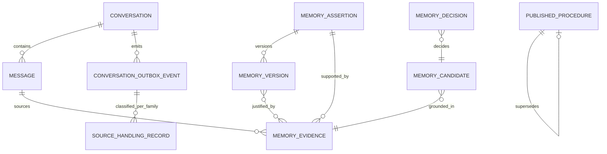

# Data Model

## Scope

This document owns the **conceptual target model** for the approved Chat-first
Agent Memory architecture. It defines entities, relationships, lifecycle and
isolation concepts. It is not a physical PostgreSQL schema, migration file, ORM
contract, or public API schema.

Canonical design authority is [Agent Memory Target Architecture](../specs/2026-09-12-agent-memory-target-architecture-design.md) v0.2 with ADRs 0036–0040 and the approved implementation plan v0.5.

Use [Current-state Architecture](current-state.md) for implemented tables and
runtime behavior and [Target-state Architecture](target-state.md) for component
and flow boundaries.

## Product and Ownership Model

The active/future product boundary is authenticated standalone Chat, not
`TripWorkspace`.

| Concept | Meaning |
| --- | --- |
| Authenticated principal | Request-time identity that supplies `owner_user_id`; never accepted from a user-data payload |
| Conversation | Standalone dialogue owned directly by one authenticated owner |
| Message | Ordered persisted user/assistant event inside a conversation |
| Conversation outbox event | Transactional source event released only after the relevant turn is terminal |
| Tenant Memory | User-derived Semantic, Episodic, or Working Memory isolated by owner and governed scope |
| Procedural publication | System-owned versioned behavior/configuration outside tenant Memory scope/RLS |

There is no target `workspace_id` parent for Conversation or Memory.

## Target Entity Overview

| Entity | Purpose | Canonical/ephemeral |
| --- | --- | --- |
| Conversation | Owner-scoped dialogue and deletion fence | Canonical PostgreSQL |
| Message | Ordered persisted turn content/status/provenance | Canonical PostgreSQL |
| ConversationOutboxEvent | Async source handoff with lease/readiness state | Canonical PostgreSQL |
| DialogueState | Reconstructed referents/topic/goal for one turn | Ephemeral |
| TurnSemantics | Typed non-authoritative interpretation of current turn | Ephemeral/evaluation trace |
| ContextPlan | Whether the turn needs Memory, RAG, both, or neither | Ephemeral/evaluation trace |
| MemoryAssertion | Stable identity for one governed remembered proposition | Canonical PostgreSQL |
| MemoryVersion | Immutable normalized state and lifecycle version for an assertion | Canonical PostgreSQL |
| MemoryEvidence | Immutable provenance supporting or contradicting a candidate/assertion | Canonical PostgreSQL |
| MemoryCandidate | Proposed normalized Memory before governed consolidation/activation | Canonical PostgreSQL |
| MemoryDecision | Auditable policy/consolidation decision | Canonical PostgreSQL |
| SourceHandlingRecord | Positive family-specific routing outcome for one source/outbox event | Canonical PostgreSQL |
| MemoryWriteIdempotency | Stable semantic retry/result record | Canonical PostgreSQL |
| MemoryOutboxEvent | Downstream Memory work owned by the Memory pipeline | Canonical PostgreSQL |
| MemoryReadSelection | Eligible/relevant selected Memory for one response | Ephemeral/evaluation trace |
| PublishedProcedure | System-owned evaluated procedural version | Separate canonical publication state |

## Core Relationships



The relationship map is conceptual. Physical foreign keys and table layouts are
owned by migrations and repository contracts when their implementation stage is
executed.

## Memory Assertion Identity

An assertion groups versions of one semantic proposition under a stable identity.
The approved Stage-2 model keeps identity independent from the current value so
correction/supersession does not create unrelated assertions.

Conceptually the identity includes:

```text
owner
+ scope
+ semantic key
+ subject
+ condition
```

The exact encoded identifier remains an implementation contract. A value is
versioned state, not part of the stable assertion identity.

Each assertion also carries the suppression-generation boundary needed to make
forget/no-resurrection deterministic.

## Memory Version

A Memory version is immutable historical state. Representative target fields
include:

- assertion/version identity;
- normalized value;
- authority;
- scope;
- persisted retention mode;
- sensitivity;
- lifecycle status;
- suppression generation;
- optional `expires_at`;
- creation/supersession/revocation provenance;
- policy/schema version metadata needed for audit/replay.

A later correction creates a new version rather than rewriting the old version.

## Normalized Semantic Values

The approved first Semantic Memory slice uses a closed registry. In-process
normalized values are typed as:

```text
single-valued key -> string enum/member
set-valued key    -> non-empty sorted/deduplicated tuple of governed members
```

Set state is one immutable assertion-version snapshot, not a delimiter-joined
string and not one assertion per member.

Positive compatible evidence computes deterministic union. If the union is
unchanged, it reinforces the current version; if it grows, a new full snapshot
supersedes the previous version. Explicit correction/member-forget materializes
the desired full snapshot first. Removing the final member revokes the
assertion.

The initial `semantic-registry-v2` contains exactly eight P0 Travel Agent keys:

| Key | Cardinality |
| --- | --- |
| `travel.preference.hotel_atmosphere` | single |
| `travel.preference.accommodation_type` | set |
| `travel.preference.transport_mode` | set |
| `travel.preference.travel_pace` | single |
| `travel.preference.activity_style` | set |
| `travel.constraint.budget_level` | single |
| `travel.preference.food_style` | set |
| `travel.profile.default_departure_city` | single |

Allowed values are owned by the registry implementation/approved plan, not by
free-form model output.

## Memory Evidence

Evidence is immutable provenance used for formation, consolidation, activation,
source validity, and audit. It identifies its source message/conversation/outbox
and generation. Multiple processing attempts of the same source are not
independent evidence.

When a conversation/source is deleted or invalidated, evidence becomes
ineligible for source-dependent use without requiring every derived Memory row
to be physically deleted or rewritten.

Raw deleted-source text must not reappear through read, inspect, prompt, trace,
summary, projection, or citation.

## Memory Candidate and Decision

`MemoryCandidate` is a proposed normalized item, not durable truth. It must pass
registry, sensitivity, scope, generation, source-validity, and lifecycle policy
before a governed effect is proposed.

`MemoryDecision` records why a candidate/evidence relation produced an effect or
abstention. Representative relation vocabulary:

```text
new | duplicate | reinforcement | correction | contradiction |
temporary_exception | stale | unrelated | uncertain
```

Representative governed operations:

```text
ADD | REINFORCE | SUPERSEDE | ADD_EXCEPTION |
PENDING_CONFLICT | REJECT | NOOP | REVOKE
```

A model may classify unresolved semantic relations, but the deterministic
resolver owns the operation.

## SourceHandlingRecord

Background inference requires positive source authority. A source/outbox event
has one family-specific handling record keyed conceptually by:

```text
(source_outbox_id, memory_family)
```

Representative outcomes include:

```text
BACKGROUND_ELIGIBLE
EXPLICIT_APPLIED
EXPLICIT_REFUSED
EXPLICIT_NOOP
FORGET_APPLIED
FORGET_REFUSED
```

No record means `UNHANDLED`, never background permission.

## Memory Dimensions

These dimensions are intentionally independent:

### Authority

```text
EXPLICIT_SAVE
EXPLICIT_STATEMENT
REPEATED_INFERENCE
```

### Scope

```text
conversation
user
```

Procedural Memory is not a tenant scope.

### Retention

```text
CONVERSATION_BOUND
SOURCE_BOUND
USER_DURABLE
```

Retention is persisted when a version is written. Optional temporal expiry and
source validity are separate eligibility inputs.

### Lifecycle

At minimum:

```text
SHADOW / PENDING
ACTIVE
SUPERSEDED
REVOKED
REJECTED
EXPIRED (effective or persisted cleanup state)
```

`ACTIVE` does not imply readable or selected.

### Sensitivity

Registry/deterministic policy sets a floor. Model classification may only raise
that classification. Initial durable user Memory stores ordinary personal data
only; higher-risk classes remain no-store until separately approved.

## Forget, Suppression, and Re-remember

Product forget is represented by `REVOKE`/`REVOKED` plus an advanced assertion
suppression generation.

```text
generation 1 active
-> explicit forget
-> generation 1 revoked; suppression_generation = 2
-> delayed generation 1 candidate cannot form/activate/read
-> explicit re-remember may create current generation 2 state
```

Privacy erasure/deletion records are separate from product forget history.

## Conflict and Precedence

Equal-authority unresolved contradiction becomes non-answer-eligible pending
conflict rather than last-write-wins.

Answer-time precedence is:

```text
system/developer policy
> current user request
> verified hard constraints
> current conversation working state / temporary override
> user-scoped soft preference/profile
> episodic/summary context
```

A current-turn override may suppress soft durable Memory for one response
without mutating that durable Memory.

## Read/Use Projection

Canonical Memory state is filtered before answer-time selection:

```text
owner + scope
-> lifecycle/retention/source/suppression eligibility
-> relevance
-> precedence/conflict exclusion
-> bounded ranking/selection
```

The resulting `MemoryReadSelection` is projected into a structured generation
contract. It is not a citation and raw evidence is not automatically included.

Optional full-text/pgvector projections, when justified later, contain only
rebuildable retrieval aids and must revalidate canonical state before use.

## Memory Families

| Family | Target ownership | Target scope |
| --- | --- | --- |
| Semantic | Tenant/user-derived | user or conversation |
| Episodic | Tenant/user-derived | conversation; governed user generalization |
| Working | Tenant/user-derived | conversation |
| Procedural | System-owned publication | separate non-tenant boundary |

Each new tenant family must implement its own formation, retention,
consolidation, read/use, deletion, failure, and evaluation slice rather than
sharing a generic ungoverned Memory blob.

## Procedural Publication Model

Procedural Memory is versioned system-owned state produced through deterministic
validation, conclusive evaluation, and explicit publication authority. Ordinary
Chat and tenant Memory-worker credentials cannot publish it.

Runtime selects only the active approved procedure version. Rollback changes the
published version pointer/selection and never rewrites tenant Memory.

## Removed Historical Concepts

The following concepts are historical and must not be used as current target
entities:

- `TripWorkspace` as a required parent;
- Workspace-scoped `ItineraryVersion`/`TripDecision` Planner state;
- SQLite-backed application schema registries;
- generic legacy `MemoryRecord` as the complete Memory lifecycle model;
- public Memory Manager/control resources.

Historical specs/reports may still mention them as evidence of earlier stages.
