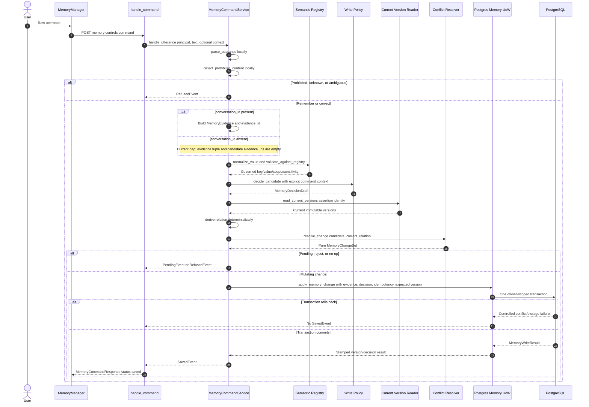

# Raw Input -> CodeGraph Flow

> **Cách đọc tài liệu:** bắt đầu từ Sections 2.1 và 3.6 để biết path nào
> thực sự được mount, sau đó đọc Sections 6.4 và 6.6 cho hai V2 Memory write
> flows. Diagram 1 là inventory của nhiều input boundaries, không phải một
> execution duy nhất. Diagram 2 chứa cả mounted behavior và capability branches
> nên phải đọc cùng truth-state labels bên dưới.

## 1. Phạm Vi Và Phương Pháp

Tài liệu này mô tả code đang có trong worktree:

```text
/Users/tnhatnguyendev2805/Documents/Projects/travel-agent/.worktrees/standalone-conversation
branch: feat/standalone-conversation-foundation
```

Ngày phân tích ban đầu: 2026-09-09. Kiểm chứng lại trên worktree ngày
2026-09-10 tại `HEAD a0f4874`; tài liệu cũng phản ánh các file chưa commit đang
hiện diện trong worktree tại thời điểm kiểm chứng. Vì vậy SHA một mình không đủ
để tái tạo toàn bộ trạng thái đã đọc.

Mục tiêu là trả lời chính xác hai câu hỏi:

1. Raw input đi vào hàm nào đầu tiên, sau đó đi qua những hàm/class/file nào trong từng nhánh.
2. Với raw input của user, từ lúc UI/API nhận input đến output hiện tại, toàn bộ quy trình và các case thành công/thất bại là gì.

Phương pháp:

- Dùng CodeGraph trên project index của `travel-agent` để tìm symbol, caller/callee và các call path chính.
- Đọc trực tiếp source trong worktree `standalone-conversation` để chốt behavior thực tế của branch này.
- Khi CodeGraph index và worktree khác branch, source trực tiếp trong worktree được dùng làm nguồn sự thật cuối cùng.
- Line range trong tài liệu là line range của source đã đọc trong worktree, không phải line range suy đoán từ tên file.

### Quy Ước Thuật Ngữ

| Thuật ngữ | Nghĩa trong tài liệu |
| --- | --- |
| External user input | Text/body/path/query do browser hoặc HTTP client cung cấp; đây mới là raw user input. |
| User chat input | Giá trị `message` từ `ChatRequest`, sau khi frontend đã trim trước khi gửi và backend trim lại ở `chat_endpoint`. |
| Structured HTTP input | JSON đã được Pydantic parse thành request model, ví dụ `ItineraryCreateRequest` hoặc `MemoryCommandRequest`. |
| Path/query input | Identifier, cursor, filter, status hoặc limit đến từ URL path/query. |
| Internal transcript input | Message content đọc từ conversation storage để memory extraction/worker xử lý; đây không phải HTTP response của chat turn. |
| Derived internal event | Outbox event tạo từ một accepted write trước đó; có liên hệ nhân quả với user input nhưng không còn là raw user input. |
| Evaluation input | CLI arguments và synthetic fixtures ngoài online request path. |
| Synchronous output | HTTP response được trả ngay cho request, ví dụ `ChatResponse`, `WorkspaceResponse`, `MemoryCommandResponse`. |
| Asynchronous output | `WorkerResult`, shadow evidence hoặc evaluation report được tạo sau, không nằm trong response đồng bộ của `/chat`. |

### Truth-State Labels

| Label | Nghĩa |
| --- | --- |
| **Mounted runtime** | Reachable qua routers và dependencies hiện do `backend/app/main.py` dựng. |
| **V2 capability** | Đã implement/test sau một interface hoặc PostgreSQL adapter, nhưng chưa chắc được mount vào HTTP runtime. |
| **Legacy path** | R5/R6 SQLite/manual-memory behavior giữ cho compatibility; không phải V2 target. |
| **Current gap** | Source hoặc fresh verification chứng minh path incomplete, broken, non-durable hoặc yếu hơn invariant mục tiêu. |

### Điều Không Được Suy Diễn

- `/chat` hiện là hàm đồng bộ `def chat_endpoint`, không có source cho streaming response.
- `memory.write_pipeline` có model adapter, nhưng model extraction của nó thuộc background outbox flow, không phải model call của synchronous `/chat` response.
- Domain `ConversationService` có khả năng tạo conversation standalone khi `workspace_id is None`, nhưng route được mount hiện tại chỉ có `POST /workspaces/{workspace_id}/conversations`; không có public HTTP standalone-create route trong source đã kiểm tra.
- Mounted conversation routes vẫn nối direct-owner domain mới với legacy SQLite
  schema/response contract: create thiếu `owner_user_id`, SQLite rehydration
  cũng thiếu owner, standalone response và authenticated chat owner-check vẫn
  giả định có workspace. Bound success paths vì vậy là capability/test path cho
  tới khi wiring được migrate.
- “Pre-model secret scan” trong worker chỉ có nghĩa là trước Memory Extraction
  model. Normal chat message có thể đã được persist và gửi tới Chat Generation
  model riêng.
- Frontend hiển thị lỗi trong `App.jsx`, nhưng việc server trả lỗi được xác định bởi backend route/middleware; không gộp UI fallback thành HTTP output.

## 2. Boundary Đầu Tiên: FastAPI Application

File `backend/app/main.py` tạo FastAPI app, cài middleware, error handlers và mount các router:

- `app = FastAPI(...)`: `backend/app/main.py:57-63`
- `RequestValidationError` handler: `backend/app/main.py:65-67`
- safe unhandled `500` handler: `backend/app/main.py:70-97`
- request correlation/body-limit middleware: `backend/app/main.py:112-210`
- router registration: `backend/app/main.py:213-221`

Đối với HTTP request, input đi qua các lớp chung sau:

1. `request_correlation_middleware` tạo request id server-owned.
2. `enforce_request_body_limit(request)` có thể trả response rejection trước route.
3. FastAPI/Pydantic parse path, query và body. Schema mismatch chạy `content_free_validation_error_handler`, không echo raw body.
4. Dependency như `require_principal`, `require_workspace_owner` và feature gate có thể chặn request trước hoặc trong route.
5. Route handler chuyển input sang domain/service.
6. Middleware gắn `X-Request-ID` và emit completion event sau khi route trả response.

### 2.1 Current Runtime Truth Before Following Any Arrow

Worktree hiện chứa ba thế hệ kiến trúc song song:

| Concern | Mounted runtime | V2 capability | Consequence |
| --- | --- | --- | --- |
| Conversation storage | SQLite từ `get_conversation_service` | Direct-owner domain và PostgreSQL conversation adapter | Mounted create/read/bound-chat chưa migrate coherent |
| Chat memory retrieval | Legacy R6 SQLite `MemoryRecord` retrieval | Chưa có V2 Read Pipeline | Answer memory hiện không phải assertion/version read model mới |
| Explicit memory write | PostgreSQL-backed Memory Controls khi gate bật | Cùng path | Đây là mounted V2 write path |
| Background memory write | Chat tạo `OutboxIntent`, mounted SQLite bỏ qua nó | PostgreSQL message+outbox transaction và worker đã có integration test | Mounted `/chat` chưa tạo durable worker input |
| Manual extraction/promotion | Legacy SQLite R5/R6 routes | Conceptually replaced by V2 Write Pipeline | Không trộn legacy candidates/records với V2 evidence/assertions/versions |

Một function tồn tại trong source không chứng minh mounted request path đã đi
đến function đó.

## 3. Sơ Đồ 1: Tất Cả Raw-Input Entry Point Và Call Path

Sơ đồ này là bản đồ breadth-first của các input boundary hiện có. Các node có format `symbol` kèm file để không nhầm giữa route và domain method.

```mermaid
flowchart TD
    IN([Input boundary]) --> HTTP[External HTTP request]
    IN --> FE[Frontend text/event input]
    IN --> CLI[Evaluation CLI arguments]
    IN --> OUTBOX[Derived internal outbox event]

    HTTP --> MW[main.py request_correlation_middleware\nbody limit + request id]
    MW --> VALID{FastAPI/Pydantic\nparse succeeds?}
    VALID -->|No| VERR[content_free_validation_error_handler\nHTTP validation error]
    VALID -->|Yes| ROUTER[main.py include_router\nroute dispatch]

    ROUTER --> CHAT[POST /api/v1/chat\nchat_endpoint\nbackend/app/api/chat.py]
    CHAT --> CHATREQ[ChatRequest\nmessage + optional conversation_id]
    CHATREQ --> ORCH[ConversationOrchestrator.handle_turn\nbackend/orchestration/conversation_orchestrator.py]
    ORCH --> RAG[RAGService\nretrieve + assemble + generate]
    ORCH --> CONV[ConversationService\noptional bound persistence]
    ORCH --> MEMRETR[MemoryRetrievalService\nonly gate-enabled bound turn]
    ORCH --> OI[Optional OutboxIntent\nmemory.extract.conversation_range]
    RAG --> EMBED[VectorEmbedder.embed_query]
    EMBED --> STORE[ChromaVectorStore.search_similar]
    STORE --> MAP[map_chroma_result]
    MAP --> CONTRACT[RetrievalResult]
    CONTRACT --> ASSEMBLE[ContextAssembler.assemble]
    ASSEMBLE --> CHATLLM[LLMGenerator.generate]
    CHATLLM --> MODEL[Chat generation provider\nonly if travel evidence is sufficient]
    CHATLLM --> CHATOUT[GeneratedAnswer -> ChatResponse\nreply/model/citations/conversation/memory]
    CONV --> SQLITE[SQLiteConversationRepository\nconversation + messages]
    OI --> OUTBOXDB[Mounted SQLite adapter accepts but ignores OutboxIntent\nno durable worker event]
    OUTBOX --> WORKER[MemoryOutboxWorker.process_one]
    WORKER --> TRANSCRIPT[ConversationService message range]
    TRANSCRIPT --> SECRET[detect_prohibited_content]
    SECRET -->|clean| EXTRACT[Injected model_adapter.extract\nMemoryExtractionModel is one implementation]
    SECRET -->|secret| SHADOWREJECT[WorkerResult SUCCEEDED\nREJECTED, no model call]
    EXTRACT --> PROVIDER[Separate Memory extraction provider\noptional structured model]
    PROVIDER --> CAND[MemoryCandidate]
    CAND --> POLICY[decide_candidate]
    POLICY --> SHADOW[MemoryCommandService.record_shadow_candidate\nMemoryOperation.NOOP]
    SHADOW --> SHADOWOUT[Shadow evidence / WorkerResult]

    ROUTER --> HEALTH[GET /health\nhealth_check\nbackend/app/api/health.py]
    HEALTH --> HEALTHOUT[JSON status/service]
    ROUTER --> OPS[GET /api/v1/ops/readiness\nget_readiness\nbackend/app/api/ops.py]
    OPS --> READY[build_readiness_snapshot]
    READY --> READOUT[Readiness snapshot dict]

    ROUTER --> WS[Workspace routes\nbackend/app/api/workspaces.py]
    WS --> WSCREATE[WorkspaceCreateRequest\ncreate_workspace]
    WSCREATE --> WSDOMAIN[WorkspaceCreate -> WorkspaceService.create_workspace]
    WSDOMAIN --> WSDB[SQLiteWorkspaceRepository]
    WSDB --> WSOUT[WorkspaceResponse / HTTP 201]
    WS --> WSDELETE[Empty DeletionRequestBody\nrequest_workspace_deletion / confirm]
    WSDELETE --> PRIV[DeletionService]
    PRIV --> PRIVOUT[DeletionResultResponse]
    WS --> WSREAD[workspace_id / owner_user_id query]
    WSREAD --> WSREADOUT[WorkspaceListResponse or WorkspaceResponse]

    ROUTER --> CONVAPI[Conversation routes\nbackend/app/api/conversations.py]
    CONVAPI --> CC[ConversationCreateRequest\ncreate_conversation]
    CC --> CS[ConversationCreate construction\nowner_user_id required by domain model]
    CS -->|Current route omits owner_user_id| CCERR[TypeError -> main.py unhandled 500]
    CS -->|If domain input is correctly constructed| CSVC[ConversationService.create_conversation]
    CSVC --> CDB[SQLiteConversationRepository]
    CDB -->|Legacy schema omits owner on rehydrate| CDBERR[Current gap: read/list/bound flow may fail]
    CDB -->|After compatible migration| COUT[ConversationResponse HTTP 201]
    CONVAPI --> MA[MessageAppendRequest\nappend_message]
    MA --> MS[ConversationService.append_message]
    MS --> MDB[SQLiteConversationRepository.append_message]
    MDB --> MOUT[MessageResponse HTTP 201]
    CONVAPI --> CH[conversation_id + cursor/limit\nlist_messages]
    CH --> HS[MessageHistoryQuery -> ConversationService.list_messages]
    HS --> HOUT[MessageListResponse + next_cursor]
    CONVAPI --> CR[conversation_id/workspace_id\nget/list]
    CR --> CROUT[ConversationResponse or ConversationListResponse]

    ROUTER --> SHADOWAPI[Manual memory routes\nbackend/app/api/memory.py]
    SHADOWAPI --> TRIG[workspace_id + conversation_id\noptional MemoryExtractionRequest]
    TRIG --> MSVC[MemoryService.run_conversation_extraction]
    MSVC --> SOURCES[eligible conversation messages]
    SOURCES --> RULE[RuleBasedMemoryExtractor.extract]
    RULE --> CANDIDATE[MemoryCandidate shadow candidates]
    CANDIDATE --> MRUN[Memory extraction run persistence]
    MRUN --> RUNOUT[MemoryExtractionRunResponse]
    SHADOWAPI --> LISTRUN[workspace/conversation/run filters]
    LISTRUN --> RUNLIST[MemoryService.list_runs/list_candidates]
    RUNLIST --> EVIDENCEOUT[Run/candidate response without raw candidate text]
    SHADOWAPI --> PROMOTE[workspace + optional conversation query]
    PROMOTE --> PROMOTESVC[MemoryService.promote_workspace]
    PROMOTESVC --> PROMOTEOUT[MemoryPromotionResultResponse]

    ROUTER --> CONTROLS[Memory control routes\nbackend/app/api/memory_controls.py]
    CONTROLS --> CMD[MemoryCommandRequest.utterance\nconversation_id/scope/idempotency_key]
    CMD --> CMDVC[MemoryCommandService.handle_utterance]
    CMDVC --> PARSE[parse_utterance\nkeyword intent, no model call]
    PARSE --> PROHIBIT[detect_prohibited_content\nlocal deterministic scan]
    PROHIBIT --> DECISION{Intent branch}
    DECISION -->|unknown/ambiguous/prohibited| REFUSED[RefusedEvent]
    DECISION -->|enable/disable| TOGGLE[ToggledEvent\npersistent=false]
    DECISION -->|remember/correct| WRITE[policy -> resolver -> UoW]
    DECISION -->|delete| DELETE[direct delete or PreviewOffer]
    DELETE -->|one match| DIRECTDELETE[commit delete directly]
    DELETE -->|many matches| CONFIRM[confirm_preview\nrevalidate token/owner/expiry/version]
    WRITE --> CMDOUT[SavedEvent / HeldEvent / PendingEvent / RefusedEvent]
    TOGGLE --> CMDOUT
    CONFIRM --> CMDOUT
    CMDOUT --> CMDSERIAL[_command_response]
    CMDSERIAL --> CMDO[MemoryCommandResponse]
    CONTROLS --> CONTROLREAD[list_memories]
    CONTROLREAD --> MEMLIST[MemoryListResponse]

    ROUTER --> PLAN[Planner routes\nbackend/app/api/planner.py]
    PLAN --> ITIN[ItineraryCreateRequest\ncreate_itinerary]
    ITIN --> ITINDOM[ItineraryVersionDraft + ItineraryItem\nPlannerService.create_itinerary_version]
    PLAN --> DEC[DecisionCreateRequest\nrecord_decision]
    DEC --> DECDOM[TripDecision -> PlannerService.record_decision]
    ITINDOM --> PDB[SQLitePlannerRepository]
    DECDOM --> PDB
    PDB --> PLANOUT[ItineraryVersionResponse / TripDecisionResponse]
    PLAN --> TRANS[status/path/query planner operations\naccept/archive/update/list]
    TRANS --> TRANSOUT[Planner response or operation list]

    FE --> FCHAT[ChatInput.handleSubmit\ntrim + onSendMessage]
    FCHAT --> FAPP[App.handleSendMessage]
    FAPP --> FSVC[frontend/services/chat.js postChatMessage]
    FSVC --> CHAT
    FAPP --> FOUT[React messages state\nassistant reply or UI error fallback]

    CLI --> EVALCLI[write_pipeline/evaluation/cli.py main]
    EVALCLI --> DATASET[load_dataset\nmanifest.json + examples.jsonl]
    DATASET --> EVALRUN[EvaluationRunner.run_suite]
    EVALRUN --> EVALMODEL[extract_from_event / policy / resolver]
    EVALMODEL --> REPORT[SuiteReport JSON + Markdown]

    classDef boundary fill:#D9EAF7,stroke:#124E78,stroke-width:2px,color:#102A43
    classDef process fill:#E8F5E9,stroke:#1B5E20,stroke-width:2px,color:#123B16
    classDef store fill:#FFF3CD,stroke:#8A5A00,stroke-width:2px,color:#3D2B00
    classDef output fill:#EDE7F6,stroke:#4527A0,stroke-width:2px,color:#24104F
    classDef error fill:#FDE2E2,stroke:#9B1C1C,stroke-width:2px,color:#5F1111
    class IN,HTTP,FE,CLI,OUTBOX boundary
    class MW,VALID,ROUTER,CHAT,ORCH,RAG,CONV,MEMRETR,WORKER,HEALTH,OPS,READY,WS,CONVAPI,SHADOWAPI,CONTROLS,PLAN,EVALCLI process
    class SQLITE,OUTBOXDB,STORE,PDB,CDB,MDB,MRUN store
    class CHATOUT,WSOUT,PRIVOUT,COUT,MOUT,HOUT,CROUT,RUNOUT,EVIDENCEOUT,PROMOTEOUT,CMDO,PLANOUT,TRANSOUT,FOUT,REPORT,SHADOWOUT,HEALTHOUT,READOUT output
    class VERR,SHADOWREJECT,REFUSED,CCERR,CDBERR error
```



### Diễn Giải Sơ Đồ 1

#### 3.1 HTTP boundary chung

`backend/app/main.py` là nơi mọi HTTP route được mount. `request_correlation_middleware` xử lý body-size rejection và request id trước khi gọi `call_next`. Nếu body không parse được, `content_free_validation_error_handler` trả lỗi validation không echo payload. Nếu exception vẫn thoát ra ngoài, `_unhandled_exception_handler` trả `500` với `detail` cố định và `request_id`.

Các route không qua RAG trừ `/chat`:

- Workspace routes không tạo embedding, Chroma hoặc model provider.
- Conversation routes không tạo RAG/model provider.
- Manual memory routes là shadow-only và không đưa candidate vào answer.
- Planner routes nhận structured planner input và không tạo RAG/model provider.
- Memory control routes dùng keyword parsing và policy/resolver/UoW; `parse_utterance` không gọi model.

#### 3.2 Chat route

Entry point chính là `chat_endpoint(request: ChatRequest, ...)` tại `backend/app/api/chat.py:125-257`. Backend trim `request.message`, từ chối chuỗi rỗng với HTTP 400, emit `CHAT_REQUEST_ACCEPTED`, rồi gọi `ConversationOrchestrator.handle_turn`.

`get_conversation_orchestrator` tại `backend/app/api/chat.py:106-122` inject:

- `RAGService` eager vì mọi turn cần generation.
- `get_conversation_service` dưới dạng provider, chỉ resolve khi có `conversation_id`.
- `get_memory_components` dưới dạng provider, chỉ resolve khi memory gate bật và turn bound.
- `outbox_enabled=settings.MEMORY_SHADOW_EXTRACT_ENABLED`, nên bound user write có thể kèm `OutboxIntent`.

#### 3.3 RAG path

Call path CodeGraph/source verified:

```text
ConversationOrchestrator._generate
  -> RAGService.generate_answer
     -> RAGService.build_travel_context
        -> KnowledgeRetriever.retrieve
           -> VectorEmbedder.embed_query
           -> ChromaVectorStore.search_similar
           -> map_chroma_result
        -> ContextAssembler.assemble
     -> RAGService.generate_from_context
        -> LLMGenerator.generate
           -> OpenAI-compatible client.chat.completions.create
```

Source anchors:

- `ConversationOrchestrator._generate`: `backend/orchestration/conversation_orchestrator.py:314-315`
- `RAGService.generate_answer/build_travel_context/generate_from_context`: `backend/rag/generation/rag_service.py:55-133`
- `KnowledgeRetriever.retrieve`: `backend/rag/retrieval/service.py:39-55`
- `VectorEmbedder.embed_query`: `backend/rag/embedding/embedder.py:59-73`
- `ContextAssembler.assemble`: `backend/rag/generation/context.py:23-69`
- `LLMGenerator.generate`: `backend/rag/generation/llm.py:54-91`

Nếu retrieval trả empty list, `ContextAssembler` tạo `ContextBundle.insufficient_evidence=True` và `LLMGenerator` trả fixed `INSUFFICIENT_EVIDENCE_REPLY`; provider không được gọi ở branch này. Nếu có evidence, prompt được tạo từ `PROMPT_TEMPLATE` và provider được gọi với `settings.LLM_MODEL`, temperature `0.7`, max tokens `800`.

#### 3.4 Conversation path

`ConversationService` nhận `ConversationCreate`, `MessageDraft` và query domain. `SQLiteConversationRepository` là persistence adapter. Trong branch standalone, domain model/service có `owner_user_id` và có thể tạo conversation với `workspace_id=None` (`backend/conversations/service.py:84-143`); route public hiện tại tạo qua workspace path (`backend/app/api/conversations.py:95-142`). Chat `append_message` có thể nhận `outbox_event`, nhưng `SQLiteConversationRepository.append_message` hiện không persist event; vì vậy `_outbox_enabled` chỉ tạo intent trong orchestrator, không chứng minh được durable outbox event trong mounted HTTP path.

Bound chat dùng cùng `ConversationService.append_message` cho:

- user message, role `USER`, source `UI`;
- assistant message, role `ASSISTANT`, source `MODEL`.

Với `outbox_enabled=True`, user append có thêm `OutboxIntent(event_type="memory.extract.conversation_range", payload={"conversation_id": ...})`; assistant append không thêm outbox intent.

#### 3.5 Memory path

Có ba memory lifecycle khác nhau và phải giữ tách biệt:

1. **Retrieval trong chat:** `MemoryRetrievalService.select_memories` chọn answer-eligible records cho bound chat, rồi `compose_memory_section` prepend memory vào travel context. Memory IDs/reasons được đưa vào `ChatMemoryPayload`; memory text không đi vào response.
2. **Manual shadow extraction:** `/workspaces/{workspace_id}/conversations/{conversation_id}/memory/extractions` đọc transcript và gọi `MemoryService.run_conversation_extraction`, `RuleBasedMemoryExtractor.extract`; candidate là shadow evidence, không tự động trở thành answer memory.
3. **Write controls/background outbox:** explicit command đi qua `parse_utterance`, policy, resolver và UoW; worker có thể đọc outbox event từ một compatible adapter hoặc external producer, secret-scan transcript, gọi injected `model_adapter.extract` nếu an toàn (với `MemoryExtractionModel` là một implementation có sẵn), rồi chỉ ghi shadow evidence với `MemoryOperation.NOOP`. Chat route hiện tại dùng SQLite adapter và không tạo durable outbox row.

### 3.6 Actual Mounted Path Versus V2 Capability

Đây là distinction quan trọng nhất của worktree hiện tại:

```text
Mounted chat
-> SQLiteConversationRepository
-> OutboxIntent bị ignore
-> không có durable worker event

V2 integration capability
-> PostgresConversationRepository
-> message + conversation_outbox cùng transaction
-> MemoryOutboxWorker có event để claim
```

Standalone ownership migration cũng chưa complete ở mounted runtime:

1. `ConversationCreate` yêu cầu `owner_user_id`, nhưng route create không truyền.
2. SQLite schema/`_row_to_conversation` không lưu hoặc rehydrate owner.
3. `ConversationResponse` vẫn yêu cầu `workspace_id: str` và không expose owner.
4. Authenticated `ConversationOrchestrator` vẫn resolve owner qua workspace.

Vì vậy các bound-chat success branches bên dưới mô tả orchestration capability
khi một owner-aware conversation adapter/test double được inject. Mounted
SQLite HTTP runtime hiện có thể fail trước khi đi đến RAG hoặc Memory logic.

Fresh evidence ngày 2026-09-10:

```text
python -m pytest -q backend/tests/integration/test_chat_conversation_binding.py -x
-> FAIL tại POST create conversation
-> ConversationCreate.__init__ missing owner_user_id
```

### 3.7 Raw Content Becomes Semantic State

Để hiểu Memory, đừng chỉ theo dõi tên hàm; hãy theo dõi representation của dữ
liệu qua mỗi seam:

| Stage | Representation | Raw content? | Durable? | Model exposure |
| --- | --- | ---: | ---: | --- |
| Chat transport | `ChatRequest.message` | Có | Chưa | Chat model nếu có travel evidence |
| Conversation source | `Message.content` | Có | Có khi bound write thành công | Chat model và sau đó có thể Memory Extraction model |
| Explicit parse | `ParsedIntent` | Không; chỉ action/value/scope | Không | Không model |
| Evidence | `MemoryEvidence` | Có thể chứa bounded `display_text` | Có khi được UoW ghi | Không trực tiếp |
| Candidate | `MemoryCandidate` | Canonical value cộng display text | Background/command-dependent | Policy, không phải persistence authority |
| Decision | `MemoryDecisionDraft` | Không chứa candidate text | Có thể được UoW ghi | Không model |
| Change plan | `MemoryChangeSet` | Không | Không; pure result | Không model |
| Current state | `MemoryVersion` | Canonical value cộng display text | Có | V2 Read Pipeline sau này; chưa được mounted chat dùng |
| HTTP output | `MemoryCommandResponse` / `ChatResponse` | Không echo command text trong controlled fields/errors | Response only | Client |

Hai model surfaces phải tách biệt:

| Model surface | Input | Timing | Secret gate in this flow | Authority |
| --- | --- | --- | --- | --- |
| Chat Generation | Current user message + travel context + optional legacy memory context | Synchronous `/chat` | Không được worker secret scan bảo vệ | Chỉ tạo answer |
| Memory Extraction | Stored conversation message range | Asynchronous worker | Worker và adapter scan trước provider | Chỉ đề xuất typed candidates |

Do đó câu “worker chặn secret trước model” không có nghĩa raw chat secret chưa
từng được lưu hoặc gửi tới Chat Generation provider.

## 4. Sơ Đồ 2: User Raw Chat Input Đến Output

Sơ đồ này chỉ mô tả `/api/v1/chat` và lifecycle trực tiếp liên quan đến một user message. Nó phân biệt output HTTP đồng bộ với outbox worker bất đồng bộ.

```mermaid
sequenceDiagram
    autonumber
    actor User as User
    participant UI as ChatInput / App.jsx
    participant API as POST /api/v1/chat
    participant MW as main.py middleware
    participant Schema as ChatRequest / FastAPI
    participant Orch as ConversationOrchestrator
    participant Conv as ConversationService
    participant Outbox as Derived outbox source
    participant Mem as MemoryRetrievalService
    participant RAG as RAGService
    participant Ret as KnowledgeRetriever
    participant Ctx as ContextAssembler
    participant ChatLLM as Chat LLMGenerator/provider
    participant MemoryLLM as MemoryExtractionModel/provider
    participant Worker as MemoryOutboxWorker

    User->>UI: Nhập text
    UI->>UI: ChatInput.handleSubmit\ntrim, reject blank/loading
    UI->>UI: App.handleSendMessage\noptimistic temp user message
    UI->>API: postChatMessage({message, optional conversation_id})
    API->>MW: request_correlation_middleware
    MW->>MW: enforce_request_body_limit
    alt Body quá lớn hoặc security config lỗi
        MW-->>UI: HTTP rejection + X-Request-ID
    else Body hợp lệ
        MW->>Schema: Parse ChatRequest
        alt Schema validation thất bại
            Schema-->>UI: Content-free validation error
        else Schema hợp lệ
            API->>API: chat_endpoint\nmessage.strip()
            alt message rỗng sau trim
                API-->>UI: HTTP 400 Message content cannot be empty
            else message không rỗng
                API->>Orch: handle_turn(message, conversation_id, principal)
                alt conversation_id is None: unbound turn
                    Orch->>RAG: _generate -> generate_answer(message, top_k=4)
                    RAG->>Ret: retrieve(query, top_k=4)
                    Ret-->>RAG: RetrievalResult list
                    RAG->>Ctx: assemble(results)
                    Ctx-->>RAG: ContextBundle
                    alt Không có evidence
                        RAG->>ChatLLM: generate(user_message, insufficient bundle)
                        ChatLLM-->>RAG: fixed insufficient-evidence reply\nno provider call
                    else Có evidence
                        RAG->>ChatLLM: generate(user_message, prompt context)
                        ChatLLM->>ChatLLM: provider chat.completions.create
                        ChatLLM-->>RAG: GeneratedAnswer + citations
                    end
                    RAG-->>Orch: reply/model/citations
                    Orch-->>API: TurnOutcome(conversation=None, memory=None)
                    API-->>UI: ChatResponse\nreply/model/citations only
                else conversation_id provided: bound turn
                    Note over API,Conv: Mounted SQLite owner migration is incomplete.<br/>The success branch below requires an owner-aware compatible adapter/test wiring.
                    Orch->>Conv: get_conversation(conversation_id)
                    alt Conversation missing/deletion-hidden
                        alt Authenticated principal
                            Orch-->>API: CrossOwnerAccessError / ConversationNotFoundError
                            API-->>UI: HTTP 404 Conversation not found
                        else Compatibility principal
                            Orch->>Conv: append_message(USER) attempts service validation
                            Conv-->>API: ConversationNotFoundError
                            API-->>UI: HTTP 404 Conversation not found
                        end
                    else Conversation found
                        Orch->>Conv: get_workspace + owner check when authenticated
                        alt Foreign owner
                            Orch-->>API: CrossOwnerAccessError
                            API-->>UI: HTTP 404 Conversation not found
                        else Scope accepted
                            alt outbox_enabled
                                Orch->>Conv: append_message(USER, UI, OutboxIntent)
                                Conv->>Conv: persist user message only\nOutboxIntent not persisted by current SQLite repository
                            else outbox disabled
                                Orch->>Conv: append_message(USER, UI)
                                Conv->>Conv: persist user message only
                            end
                            alt User message persistence fails
                                Conv-->>Orch: ConversationRepositoryError
                                Orch-->>API: propagate before generation
                                API-->>UI: HTTP 500 Conversation storage unavailable
                            else User message persisted
                                alt memory gate disabled
                                    Orch->>RAG: _generate(message)
                                    RAG->>Ret: retrieve -> embed -> vector search
                                    Ret-->>RAG: RetrievalResult list
                                    RAG->>Ctx: assemble(results)
                                    RAG->>ChatLLM: generate(context)
                                    ChatLLM-->>RAG: answer + citations
                                else memory gate enabled
                                    Orch->>Mem: _select_memories(message, conversation scope)
                                    alt Memory provider/repository unavailable
                                        Mem-->>Orch: Memory/Conversation/ServiceError
                                        Orch->>RAG: ungated _generate(message)
                                        Orch->>Orch: TurnMemory(SKIPPED, no ids)
                                        RAG-->>Orch: answer + citations
                                    else No memory selected
                                        Mem-->>Orch: empty selections
                                        Orch->>RAG: ungated _generate(message)
                                        Orch->>Orch: TurnMemory(NONE_SELECTED)
                                        RAG-->>Orch: answer + citations
                                    else Memory selected
                                        Mem-->>Orch: selected memories + reasons
                                        Orch->>RAG: build_travel_context(message)
                                        RAG->>Ret: embed + vector search
                                        Ret-->>RAG: travel evidence
                                        RAG->>Ctx: assemble(travel evidence)
                                        Ctx-->>RAG: ContextBundle
                                        Orch->>Orch: compose_turn_context(memory + travel)
                                        Orch->>RAG: generate_from_context(composed bundle)
                                        RAG->>ChatLLM: generate(composed prompt)
                                        ChatLLM-->>RAG: answer + travel citations
                                        RAG-->>Orch: answer + citations
                                        Orch->>Orch: TurnMemory(SELECTED, ids/reasons)
                                    end
                                end
                                alt Generation fails
                                    RAG-->>Orch: ValueError/provider/other exception
                                    Orch-->>API: exception propagates
                                    API-->>UI: HTTP 500 Chat generation failed
                                else Generation succeeds
                                    Orch->>Conv: append_message(ASSISTANT, MODEL)
                                    alt Assistant persistence fails
                                        Conv-->>Orch: ConversationRepositoryError
                                        Orch->>Orch: TurnPersistence(persisted=False, assistant id=None)
                                        Orch-->>API: reply still available + persistence gap
                                        API-->>UI: HTTP 200 ChatResponse\nconversation.persisted=false
                                    else Assistant persisted
                                        Conv->>Conv: persist assistant message only
                                        Orch->>Orch: TurnPersistence(persisted=True, both ids)
                                        Orch-->>API: complete TurnOutcome
                                        API-->>UI: HTTP 200 ChatResponse\nreply/citations/conversation/memory
                                    end
                                end
                            end
                        end
                    end
                end
            end
        end
    end

    opt An outbox event exists from a compatible conversation adapter or external producer
        Outbox-->>Worker: later claim/process event
        Worker->>Conv: revalidate conversation and retention
                        alt Missing/deleted
                            Worker-->>Outbox: cancel event\nWorkerResult(CANCELLED)
                        else Source still valid
                            opt Conversation service implements get_deletion_epoch and payload has a nonzero expected epoch
                                Worker->>Conv: optional deletion-epoch revalidation
                                alt Epoch advanced
                                    Worker-->>Outbox: cancel event\nWorkerResult(CANCELLED)
                                else Epoch unchanged or capability absent
                                    Worker->>Conv: continue transcript processing
                                end
                            end
                            Worker->>Conv: load transcript range
            Worker->>Worker: detect_prohibited_content over messages
            alt Secret detected
                Worker-->>Outbox: mark succeeded\nREJECTED, no model call
            else No secret
                Worker->>MemoryLLM: injected model_adapter.extract(messages)\n(optional MemoryExtractionModel implementation)
                alt Transient provider error
                    MemoryLLM-->>Worker: ProviderTransientError
                    Worker-->>Outbox: retry/backoff or failed status
                else Permanent/unknown provider error
                    MemoryLLM-->>Worker: ProviderPermanentError/Exception
                    Worker-->>Outbox: DEAD_LETTER or failed status
                else Candidates returned
                    Worker->>Worker: decide_candidate(origin=BACKGROUND_CHAT)
                    Worker->>Outbox: record shadow candidate via UoW\noperation=NOOP
                    Worker-->>Outbox: mark succeeded\nWorkerResult(SUCCEEDED)
                end
            end
        end
    end
```



## 5. Chi Tiết Từng Case Của User Chat

### 5.1 Frontend đến backend

Source frontend hiện có:

1. `ChatInput.handleSubmit` tại `frontend/src/components/ChatInput.jsx:6-11` kiểm tra `input.trim()` và loading trước khi gọi `onSendMessage(input)`; component này không tự trim giá trị truyền vào. `postChatMessage` trim lần nữa trước khi tạo HTTP payload (`frontend/src/services/chat.js:20-27`).
2. `App.handleSendMessage` tại `frontend/src/App.jsx:137-180` chọn `activeConversationId`, append optimistic user message, gọi `postChatMessage`, rồi append assistant message hoặc UI error fallback.
3. `postChatMessage` tại `frontend/src/services/chat.js:20-27` tạo payload `{message: message.trim()}` và thêm `conversation_id` nếu có, sau đó `POST /chat`.

Frontend gọi `/chat` không có prefix trong service; prefix thực tế phụ thuộc `apiClient` configuration. Backend mount router với `settings.API_V1_STR` tại `backend/app/main.py:215`, nên route backend là `/api/v1/chat` khi `API_V1_STR=/api/v1`.

### 5.2 Request bị chặn trước chat handler

| Case | Hàm/file | Kết quả | Có gọi orchestrator/model không? |
| --- | --- | --- | --- |
| Body vượt limit | `main.py:134-150`, `enforce_request_body_limit` | Response rejection, có `X-Request-ID` | Không |
| Security config không hợp lệ trong body-limit | `main.py:135-146` | HTTP 500 `Request rejected.` | Không |
| JSON/schema sai | `main.py:65-67`, `content_free_validation_error_handler` | Content-free validation error | Không |
| `message` chỉ có whitespace | `chat.py:131-134` | HTTP 400 `Message content cannot be empty.` | Không |
| Auth/dependency reject | `chat.py:127-129`, `require_principal` | Dependency-controlled error | Không vào phần thân `chat_endpoint` |

### 5.3 Unbound turn: `conversation_id` omitted

Call path:

```text
chat_endpoint
  -> ConversationOrchestrator.handle_turn
     -> _unbound_turn
        -> _generate
           -> RAGService.generate_answer
```

Behavior:

- Không gọi `get_conversation_service` provider.
- Không mở conversation storage để kiểm tra hoặc ghi.
- Không mở memory provider/repository, kể cả khi global memory setting bật, vì memory chỉ được dùng ở bound branch.
- Không ghi user message/assistant message.
- Kết quả `TurnOutcome` có `conversation=None`, `memory=None`.
- `ChatResponse` serializer xóa `conversation` và `memory` khi absent (`backend/app/schemas/chat.py:76-92`).
- HTTP success trả các field tương thích: `reply`, `model`, `citations`.

### 5.4 Bound turn: conversation tồn tại và owner hợp lệ

`ConversationOrchestrator.handle_turn` tại `backend/orchestration/conversation_orchestrator.py:156-303` thực hiện thứ tự:

1. Resolve `ConversationService` provider.
2. `get_conversation(conversation_id)`.
3. Nếu conversation có workspace đang `deletion_requested` hoặc `deleted`, coi như không tồn tại.
4. Nếu principal authenticated, lấy owner qua `get_workspace_owner_id` và so với `principal.owner_user_id`.
5. Tạo `OutboxIntent` nếu `_outbox_enabled`; mounted SQLite adapter hiện nhận nhưng không persist intent thành outbox row.
6. Ghi user message trước model call.
7. Chọn generation path theo memory gate.
8. Ghi assistant message sau generation.
9. Trả `TurnOutcome` với persistence metadata.

Điểm bảo đảm quan trọng: user message phải được persist trước generation. Nếu user write fail, không gọi RAG/model.

### 5.5 Bound turn: missing, foreign hoặc deletion-hidden conversation

| Case | Source branch | Kết quả |
| --- | --- | --- |
| `get_conversation` trả `None`, compatibility/non-auth principal | `conversation_orchestrator.py:185-187`, sau đó `append_message`/`_require_conversation` | `ConversationNotFoundError`, route map HTTP 404 |
| Authenticated principal và conversation missing | `conversation_orchestrator.py:206-220` | `CrossOwnerAccessError`, route map HTTP 404 để không lộ existence |
| Workspace retention `deletion_requested`/`deleted` | `conversation_orchestrator.py:187-202` | `ConversationNotFoundError`, HTTP 404 |
| Owner khác principal | `conversation_orchestrator.py:217-220` | `CrossOwnerAccessError`, HTTP 404 |

Các case này không ghi user message thành công và không gọi model. Với compatibility principal, missing conversation được phát hiện khi `append_message` vào service, thay vì exception pre-check trong orchestrator.

### 5.6 Bound turn: user-message write failure

`ConversationService.append_message` được gọi trước generation. Nếu repository/service trả `ConversationRepositoryError`, exception đi lên `chat_endpoint` và map thành HTTP 500 `Conversation storage is unavailable.` (`chat.py:228-235`). Không có `TurnOutcome`, không có reply, không có model call trong flow này.

### 5.7 Memory gate disabled

`memory_enabled=False` hoặc setting `MEMORY_RETRIEVAL_ENABLED` false:

```text
append user message
  -> _generate(message)
  -> RAGService.generate_answer
  -> append assistant message
```

`turn_memory=None`; response không có key `memory`. `_outbox_enabled` vẫn tạo `OutboxIntent` trong orchestrator, nhưng với `get_conversation_service` hiện tại, SQLite repository không lưu intent thành outbox row. Vì vậy không có bằng chứng rằng mounted chat request tự khởi chạy shadow worker; worker lifecycle bên dưới mô tả capability khi một event tồn tại từ adapter/producer.

### 5.8 Memory gate enabled: memory unavailable

`_generate_with_memory` bắt các lỗi:

- `MemoryRepositoryError`
- `ConversationRepositoryError`
- `MemoryServiceError`

Tại `backend/orchestration/conversation_orchestrator.py:317-352`, hệ thống:

1. Log failure class, không log memory text.
2. Emit `MEMORY_RETRIEVAL_COMPLETED` với result `SKIPPED`.
3. Fallback sang `_generate(message)` không memory.
4. Trả `TurnMemory(enabled=True, status=SKIPPED, selected_memory_ids=(), selection_reasons=())`.
5. Nếu assistant persistence thành công, HTTP 200 vẫn có `memory.status="skipped"`.

Memory retrieval là enhancement; lỗi memory không làm chat fail.

### 5.9 Memory gate enabled: no selection

Nếu `_select_memories` trả tuple rỗng, `compose_memory_section` trả chuỗi rỗng. Orchestrator tại `conversation_orchestrator.py:354-369`:

- emit success với `reason_code="none_selected"`;
- gọi `_generate(message)` theo travel-only path;
- trả `TurnMemory(status=NONE_SELECTED, ids=(), reasons=())`;
- không tạo memory prompt section.

### 5.10 Memory gate enabled: selected memories

Nếu có selections:

1. `_select_memories` resolve provider và owner từ conversation workspace (`conversation_orchestrator.py:396-425`).
2. `MemoryRetrievalService.select_memories` nhận `owner_user_id`, `workspace_id`, `conversation_id`, query và `max_selected`.
3. `RAGService.build_travel_context` lấy travel evidence/citations.
4. `compose_turn_context` đặt `[Bộ nhớ liên quan]` trước `[Ngữ cảnh du lịch]`.
5. `dataclasses.replace` tạo bundle mới chỉ thay `prompt_context`; travel citations vẫn giữ nguyên.
6. `RAGService.generate_from_context` gọi LLM.
7. Response chỉ mang selected memory IDs và controlled reasons, không mang memory text.

Memory không trở thành citation: citation list đến từ `ContextBundle.citations` của travel evidence.

### 5.11 Retrieval không có evidence

`ContextAssembler.assemble([])` trả placeholder `Không tìm thấy tài liệu liên quan.`, evidence rỗng, citations rỗng và `insufficient_evidence=True` (`backend/rag/generation/context.py:34-41`). `LLMGenerator.generate` trả câu trả lời cố định (`backend/rag/generation/llm.py:65-70`) và không tạo provider client/call.

### 5.12 Retrieval có evidence nhưng provider lỗi

`RAGService.generate_from_context` bắt exception từ `LLMGenerator.generate`, emit `MODEL_CALL_FAILED`, rồi re-raise (`rag_service.py:105-115`). `chat_endpoint` bắt `ValueError` riêng và exception tổng quát:

- `ValueError`: emit failure reason `validation_error`, HTTP 500 `Chat generation failed.`.
- Exception khác: emit `unhandled_exception`, HTTP 500 `Chat generation failed.`.

Trong trường hợp này user message đã persist nếu turn bound; assistant message chưa được ghi bởi vì generation chưa trả kết quả.

### 5.13 Assistant write failure sau generation

Nếu generation thành công nhưng `append_message(role=ASSISTANT)` fail, orchestrator bắt `ConversationRepositoryError` tại `conversation_orchestrator.py:256-282` và trả reply đã có với:

```json
{
  "conversation": {
    "conversation_id": "...",
    "user_message_id": "...",
    "assistant_message_id": null,
    "persisted": false
  }
}
```

Đây là HTTP 200 theo route hiện tại vì route chỉ nhận `TurnOutcome` và return `ChatResponse`; persistence gap được báo explicit trong payload, không bị nuốt.

### 5.14 Thành công đầy đủ

Nếu user write, memory/RAG generation và assistant write đều thành công:

- `TurnPersistence.persisted=True`;
- `user_message_id` và `assistant_message_id` đều có;
- `reply`, `model`, `citations` được trả;
- bound turn có `conversation` payload;
- memory-enabled bound turn có `memory` payload;
- `CHAT_TURN_COMPLETED` emit counters cho citations, memory selected và persisted.

## 6. Các Raw-Input Case Ngoài `/chat`

Phần này giải thích các entry point khác để không nhầm rằng mọi raw input đều đi qua RAG.

### 6.1 Workspaces

Route mount: `backend/app/main.py:216`.

| Route | Input | Call path | Output |
| --- | --- | --- | --- |
| `POST /workspaces` | `WorkspaceCreateRequest` gồm owner, title, destination, dates, planning status | `create_workspace` `workspaces.py:100-148` -> `WorkspaceCreate` -> `WorkspaceService.create_workspace` -> `SQLiteWorkspaceRepository` | `WorkspaceResponse`, HTTP 201 |
| `GET /workspaces` | `owner_user_id` query | `list_workspaces` `workspaces.py:151-182` -> service list | `WorkspaceListResponse` |
| `GET /workspaces/{workspace_id}` | path id | `get_workspace` `workspaces.py:185-215` -> service get | `WorkspaceResponse` hoặc 404 |
| `POST /workspaces/{id}/deletion-requests` | optional empty `DeletionRequestBody` | `request_workspace_deletion` `workspaces.py:218-255` -> `DeletionService.request_workspace_deletion` | `DeletionResultResponse` |
| `POST /workspaces/{id}/deletion-confirmations` | optional empty `DeletionRequestBody` | `confirm_workspace_deletion` `workspaces.py:258-299` -> `DeletionService.confirm_workspace_deletion` | `DeletionResultResponse`, có thể 409 conflict |

Workspace create có owner check; workspace route docstring ghi rõ local-development scope, không phải public tenant isolation. Các error chính là 403 owner mismatch, 404 not found, 409 deletion conflict, 422 validation và 500 storage/service.

### 6.2 Conversations Và Message History

Route file: `backend/app/api/conversations.py`.

| Route | Input | Call path | Output |
| --- | --- | --- | --- |
| `POST /workspaces/{workspace_id}/conversations` | `ConversationCreateRequest.title` + path workspace | `create_conversation:95-142` -> attempts `ConversationCreate` at `conversations.py:113-116`, but omits required `owner_user_id` from `conversations/models.py:278-309` | Current source reaches an unhandled `TypeError`, then `main.py:_unhandled_exception_handler:70-97` returns generic HTTP 500. A correctly constructed domain input would continue to `ConversationService.create_conversation:84-143`. |
| `GET /workspaces/{workspace_id}/conversations` | path workspace | `list_conversations:145-184` -> service list -> SQLite row mapping | Intended `ConversationListResponse`; current SQLite `_row_to_conversation` omits required owner and may fail before response |
| `GET /conversations/{conversation_id}` | path conversation | `get_conversation:187-215` -> service get -> SQLite row mapping -> owner check | Intended `ConversationResponse`; current SQLite rehydration may fail first |
| `POST /conversations/{conversation_id}/messages` | `MessageAppendRequest` role/content/source/trace visibility | route -> `ConversationService.append_message`, which first requires/reloads conversation | Intended `MessageResponse`; current SQLite rehydration can block the append before insert |
| `GET /conversations/{conversation_id}/messages` | path id, `after_message_id`, `limit` query | route -> `MessageHistoryQuery` -> service first requires/reloads conversation | Intended `MessageListResponse`; current SQLite rehydration can block history read |

Public append chỉ cho phép `PUBLIC_WRITABLE_ROLES`; assistant/tool role do orchestrator ghi, để caller không forge transcript role và ảnh hưởng memory extraction.

Nuance standalone branch:

- `ConversationService.create_conversation` có domain support cho `workspace_id=None` và owner trực tiếp (`backend/conversations/service.py:84-143`).
- Route public được đọc trong `conversations.py` chỉ nhận workspace path và gọi `ConversationCreate(workspace_id=workspace_id, title=request.title)` (`conversations.py:100-116`), thiếu `owner_user_id` bắt buộc theo domain model. Vì vậy behavior hiện tại của route create là generic HTTP 500, không phải HTTP 201.
- `SQLiteConversationRepository._row_to_conversation` constructs `Conversation`
  without `owner_user_id`; stored conversation reads/listing therefore do not
  satisfy the new domain constructor. This affects bound chat, append, history,
  get, and list—not only create.
- `ConversationResponse` still omits direct owner and declares
  `workspace_id: str`; a future standalone `workspace_id=None` result needs a
  migrated response contract.
- Authenticated bound chat still checks owner through
  `get_workspace_owner_id(conversation.workspace_id)`, so a direct-owner
  standalone conversation cannot yet pass this wiring honestly.
- Domain service vẫn hỗ trợ `workspace_id=None`, nhưng tài liệu không vẽ một public `POST /conversations` standalone endpoint vì không có route decorator tương ứng.

### 6.3 Manual Shadow Memory

Route file: `backend/app/api/memory.py`. Đây là memory extraction cũ/R5, không phải direct write control.

| Route | Input | Call path | Output |
| --- | --- | --- | --- |
| `POST /workspaces/{workspace_id}/conversations/{conversation_id}/memory/extractions` | path ids, optional empty request | `trigger_extraction:114-175` -> `MemoryService.run_conversation_extraction:127-266` -> eligible source messages -> `RuleBasedMemoryExtractor.extract` -> persist run/candidates | `MemoryExtractionRunResponse`, HTTP 201 |
| `GET /workspaces/{workspace_id}/memory/extractions` | workspace path + optional conversation query | `list_extraction_runs:178-228` -> `MemoryService.list_runs` | `MemoryExtractionRunListResponse` |
| `GET /workspaces/{workspace_id}/memory/candidates` | workspace path + conversation/run filters | `list_candidates:231-290` -> service list | `MemoryCandidateListResponse` |
| `POST /workspaces/{workspace_id}/memory/promotions` | workspace path + optional conversation query; body không dùng | `promote_candidates:293-350` -> `MemoryService.promote_workspace` | `MemoryPromotionResultResponse`, HTTP 201 |

Manual shadow route đọc source messages, nhưng response candidate cố ý không chứa candidate `text`; chỉ trả identity, status, confidence, sensitivity, evidence summary và reason.

### 6.4 Memory Write Controls

Route file: `backend/app/api/memory_controls.py`; toàn router phụ thuộc `require_write_pipeline_enabled` (`memory_controls.py:67-76`). Nếu gate tắt, mọi route trả HTTP 503.

#### Direct natural-language command

`POST /memory/controls/commands` nhận `MemoryCommandRequest` tại `backend/app/schemas/memory_controls.py:16-24`:

- `utterance` là text 1-2000 chars;
- `conversation_id`, `scope`, `idempotency_key` optional;
- `extra` fields bị forbid.

Call path:

```text
handle_command:192-234
  -> MemoryCommandService.handle_utterance:332-361
     -> parse_utterance:263-295
     -> detect_prohibited_content
     -> branch action
```

`parse_utterance` lower/casefold text và first-match theo thứ tự `correct -> remember -> delete -> enable -> disable` (`service.py:263-295`). Không có model call.

| Input result | Branch | Output |
| --- | --- | --- |
| Secret/prohibited detected | `RefusedEvent("prohibited_content")` | `MemoryCommandResponse(status="refused", reason_code=...)` |
| No recognized action | `RefusedEvent("unknown_intent")` | Refused |
| Multiple values found | `RefusedEvent("ambiguous_value")` | Refused |
| Enable/disable | `_toggle` | `ToggledEvent`, `persistent=false` |
| Delete one match | `_delete_by_intent` -> commit delete | `DeletedEvent` + undo |
| Delete many matches | `_new_preview` | `PreviewOffer`, response status `preview_required` |
| Remember/correct no value | `RefusedEvent("no_value")` | Refused |
| Remember/correct valid explicit value | candidate -> `decide_candidate` -> `resolve_change` -> `MemoryUnitOfWork.apply_memory_change` | `SavedEvent` |
| Sensitive/rejected/pending policy | policy/resolver outcome | `HeldEvent`, `RefusedEvent` hoặc `PendingEvent` |

#### Explicit semantic transformation

```text
raw utterance
-> ParsedIntent(action, value, scope, ambiguous)
-> optional MemoryEvidence
-> MemoryCandidate(canonical key/value/scope/authority/sensitivity)
-> MemoryDecisionDraft(permission outcome)
-> AssertionIdentity(owner/scope/key/subject/condition)
-> MemoryRelation
-> MemoryChangeSet(operation only; no SQL)
-> PostgresMemoryUnitOfWork
-> persisted evidence/decision/assertion/version/event/outbox/idempotency result
-> SavedEvent only after commit
```

The separation answers different questions:

| Object | Question it answers | May mutate storage? |
| --- | --- | ---: |
| `ParsedIntent` | What command/value/scope did deterministic parsing recognize? | No |
| `MemoryEvidence` | What source observation supports the proposal? | No; it is data passed to UoW |
| `MemoryCandidate` | What canonical Memory does the system propose? | No |
| `MemoryDecisionDraft` | Does deterministic policy permit direct, Shadow, held, rejected, or invalid handling? | No |
| `AssertionIdentity` | Which stable semantic slot would change? | No |
| `MemoryChangeSet` | Add, reinforce, supersede, exception, pending, reject, or no-op? | No |
| `PostgresMemoryUnitOfWork` | Can that resolved change commit atomically for this owner/version/idempotency key? | Yes |
| `MemoryVersion` | What immutable value/lifecycle revision became durable? | Created only by persistence |



Current provenance gap: `MemoryManager.handleSend` calls
`sendMemoryCommand({utterance: text})` without conversation context. In
`_remember_or_correct`, evidence is constructed only when `conversation_id` is
present. The default UI path can therefore commit an active version with no
`MemoryEvidence`. This is current behavior and must not be described as the
target invariant; final evaluation/review must either reject it or define an
independent command-event provenance record.

`_command_response` tại `memory_controls.py:148-189` chuyển event domain thành response contract; raw utterance không được echo.

#### Delete, scope expansion, confirmation

- `POST /memory/controls/deletions`: `MemoryDeletionRequest.version_ids`; một id commit trực tiếp, nhiều ids tạo preview (`service.py:436-457`).
- `POST /memory/controls/expansions`: một conversation-scope version tạo preview mở rộng lên user scope (`service.py:459-476`).
- `POST /memory/controls/confirmations`: nhận `preview_id` + one-time `token`; `confirm_preview` revalidate owner, expiry, deletion epoch, active ids và sensitivity trước commit (`service.py:478-519`).
- Preview stale/expired/foreign map về 404 hoặc 409 theo route handler; không commit nếu revalidation fail.

### 6.5 Planner

Route file: `backend/app/api/planner.py`; planner service không tạo RAG/model provider.

| Route family | Raw input | Call path | Output |
| --- | --- | --- | --- |
| `POST /workspaces/{id}/planner/itineraries` | `ItineraryCreateRequest` | `create_itinerary:118-199` -> `ItineraryVersionDraft`/`ItineraryItem` -> `PlannerService.create_itinerary_version` -> `SQLitePlannerRepository` | `ItineraryVersionResponse`, HTTP 201 |
| `GET /workspaces/{id}/planner/itineraries` | status query | `list_itineraries:202-233` -> service list | list response |
| `GET /workspaces/{id}/planner/itineraries/{version}` | ids | `get_itinerary:236-269` -> service get | itinerary response |
| `POST .../{version}/accept` | ids | `accept_itinerary:272-315` -> lifecycle transition | itinerary response |
| `POST .../{version}/archive` | ids | `archive_itinerary:318-361` -> lifecycle transition | itinerary response |
| `POST /workspaces/{id}/planner/decisions` | `DecisionCreateRequest` | `record_decision:364-436` -> `TripDecision` -> `PlannerService.record_decision` -> repo | `TripDecisionResponse`, HTTP 201 |
| `GET .../decisions` | status/type queries | `list_decisions:439-473` | decision list |
| `PATCH .../decisions/{decision_id}` | `DecisionStatusUpdateRequest` | `update_decision:476-522` -> service lifecycle update | decision response |
| `GET .../operations` | workspace path | `list_operations:525-553` -> service list | operation list |

Create itinerary request có structured `items`; create decision request có `statement`, `rationale`, provenance ids và lifecycle fields. Route maps validation 422, missing/scope 404, lifecycle conflict 409 và storage/service 500.

### 6.6 Background Outbox Worker

Bound chat user write có thể tạo outbox event; worker không chạy trong HTTP call stack.

`MemoryOutboxWorker.process_one` tại `backend/memory/write_pipeline/worker.py:146-516` là worker capability độc lập; nó không nằm trong synchronous `/chat` call stack. Với mounted chat route, `get_conversation_service` dùng `SQLiteConversationRepository` (`backend/app/api/conversations.py:66-92`), còn `SQLiteConversationRepository.append_message` không persist `outbox_event` (`backend/conversations/sqlite_repository.py:375-439`). Vì vậy worker chỉ có input khi một compatible adapter hoặc external producer đã tạo outbox event.

1. Lấy/claim lease và xử lý các trạng thái cancelled/succeeded/dead-letter/leased.
2. Revalidate conversation tồn tại và retention state; deletion-epoch check chỉ chạy nếu injected conversation service có `get_deletion_epoch` và event payload có expected epoch khác `0` (`worker.py:260-269`). `ConversationService` hiện tại không cung cấp capability này, và chat intent payload chỉ có `conversation_id` (`conversation_orchestrator.py:223-229`).
3. Load transcript range, có cursor `after_sequence` hoặc `after_message_id`.
4. Scan secret trước **Memory Extraction model** (`worker.py:290-307`). Secret
   thì mark succeeded với `DecisionOutcome.REJECTED`, không gọi extraction
   model. Đây không phải bảo đảm rằng text chưa từng được lưu hoặc gửi tới Chat
   Generation model: chat generation đã xảy ra ở synchronous turn trước khi
   worker chạy.
5. Gọi injected `model_adapter.extract` ngoài database transaction (`worker.py:312-317`). `MemoryExtractionModel` tại `model_adapter.py:204-360` là một implementation tương thích, không phải dependency construction được chứng minh trong worker file.
6. Transient error -> retry/backoff; permanent/unknown error -> failed/dead-letter path.
7. Revalidate lease trước persistence.
8. Tạo `DecisionContext(origin=BACKGROUND_CHAT)` và ghi candidate qua `record_shadow_candidate` hoặc UoW với `MemoryOperation.NOOP`.
9. Mark outbox succeeded và trả `WorkerResult`.

#### Background semantic transformation

Luồng dữ liệu của worker, nếu một durable event thực sự tồn tại, là:

```text
OutboxEvent (derived from an earlier accepted message write)
-> revalidated conversation/retention boundary
-> transcript messages
-> deterministic prohibited-secret scan
-> MemoryExtractionModel structured candidates
-> registry-normalized MemoryCandidate objects
-> decide_candidate(origin=BACKGROUND_CHAT)
-> SHADOW decision
-> MemoryChangeSet(operation=NOOP)
-> PostgresMemoryUnitOfWork
-> durable evidence + decision + event/outbox bookkeeping
-> source outbox event marked SUCCEEDED
```

`NOOP` ở đây không có nghĩa là “không ghi gì”. Với một background decision có
outcome `SHADOW`, UoW không tạo active `MemoryVersion`, nhưng vẫn có thể ghi
evidence, decision và audit/outbox records. Đây là cách hệ thống giữ đề xuất để
đánh giá mà chưa cho nó ảnh hưởng response của user.

```mermaid
sequenceDiagram
    autonumber
    participant Chat as Synchronous chat turn
    participant Conv as Conversation adapter
    participant Source as Memory-extraction outbox
    participant Worker as MemoryOutboxWorker
    participant MemoryLLM as Memory Extraction model
    participant Policy as Deterministic policy
    participant UoW as Postgres Memory UoW
    participant DB as PostgreSQL

    Chat->>Conv: append user message plus OutboxIntent
    alt Mounted SQLite adapter
        Conv-->>Chat: message may persist; outbox intent is ignored
        Note over Source,Worker: No durable event is proven from mounted chat
    else Compatible PostgreSQL adapter capability
        Conv->>Source: message and event commit atomically
        Source-->>Worker: claim leased OutboxEvent later
        Worker->>Worker: revalidate source and scan transcript for secrets
        alt Prohibited secret detected
            Worker->>Source: mark SUCCEEDED with rejected result
        else Safe for extraction
            Worker->>MemoryLLM: extract structured candidates
            MemoryLLM-->>Worker: zero or more candidates
            Worker->>Worker: revalidate lease
            loop Each candidate
                Worker->>Policy: decide as BACKGROUND_CHAT
                Policy-->>Worker: SHADOW or hard-policy outcome
                Worker->>UoW: apply NOOP change with evidence and decision
                UoW->>DB: commit one candidate transaction
            end
            Worker->>Source: mark source event SUCCEEDED separately
        end
    end
```

#### Current at-least-once/idempotency gap

Việc ghi candidate và việc hoàn tất source outbox event không nằm trong cùng
transaction:

1. Mỗi `apply_memory_change(...)` có thể commit trước.
2. Sau vòng lặp, worker mới gọi `mark_succeeded(...)` riêng.
3. Nếu bước 1 thành công nhưng bước 2 thất bại hoặc lease bị mất, event vẫn có
   thể được retry.
4. Idempotency key hiện là
   `bg_{outbox_id}_{candidate.candidate_id}`. Nếu extraction retry tạo
   `candidate_id` mới, cùng một semantic candidate nhận key khác và lookup
   idempotency không chặn bản ghi lặp.

Đây là **current gap**, không chỉ là một failure case lý thuyết. Invariant mục
tiêu nên là: một source event và một canonical candidate identity chỉ tạo tối
đa một durable shadow result. Một hướng sửa sau này là dùng deterministic key
từ `outbox_id + canonical assertion identity + normalized value`, hoặc đưa
candidate persistence và source-event completion vào cùng transaction/outbox
protocol. Hướng deterministic key đơn giản hơn; transaction thống nhất mạnh
hơn nhưng coupling và phạm vi thay đổi lớn hơn.

Model-adapter outcomes before policy/persistence:

- messages rỗng -> `()`;
- prohibited secret -> `()` trước provider;
- provider absent -> `()`;
- provider response JSON/schema sai -> tối đa một repair prompt trong `MemoryExtractionModel` (`model_adapter.py:338-360`);
- key/value ngoài registry -> bỏ candidate;
- candidate hợp lệ -> `MemoryCandidate` scope conversation, sensitivity ordinary personal.


Evaluation input không phải request online. Nó đến từ command line:

```text
python -m backend.memory.write_pipeline.evaluation.cli
  validate-dataset | preflight | run | compare
```

Entry points tại `backend/memory/write_pipeline/evaluation/cli.py:57-297`:

- `validate-dataset --dataset`: `validate_dataset` -> `load_dataset` đọc `manifest.json` và `examples.jsonl`.
- `preflight --dataset`: validate dataset, instantiate `EvaluationRunner`, load examples.
- `run --dataset --suite [safety|quality|operational|all]`: runner gọi `run_suite` trên từng suite, in Markdown summary và có thể ghi report.
- `compare --baseline --candidate`: đọc JSON reports, kiểm hard gates/metric regressions/result state và ghi comparison report.

## 7. Invariants Và Failure Boundaries

**Behavior** là kết quả quan sát được tại một boundary, ví dụ “bound turn không
gọi model nếu user-message write thất bại”. **Module** là nơi gom policy và state
transition để giữ behavior đó, ví dụ `ConversationOrchestrator`. **Invariant**
là điều phải đúng xuyên qua nhiều branch, kể cả khi có exception hoặc retry.

| Invariant hoặc intended invariant | Component chịu trách nhiệm chính | Evidence hiện tại | Trạng thái |
| --- | --- | --- | --- |
| User message được ghi trước khi generate trong bound turn | `ConversationOrchestrator` + conversation service | Call order trong `handle_turn`; characterization tests | V2 orchestration capability; mounted route còn bị owner migration chặn |
| Không ghi assistant message trước khi generation thành công | `ConversationOrchestrator` | Assistant append nằm sau `_generate`/`_generate_with_memory` | Implemented trong orchestration |
| Memory retrieval lỗi không làm chat fail | `_generate_with_memory` | Bắt memory/repository errors và fallback `_generate` | Implemented cho bound capability |
| LLM chỉ đề xuất candidate, không trực tiếp chọn DB operation | `MemoryExtractionModel` -> policy -> resolver -> UoW | Typed candidate, deterministic decision/resolution, UoW boundary | Implemented trong V2 write package |
| Background inference không tạo active memory | `decide_candidate(BACKGROUND_CHAT)` + UoW `NOOP` handling | Shadow decision; không có `new_version` | Implemented trong worker capability |
| Prohibited secret không đi vào Memory Extraction model hoặc semantic-memory evidence/decision storage | worker/adapter secret detector + policy | Pre-extraction scan; reject/no-store path | Implemented cho semantic write; chat transcript có thể đã được lưu và gửi qua Chat Generation path |
| Một active memory phải có provenance có thể audit | command service + UoW | UI command thiếu `conversation_id`, evidence tuple có thể rỗng | **Violated/current gap** |
| Một source event/canonical candidate chỉ ghi shadow result tối đa một lần | worker + idempotency store + outbox completion | UoW commit tách `mark_succeeded`; key chứa random candidate ID | **Not guaranteed/current gap** |
| Owner isolation phải được enforce ở mọi HTTP/storage path | auth dependency, service, adapter/RLS | V2 UoW owner check; mounted conversation owner migration chưa đồng bộ | Partial/current gap |

Tư duy failure đúng là đặt câu hỏi tại từng boundary: “bước trước đã commit gì,
bước sau có thể fail thế nào, retry có lặp tác dụng phụ không, và caller quan sát
được trạng thái nào?”. Hai gap lớn ở trên đều lộ ra bằng câu hỏi đó, không phải
bằng việc đọc riêng từng hàm.


| Layer | Success output | Typical controlled failure | Raw input có được echo không? |
| --- | --- | --- | --- |
| Main middleware | Original route response + `X-Request-ID` | body too large, security rejection, unhandled 500 | Không |
| Pydantic/request schema | Route input object | `RequestValidationError` | Không, dùng content-free handler |
| Chat route | `ChatResponse` | 400 empty, 404 conversation, 422 conversation validation, 500 storage/generation | Không echo message trong error |
| Workspace/conversation route | Resource response | 403/404/409/422/500 tùy route | Không echo title/message content trong lỗi |
| Manual memory route | Run/candidate/promotion response | 404 scope/not found, 422 validation, 500 storage/service | Candidate response không chứa raw candidate text |
| Memory controls | `MemoryCommandResponse` | 404 not found, 409 stale/conflict, 422 validation, 500 storage, 503 disabled | Utterance không echo |
| Planner route | Itinerary/decision/operation response | 404/409/422/500 | Error không echo raw itinerary/chat text |
| Outbox worker | `WorkerResult` + outbox state | cancelled/retry/dead-letter | Worker contract intends content-free logging, nhưng provider/repair exception text hiện được log; không coi đây là guarantee tuyệt đối. Mounted SQLite chat path hiện không tạo durable outbox row. Candidate commit và source-event completion tách transaction; random `candidate_id` trong idempotency key tạo duplicate window khi retry. |
| Evaluation CLI | exit code + JSON/Markdown report | FAIL/INCONCLUSIVE/INVALID | JSON serialization qua `SuiteReport.to_dict` sanitize; Markdown renderer hiện không gọi sanitizer riêng |

## 8. Route-To-Symbol Index

### Application And Chat

| Symbol | File | Lines |
| --- | --- | --- |
| `app` / router registration | `backend/app/main.py` | 57-67, 97-109, 112-221 |
| `request_correlation_middleware` | `backend/app/main.py` | 112-210 |
| `health_check` | `backend/app/api/health.py` | 6-9 |
| `get_readiness` | `backend/app/api/ops.py` | 29-46 |
| `chat_endpoint` | `backend/app/api/chat.py` | 125-257 |
| `get_memory_components` | `backend/app/api/chat.py` | 66-103 |
| `get_conversation_orchestrator` | `backend/app/api/chat.py` | 106-122 |
| `ChatRequest` / `ChatResponse` | `backend/app/schemas/chat.py` | 5-18, 64-92 |
| `ConversationOrchestrator.handle_turn` | `backend/orchestration/conversation_orchestrator.py` | 156-303 |
| `_generate_with_memory` / `_select_memories` | `backend/orchestration/conversation_orchestrator.py` | 317-425 |
| `RAGService` methods | `backend/rag/generation/rag_service.py` | 32-133 |
| `KnowledgeRetriever.retrieve` | `backend/rag/retrieval/service.py` | 16-55 |
| `ContextAssembler.assemble` | `backend/rag/generation/context.py` | 12-69 |
| `LLMGenerator.generate` | `backend/rag/generation/llm.py` | 37-91 |

### Workspace, Conversation, Memory, Planner

| Symbol family | File | Lines |
| --- | --- | --- |
| Workspace route handlers | `backend/app/api/workspaces.py` | 100-299 |
| Conversation route handlers | `backend/app/api/conversations.py` | 95-374 |
| `ConversationCreate` domain contract | `backend/conversations/models.py` | 277-309 |
| `ConversationService` | `backend/conversations/service.py` | 73-400 |
| Manual memory route handlers | `backend/app/api/memory.py` | 114-350 |
| `MemoryService.run_conversation_extraction` | `backend/memory/service.py` | 127-266 |
| Memory controls route handlers | `backend/app/api/memory_controls.py` | 67-356 |
| `parse_utterance` | `backend/memory/write_pipeline/service.py` | 263-295 |
| `MemoryCommandService.handle_utterance` | `backend/memory/write_pipeline/service.py` | 332-361 |
| `MemoryCommandService._remember_or_correct` | `backend/memory/write_pipeline/service.py` | 561-668 |
| `MemoryCommandService.confirm_preview` | `backend/memory/write_pipeline/service.py` | 478-519 |
| `PostgresMemoryUnitOfWork.apply_memory_change` | `backend/memory/write_pipeline/postgres.py` | 266-352 |
| `MemoryManager.handleSend` | `frontend/src/components/memory/MemoryManager.jsx` | 89-108 |
| Planner route handlers | `backend/app/api/planner.py` | 118-553 |
| Planner schemas | `backend/app/schemas/planner.py` | 29-195 |
| Outbox worker | `backend/memory/write_pipeline/worker.py` | 89-572 |
| Model extraction adapter | `backend/memory/write_pipeline/model_adapter.py` | 204-360 |
| Evaluation CLI | `backend/memory/write_pipeline/evaluation/cli.py` | 57-297 |
| Evaluation dataset loader | `backend/memory/write_pipeline/evaluation/dataset.py` | 24-151 |
| Evaluation runner | `backend/memory/write_pipeline/evaluation/runner.py` | 240-775; `run_suite` at 508-775 |

## 9. CodeGraph Evidence And Limitations

### CodeGraph Evidence

CodeGraph supplied the principal online call paths:

- `chat_endpoint -> ConversationOrchestrator.handle_turn`.
- `handle_turn -> _generate_with_memory -> _select_memories`.
- `ConversationOrchestrator._generate -> RAGService.generate_answer`.
- `RAGService -> KnowledgeRetriever -> VectorEmbedder/ChromaVectorStore -> ContextAssembler -> LLMGenerator`.
- Conversation route handlers -> `ConversationService` -> SQLite repository.
- Planner route handlers -> `PlannerService`.
- Memory service/extraction/retrieval symbols and evaluation runners.

### Branch Mismatch Handling

The CodeGraph index available in this session is rooted at the main `travel-agent` project, while the requested code lives in linked worktree branch `feat/standalone-conversation-foundation`. The main index showed an older conversation model in some places. Therefore:

- CodeGraph was used for structural discovery and call-path orientation.
- The final route list, standalone conversation nuance, `outbox_enabled` branch, memory controls, and line references were checked against direct source in the worktree.
- Any symbol that CodeGraph did not index exactly in the worktree was marked implicitly as direct-source verified by using the branch file itself.

### Scope Limitations

- This document covers mounted HTTP routes, frontend chat caller, memory worker and write-pipeline evaluation CLI present in the inspected worktree.
- It does not claim that a frontend service is the only client; it only documents the service code that is present.
- It does not claim streaming because no streaming response implementation was found in the inspected chat route.
- It does not claim a public standalone conversation HTTP route because no such route decorator was present; only the domain service supports `workspace_id=None`.
- Database internals, provider network behavior and Chroma implementation details are described only at the method boundary actually called by this code.

## 10. Kết Luận Ngắn

### 10.1 Mental model đúng về hệ thống hiện tại

Hệ thống không có một “raw-input pipeline” duy nhất. Nó có năm pipeline với
authority và output khác nhau:

| Pipeline | Mục đích | Model surface | Durable mutation |
| --- | --- | --- | --- |
| Synchronous chat | Trả lời turn hiện tại | Chat Generation model | Message write nếu bound và adapter hoạt động |
| Semantic read/use | Chọn active memory để hỗ trợ chat | Rule-first selection; không phải write extractor | Không ghi semantic memory |
| Explicit memory control | User chủ động remember/correct/delete/toggle | Deterministic parser; không gọi LLM | Có thể ghi/xoá ngay hoặc tạo preview |
| Background semantic write | Đề xuất memory từ transcript sau chat | Memory Extraction model riêng | Shadow evidence/decision; không tạo active version |
| Evaluation | Đo safety/quality/operation offline | Runner/provider tùy suite | Report, không phải online user state |

Đối với user chat thông thường, flow logic là:

```text
UI text
  -> ChatRequest
  -> chat_endpoint
  -> ConversationOrchestrator
  -> optional conversation user write
  -> optional memory selection
  -> RAG retrieval + context assembly
  -> LLM generation hoặc fixed insufficient-evidence reply
  -> optional assistant write
  -> ChatResponse
```

Nhưng “flow logic” không đồng nghĩa với “mounted success path”. Conversation
domain đã đổi sang direct owner, trong khi mounted route/schema/SQLite adapter
và authenticated owner-check chưa migrate đồng bộ. Fresh integration test dừng
ngay ở create với thiếu `owner_user_id`; vì vậy bound-chat success cần được xem
là target/capability cho tới khi migration hoàn tất.

Đối với bound turn có `MEMORY_SHADOW_EXTRACT_ENABLED`, orchestrator tạo
`OutboxIntent`, nhưng mounted SQLite conversation repository hiện không persist
intent thành durable outbox row. Vì vậy source hiện không chứng minh chat
request tự tạo worker event. Nếu event tồn tại từ một compatible adapter hoặc
external producer, worker sẽ xử lý transcript read, secret scan, Memory
Extraction model và shadow-only persistence; `WorkerResult` không được trả vào
HTTP `ChatResponse`.

Hai correctness gaps đáng ưu tiên sau wiring là:

1. Memory Manager mặc định không gửi `conversation_id`, nên explicit save có
   thể tạo active version không có `MemoryEvidence`.
2. Worker commit shadow result trước khi mark source event succeeded, trong khi
   idempotency key chứa random `candidate_id`; retry sau partial success có thể
   tạo duplicate evidence/decision.

### 10.2 Sáu câu hỏi để đọc sâu bất kỳ flow nào

Khi đọc một input path trong codebase này, đừng chỉ hỏi “hàm nào gọi hàm nào”.
Hãy trả lời đủ sáu câu sau:

1. **Boundary:** dữ liệu đi vào từ HTTP, UI, outbox hay evaluation CLI?
2. **Representation:** nó lần lượt trở thành request model, domain object,
   candidate, decision hay version nào?
3. **Authority:** rule, user intent, LLM hay resolver được phép quyết định phần
   nào? LLM chỉ đề xuất hay có quyền mutate?
4. **Persistence:** transaction nào ghi gì; cái gì vẫn sống nếu bước kế tiếp
   thất bại?
5. **Exposure:** raw text đã đi qua model nào và safety filter bảo vệ đúng model
   nào?
6. **Observable result:** user nhận HTTP/UI state nào, còn worker/evaluation tạo
   output nội bộ nào?

Nếu một sơ đồ không trả lời được các câu này, nó mới chỉ là call graph. Khi trả
lời đủ, nó trở thành mô hình kiến trúc có thể dùng để tìm invariant, failure
window và ranh giới trách nhiệm.
