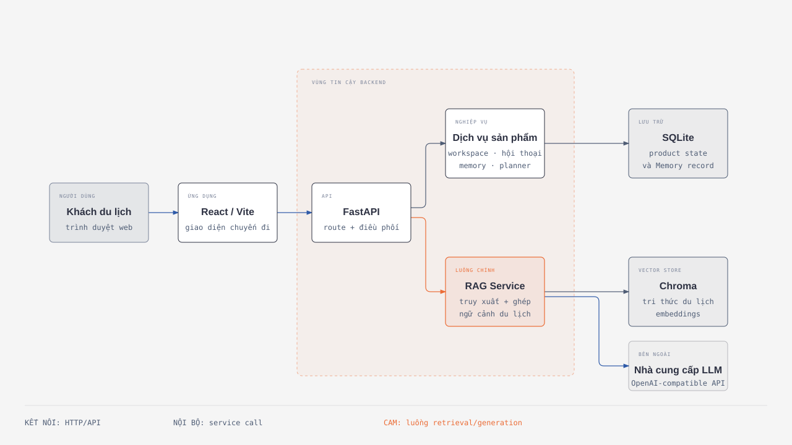
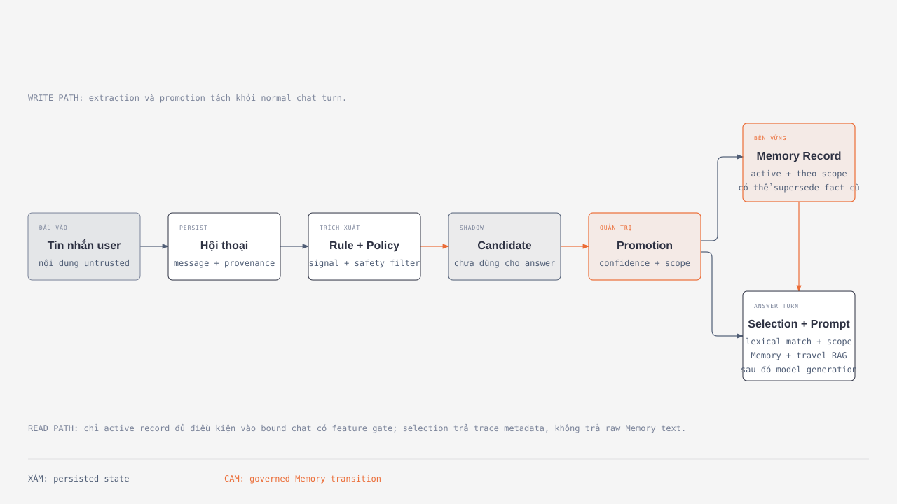
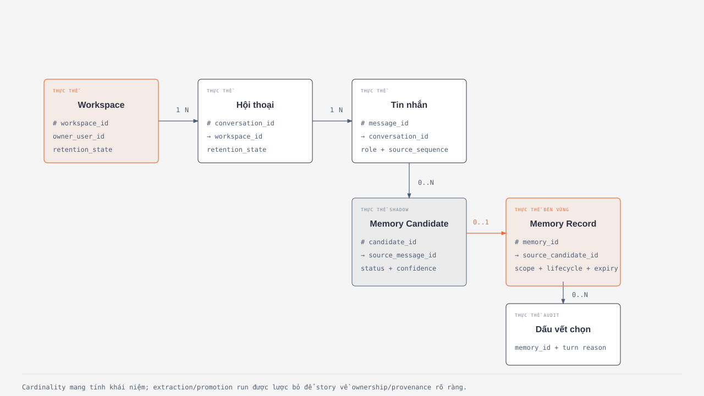

# Tài liệu Kiến trúc Hệ thống

| Trường | Giá trị |
| --- | --- |
| Trạng thái | Bản nháp mô tả hiện trạng; không phải tài liệu phê duyệt |
| Phiên bản | 0.1 |
| Ngày | 2026-09-06 |
| Phạm vi | Kiến trúc toàn hệ thống Travel Agent, tập trung sâu vào Memory |
| Mốc bằng chứng | Source code tại a4ced44, báo cáo R6/R9, các thiết kế R6/R9 đã được phê duyệt |
| Độc giả | Chủ repository, kỹ sư, người review, và bên liên quan sản phẩm |

## 1. Tóm tắt Điều hành

Travel Agent là một prototype local hướng đến việc học và xây dựng dần một trợ lý du lịch theo tư duy production. Trình duyệt gửi câu hỏi du lịch đến backend FastAPI. Backend lưu product state, truy xuất tri thức du lịch từ Chroma, tạo prompt có kiểm soát rồi gọi model provider tương thích OpenAI. Phản hồi trả về citation cho tri thức du lịch và, ở những lượt chat đã bind có bật tính năng, metadata được kiểm soát về việc chọn Memory.

Quyết định kiến trúc quan trọng nhất là tách ba dạng state:

1. **Lịch sử hội thoại** là bản ghi theo thời gian của cuộc đối thoại.
2. **Memory** là diễn giải bền vững, có scope và bị chi phối bởi policy về các fact/ràng buộc đã chọn lọc từ người dùng.
3. **Tri thức du lịch** là bằng chứng bên ngoài được retrieval để grounding câu trả lời và tạo citation.

Việc tách này ngăn vector store biến thành nơi lưu dữ liệu cá nhân không kiểm soát, đồng thời ngăn mọi câu chat bị coi là một fact cần nhớ lâu dài.

Nguồn chỉnh sửa được: [sơ đồ kiến trúc](./assets/sdd/system-architecture.html).

## 2. Vấn đề và Mục tiêu

RAG chat thông thường có thể trả lời từ tri thức du lịch đã index nhưng không biết các ràng buộc dài hạn, correction, hoặc quyết định riêng của một chuyến đi. Đưa toàn bộ lịch sử chat vào mọi prompt vừa tốn kém, vừa khó audit, vừa không an toàn: dữ liệu cũ, mâu thuẫn, không liên quan hoặc nhạy cảm có thể ảnh hưởng đến câu trả lời sau này.

Hệ thống được thiết kế để:

1. Cung cấp conversation và planning state theo từng workspace chuyến đi.
2. Sinh câu trả lời du lịch dựa trên evidence có citation.
3. Lưu product state qua các domain boundary rõ ràng.
4. Đưa Memory vào qua extraction, policy, promotion, retrieval theo scope và traceability, thay vì replay toàn bộ chat history.
5. Bảo vệ state theo owner bằng authentication và authorization cục bộ.
6. Tạo evidence vận hành hữu ích mà không log user content mặc định.

## 3. Những Điều Không Nằm Trong Phạm vi

Implementation hiện tại không tuyên bố cung cấp:

- Triển khai production public trên Internet.
- OAuth/OIDC, SSO, account recovery hoặc hosted identity.
- Tích hợp booking, thanh toán hoặc tài khoản du lịch bên thứ ba.
- Semantic/vector retrieval cho Memory.
- Ghi Memory tự động ở background sau mọi message.
- Hard deletion khỏi storage, backup, replica hoặc provider.
- Giao diện quản trị Memory hoàn chỉnh cho người dùng.
- SLO về độ trễ, availability, throughput, retention hoặc recovery.

Việc chưa có các năng lực trên là giới hạn scope hiện tại, không phải lời hứa ngầm cho tương lai.

## 4. Requirements và Quality Attributes

| Thuộc tính | Yêu cầu | Cách kiến trúc hiện tại đáp ứng |
| --- | --- | --- |
| Câu trả lời có grounding | Travel claim cần evidence đã retrieval và citation | RAG lấy document từ Chroma và trả citation |
| An toàn khi cá nhân hóa | Không biến mọi câu chat thành durable state | Candidate, policy và promotion diễn ra trước khi Memory được dùng trong answer |
| Cô lập dữ liệu | Một owner không đọc/ghi product state của owner khác | Principal cục bộ và kiểm tra ownership phía server |
| Ưu tiên correction | Correction rõ ràng mới phải thắng fact cũ | Promotion có thể supersede record active; retrieval chỉ chọn record active |
| Tối thiểu hóa dữ liệu | Không log hoặc trả personal text không cần thiết | Metadata có kiểm soát, safe event, guard với secret-like content |
| Khả năng giải thích | Biết vì sao Memory ảnh hưởng answer | Selection trace lưu ID và reason có kiểm soát |
| Xóa an toàn | Ngăn sử dụng trước khi mọi child transition xong | deletion_requested là access barrier fail-closed |
| Khả năng phát triển | Không gắn route trực tiếp với SQLite, Chroma hoặc provider | Domain service/repository và RAG facade hẹp |

## 5. Bối cảnh Hệ thống và Trust Boundary

| Actor hoặc hệ thống | Trách nhiệm | Trust posture |
| --- | --- | --- |
| Traveller trên browser | Tạo workspace, gửi message, xem answer | Input do user kiểm soát, luôn untrusted |
| React/Vite client | Workspace UI và API call | Client state không phải authorization |
| FastAPI backend | Validation, principal resolution, orchestration | Trust boundary cục bộ chính |
| SQLite application database | Workspace, conversation, Memory, planner state | Local product-data store |
| Chroma vector store | Travel-knowledge chunk và embedding | Knowledge store, không phải Memory store |
| Embedding model và LLM provider | Embed query và sinh answer | External dependency có thể nhận prompt context |

Các quy tắc trust boundary:

1. Browser input, retrieved content, model output, fixture và tool output là data, không phải authority.
2. Khi authentication bật, identity đến từ principal mà server resolve. Owner label do client gửi không cấp quyền.
3. Memory response object chỉ chứa selected ID/reason, không chứa raw Memory text.
4. Citation mô tả travel evidence, không mô tả Memory.
5. Workspace ở deletion_requested hoặc deleted bị ẩn khỏi normal use; retrieval chỉ xét record còn eligible và active.

## 6. Kiến trúc Thành phần

### Presentation

frontend/src/App.jsx chọn workspace, tải hoặc tạo conversation, render optimistic user turn, gửi chat message và refresh planner state. Các frontend service module chuyên biệt xử lý auth, workspace, conversation, chat và planner. Browser chỉ lưu UI preference như active workspace; backend mới là source of truth cho product data.

### API và orchestration

backend/app/main.py khởi tạo FastAPI, mount route, áp dụng CORS, request correlation, request-size control và controlled response cho unhandled error. Các route module validate HTTP contract và chuyển domain error. Chat route giao một lượt chat cho ConversationOrchestrator thay vì tự gọi storage hoặc provider client.

Orchestrator có trách nhiệm giới hạn:

1. Validate và persist bound user turn.
2. Authorize chuỗi conversation -> workspace -> owner khi cần.
3. Chỉ select Memory cho bound turn có feature gate.
4. Lấy travel context qua RAG facade.
5. Compose section Memory và RAG có kiểm soát.
6. Gọi generation rồi persist assistant turn.
7. Trả reply, citation, persistence outcome và controlled Memory trace.

### Product domain

| Domain | Sở hữu |
| --- | --- |
| Workspaces | Tiêu đề chuyến đi, destination, owner, planning/retention state |
| Conversations | Ordered message, role, source, trace visibility |
| Memory | Candidate, promotion, retrieval, lifecycle, selection trace |
| Planner | Itinerary version, decision, planner operation |
| Security/privacy | Local principal, owner authorization, deletion orchestration |
| Observability | Request ID, safe event, redaction, readiness |

Mỗi domain có model, service use case, repository interface, SQLite adapter và route/schema boundary riêng.

### Knowledge và persistence

RAG service sở hữu embedding, Chroma retrieval, context assembly, provider generation và citation. Orchestrator dùng facade hẹp của nó nên không tự khởi tạo Chroma hay model client.

Một SQLite database dùng chung lưu application state qua các adapter theo domain. Schema registry sở hữu database marker và module schema version, fail closed khi ownership chưa biết hoặc schema không tương thích. Chroma được tách riêng vì nó phục vụ similarity search trên travel document; nó không phải personal Memory database.

## 7. Workflow và Data Flow

### Khởi tạo workspace và conversation

    Browser -> workspace API -> WorkspaceService -> SQLite
    Browser -> conversation API -> ConversationService -> SQLite
    Browser <- identifier và ordered message history

Frontend tải workspace đã chọn, dùng conversation có sẵn hoặc tạo conversation mới, rồi tải message. conversation_id bind các chat turn sau này với workspace và owner fact phía server.

### Một bound chat turn tiêu chuẩn

    Browser gửi message + conversation_id
      -> FastAPI validate request và principal
      -> ConversationOrchestrator persist user message
      -> optional Memory selection
      -> RAG retrieval travel evidence từ Chroma
      -> controlled prompt composition
      -> external model completion
      -> persist assistant message
      -> reply + citation + optional trace metadata

Answer path vẫn phụ thuộc credential, network, model/embedding availability và knowledge corpus đã được nạp. Health endpoint thành công không chứng minh end-to-end answer đã sẵn sàng.

### Vòng đời ghi và đọc Memory

Nguồn chỉnh sửa được: [sơ đồ vòng đời Memory](./assets/sdd/memory-lifecycle.html).

**Write path**

1. Một extraction operation tường minh đọc các conversation message đủ điều kiện.
2. RuleBasedMemoryExtractor tạo draft từ preference, constraint, correction và secret-like pattern.
3. MemoryPolicy đánh giá source, trace visibility, confidence, scope, sensitivity và signal type.
4. Proposal được accepted trở thành MemoryCandidate shadow data; chúng chưa thể ảnh hưởng answer.
5. Promotion operation riêng áp dụng kiểm tra chặt hơn cho confidence, provenance, type/scope hợp lệ, sensitivity, duplicate và correction.
6. Item hợp lệ thành MemoryRecord active; một correction có thể đánh dấu record cũ là superseded.

**Read path**

1. Bound chat turn resolve conversation, workspace và owner scope.
2. Khi MEMORY_RETRIEVAL_ENABLED=true, retrieval tải active record theo owner và áp dụng filter lifecycle, expiration, sensitivity và scope.
3. Nó rank bằng deterministic lexical overlap, ưu tiên correction và chọn số record bị giới hạn.
4. Controlled Memory section được compose cùng RAG section du lịch được assemble độc lập.
5. MemorySelectionTrace lưu selected ID/reason. Raw Memory text không được trả trong trace metadata.

### Deletion flow

    Authenticated owner yêu cầu xóa workspace
      -> workspace thành deletion_requested (read/write barrier)
      -> conversation và active Memory record transition hoặc bị ẩn
      -> owner xác nhận xóa
      -> entity tombstone thành deleted
      -> Memory retrieval về sau loại trừ chúng

Kiến trúc hiện tại không tuyên bố cross-domain transaction. Chuyển sang deletion_requested sớm giúp fail closed trong khi các child transition idempotent được hoàn tất hoặc reconcile.

## 8. Memory Data Model

Nguồn chỉnh sửa được: [sơ đồ data model](./assets/sdd/memory-data-model.html).

| Entity | Mục đích | Liên kết quan trọng |
| --- | --- | --- |
| Workspace | Trip container theo owner và retention boundary | Sở hữu conversation; neo workspace scope |
| Conversation | Hội thoại có thứ tự trong một workspace | Sở hữu message; bind chat với workspace |
| Message | Turn được persist với sequence, role và source | Nguồn provenance của Memory |
| MemoryExtractionRun | Audit cho một lần extraction | Gom candidate và identity của policy/extractor |
| MemoryCandidate | Shadow proposal, chưa answer-eligible | Liên kết run, source message, workspace, conversation |
| MemoryPromotionRun | Audit cho một lần promotion | Đếm outcome và controlled skip reason |
| MemoryRecord | Durable Memory có thể dùng trong answer | Scope, status, confidence, expiry, provenance |
| MemorySelectionTrace | Audit theo từng turn khi selection | Memory ID, score/reason, không có raw content |

| Scope | scope_id | Khả năng nhìn thấy dự kiến |
| --- | --- | --- |
| user | owner_user_id | Cùng owner trên các workspace đủ điều kiện |
| workspace | workspace_id | Một trip workspace |
| conversation | conversation_id | Một hội thoại duy nhất |

Candidate và record có ngữ nghĩa khác nhau. Candidate được accepted là shadow evidence, không phải durable fact. Chỉ record đã promote và active mới answer-eligible; superseded, expired, archived, deletion_requested và deleted bị filter khỏi normal retrieval.

## 9. Design Decision và Trade-off

| Quyết định | Lợi ích | Đánh đổi |
| --- | --- | --- |
| Memory nằm ngoài Chroma | Có policy, lifecycle, scope, ownership | SQLite phải giữ thêm domain model |
| Candidate tách khỏi record | Extraction chưa chắc chắn không thể ảnh hưởng answer | Có thêm workflow promotion và audit entity |
| Promotion tường minh | Durable write reviewable và an toàn hơn | Ít tự động hơn trợ lý consumer |
| Lexical retrieval trước | Deterministic, testable, explainable | Bỏ sót paraphrase và semantic intent |
| Retrieval có feature gate | Hỗ trợ paired evaluation và rollback | Runtime behaviour phụ thuộc configuration |
| Provenance và selection trace | Review được answer influence | Nhiều metadata/lifecycle hơn |
| Local bearer principal | Chứng minh server-side identity ở local | Không phải production identity architecture |
| Soft deletion có barrier | Ngăn sử dụng trước khi adapter cùng hoàn tất | Tombstone còn lại; không có hard-delete claim |
| Repository protocol/schema registry | Giới hạn storage coupling và migration không an toàn | Nhiều adapter/contract code hơn |

## 10. Security, Privacy, Operations và Evaluation

Control đã implement gồm local bearer-token authentication tùy chọn, server-side owner authorization, CORS restriction khi bật auth, request-size limit, request ID, validation/500 error không chứa content, safe event, secret-like Memory safeguard và loại trừ Memory sau deletion.

Residual risk vẫn đáng kể: generation có thể truyền user query, travel context và selected Memory đến provider đã cấu hình. Hệ thống chưa thiết lập production TLS, hosted identity, secret manager, backup deletion, legal compliance, rate limiting hoặc public-hosting control. Public production bị block theo policy.

Memory evaluation đánh giá theo từng tầng:

1. Extraction precision/recall.
2. Promotion precision và scope assignment.
3. Retrieval Hit@5 và irrelevant-selection rate.
4. Paired answer quality so với Memory-disabled baseline.
5. Zero-tolerance gate cho cross-user leakage, wrong-workspace scope, deleted-memory retrieval, secret-like promotion và correction precedence.

Báo cáo R6 và R9 ghi nhận bằng chứng synthetic trong scope tương ứng là pass. Chúng không chứng nhận personalization quality rộng, production reliability hoặc public deployment readiness.

## 11. Current Capabilities

- React workflow cho workspace, conversation, chat và planner.
- FastAPI API cho health, chat, workspace, conversation, Memory, planner và local readiness.
- SQLite persistence cho product/Memory state; Chroma-backed travel RAG.
- Cited RAG answer khi corpus, model, credential và provider đã sẵn sàng.
- Rule-based Memory extraction, policy filtering, shadow candidate, promotion, correction supersession và lifecycle-aware record.
- Feature-gated lexical Memory retrieval, controlled prompt composition và selection trace.
- Local auth/owner authorization và tombstone deletion semantics.
- Content-minimizing error, request correlation, safe event và R6/R9 evidence report.

## 12. Limitations

1. Rule-based extraction bỏ sót paraphrase, preference gián tiếp, multi-turn inference và temporal language phức tạp.
2. Lexical retrieval có thể bỏ sót query cùng nghĩa nhưng khác từ.
3. Chưa có scheduler hoặc automatic post-turn durable Memory pipeline được chứng minh.
4. Chưa có UI hoàn chỉnh để review, edit, approve, reject hoặc delete từng Memory item.
5. Temporal reasoning chủ yếu là expiry/lifecycle filtering, chưa phải validity interval phong phú hoặc hoàn cảnh du lịch thay đổi.
6. Conflict handling mạnh nhất với direct correction; authority và cross-scope conflict rộng hơn cần thiết kế thêm.
7. SQLite/local topology chưa thiết lập horizontal scaling, high availability, distributed transaction, backup recovery hoặc multi-region use.
8. Provider, network, embedding model và knowledge corpus vẫn là external runtime dependency.

### Rủi ro về tính nhất quán của tài liệu

Một số entry-point document cũ, gồm phần của README.md và docs/evaluation/memory-evaluation.md, vẫn mô tả behavior stateless hoặc future-only trước R3/R9. SDD này ưu tiên source code mới hơn và report R6/R9 cho current-state claim. Bộ tài liệu cần một reconciliation pass có chủ đích; tài liệu này không âm thầm sửa các document cũ.

## 13. Cải tiến Tương lai

### Priority 0: làm Memory hiện tại có thể kiểm soát

1. Thêm Memory management surface: xem provenance, sửa, xóa, approve/reject candidate và opt out theo scope.
2. Định nghĩa consent và personalization policy trước khi bật Memory mặc định.
3. Reconcile các entry point cũ của architecture/readme/evaluation.
4. Mở rộng fixture cho cách diễn đạt tiếng Việt, paraphrase, ambiguity, temporal case, conflict và no-Memory-injection case.

### Priority 1: tăng chất lượng nhưng không làm yếu governance

1. Thêm semantic retrieval sau strict metadata/scope filtering, kết hợp lexical ranking và deterministic reranking.
2. Chỉ thêm model-assisted extraction khi có evaluation, redaction, prompt-injection control và promotion policy audit được.
3. Thiết kế authority, recency, temporal-validity và cross-scope conflict rule tường minh.
4. Chỉ thêm background orchestration sau khi định nghĩa retry, deduplication, failure visibility và user control.

### Priority 2: chuẩn bị production architecture có chủ đích

1. Chọn production identity, session, secret-management và trusted-origin architecture qua design/ADR đã phê duyệt.
2. Định nghĩa storage migration, encryption, backup/recovery, retention, hard deletion và provider data-processing contract.
3. Đặt mục tiêu load, latency, availability, cost, tracing, alerting và incident với evidence gate.

## 14. Evidence và Thứ tự Đọc

Đọc theo thứ tự sau để có mental model chính xác:

1. Tài liệu này và ba sơ đồ.
2. [Current-state Architecture](./current-state.md) và [Architecture Gateway](../../ARCHITECTURE.md).
3. [Data Model](./data-model.md).
4. backend/app/main.py, backend/app/api/chat.py và backend/orchestration/conversation_orchestrator.py.
5. backend/memory/models.py, extraction.py, policy.py, promotion.py, retrieval.py và service.py.
6. backend/rag/ cho travel retrieval/generation và backend/storage/ cho persistence boundary.
7. [Memory Retrieval Design](../specs/2026-09-04-memory-retrieval-design.md), [Security and Privacy Hardening Design](../specs/2026-09-06-security-and-privacy-hardening-design.md), [R6 retrieval report](../reports/memory/r6-retrieval-v0.2.md), [R9 report](../reports/security/r9-security-privacy-v0.1.md), và [Security Policy](../../SECURITY.md).

## 15. Thuật ngữ

| Thuật ngữ | Nghĩa trong hệ thống |
| --- | --- |
| Bound chat turn | Request mang conversation_id, cho phép server resolve scope |
| Candidate | Shadow Memory proposal chưa thể ảnh hưởng answer |
| Promotion | Chuyển candidate thành durable record dưới sự chi phối của policy |
| Memory record | Context có scope/lifecycle, có thể thành answer input |
| Selection trace | Audit metadata cho record ID/reason được chọn |
| Travel evidence | Tri thức từ Chroma dùng để grounding và citation |
| Tombstone | Row còn lưu trong deletion lifecycle state, bị ẩn khỏi normal use |

---

Tài liệu này mô tả bằng chứng hiện tại và direction tương lai đã được gắn nhãn rõ. Nó không phê duyệt runtime change, feature default, production deployment, retention period hoặc provider architecture.

