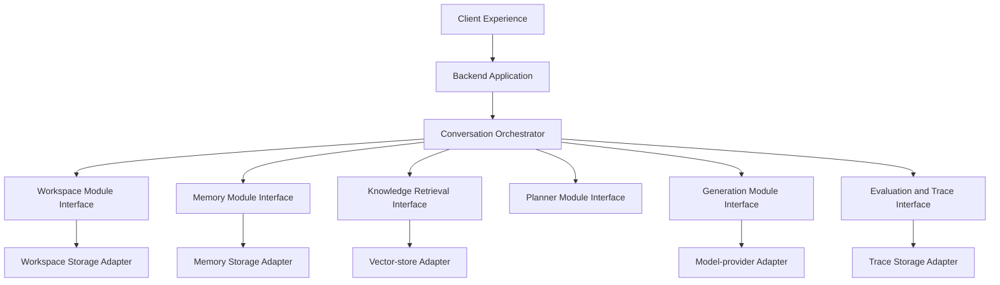
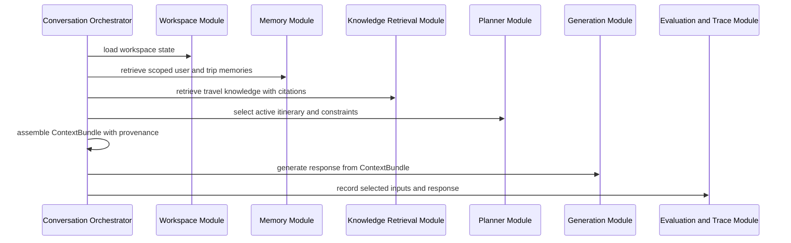
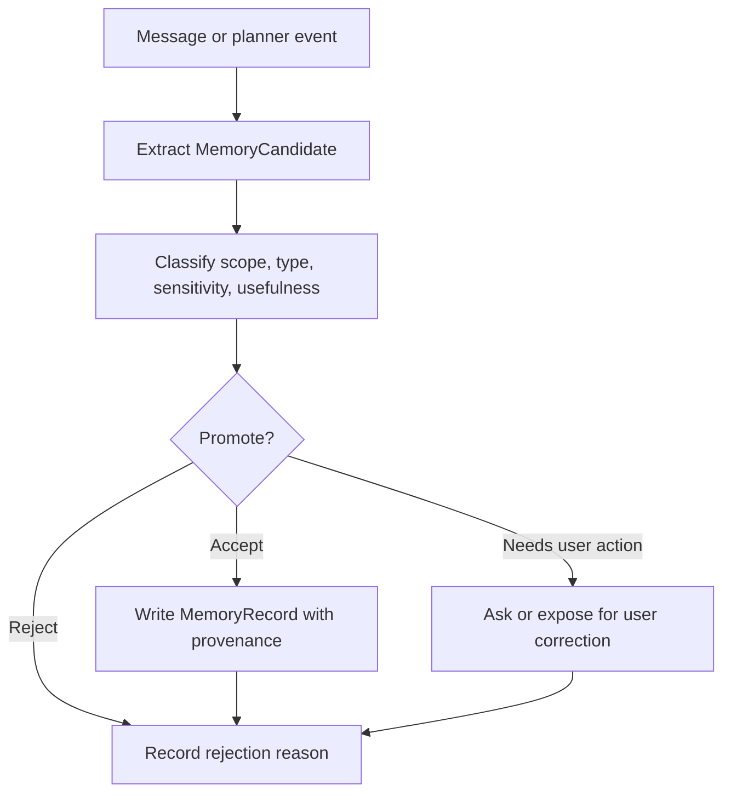

# Target-state Architecture

## Scope

This document describes the proposed target architecture for Travel Agent. It
is not implemented behavior. It does not authorize runtime changes, source
changes, storage migrations, new dependencies, production claims, or Git
delivery.

Use [Current-state Architecture](current-state.md) for the implemented baseline
and [Data Model](data-model.md) for the conceptual target entities.

## Target Principles

1. Keep current behavior and target architecture visibly separate.
2. Treat a trip workspace as the primary product container.
3. Keep product memory separate from travel knowledge retrieval.
4. Put small interfaces at durable module seams.
5. Hide storage and model providers behind adapters.
6. Assemble every model context bundle from evidence-bearing inputs.
7. Capture enough trace data to evaluate quality regressions and improvements.
8. Roll out memory and planner behavior in stages before using it in answers.
9. Prefer user correction over inferred memory when conflicts appear.
10. Avoid production security or privacy claims until Package 6 and later
    runtime controls exist.

## Product Container: Trip Workspace

`TripWorkspace` is the target product container for one planned trip. It groups
the user's planning conversations, destination shortlist, dates, budget,
traveler constraints, accepted and rejected decisions, itinerary versions,
trip-scoped memories, and evaluation traces.

A user can own multiple trip workspaces. A future collaboration model may allow
membership, but Package 3 does not define team authorization or access control.
The workspace gives the agent a stable place to preserve planning state without
turning every remembered fact into global user memory.

## Target Module Map

| Module | Interface responsibility | Adapter examples | Current baseline |
| --- | --- | --- | --- |
| Client Experience | Sends user intent, workspace selection, conversation events, and explicit edits | Browser UI adapter, future mobile adapter | React/Vite client posts `{ message }` |
| Backend Application | Validates request contracts, resolves authenticated context later, and calls orchestration | FastAPI route adapter | FastAPI mounts `/health` and `/api/v1/chat` |
| Conversation Orchestrator | Coordinates workspace state, memory read/write policy, knowledge retrieval, planning, generation, and tracing | None; this is product logic | Current chat route calls RAG directly |
| Workspace Module | Owns workspace lifecycle, itinerary state, constraints, decisions, and memberships | Workspace repository adapter | Not implemented |
| Memory Module | Owns extraction, retrieval, consolidation, conflict handling, confidence, retention, and deletion policy | Memory repository adapter, embedding adapter | Not implemented |
| Knowledge Retrieval Module | Owns travel-document retrieval and citation metadata | Vector-store adapter | Partly implemented by `ChromaVectorStore` and RAG code |
| Planner Module | Owns itinerary drafts, plan operations, alternatives, conflict detection, and decision state | Plan repository adapter | Not implemented |
| Generation Module | Owns prompt assembly and model-provider calls from a context bundle | Model-provider adapter | Partly implemented by `RAGService` |
| Evaluation and Trace Module | Owns trace capture, metric inputs, offline datasets, and quality gates | Trace repository adapter | Not implemented in online route |
| Storage Adapters | Persist relational, vector, blob, and trace data behind interfaces | Relational, vector, blob, and event-store adapters | Chroma only for local travel knowledge |

A module is a unit with an interface and implementation. A seam is the location
where the module interface lives. An adapter satisfies an interface at a seam
and hides a concrete external system or storage choice.

## Dependency Direction

Target dependency direction:

Routes and UI can depend on orchestration interfaces. Orchestration can depend
on module interfaces. Business modules can depend on repository or provider
interfaces. Concrete storage and model clients stay in adapters and must not
leak into product policy.

## Layered Memory Architecture

| Layer | Scope | Target use | Write rule | Evaluation focus |
| --- | --- | --- | --- | --- |
| Working context | One model turn | Current user message, active plan slice, selected memory bundle | Created per request and discarded | Token discipline and correct inclusion |
| Conversation summary | One conversation | Recent decisions, unresolved questions, local continuity | Updated from conversation events | Faithfulness and update accuracy |
| Trip state | One trip workspace | Dates, budget, destination shortlist, itinerary versions, constraints | Written by planner actions or explicit user edits | Plan consistency and conflict detection |
| User profile memory | One user across trips | Stable preferences, accessibility needs, dietary patterns, pace, hotel style | Promoted only when confidence and usefulness pass policy | Precision, usefulness, privacy safety |
| Episodic memory | One user or trip event | Past decisions, rejected options, contextual reasons | Promoted with provenance and decay behavior | Retrieval relevance and time sensitivity |
| Travel knowledge | Global corpus | Destination facts, guide content, activities, citations | Written by offline indexing only | Retrieval relevance and groundedness |
| Evaluation trace | One request, run, or experiment | Inputs, selected context, answer, scores, failures | Written by trace policy | Reproducibility and learning signal quality |

Memory read and write are separate operations. Reading memory selects scoped
evidence for a turn. Writing memory proposes candidates, validates them through
policy, and persists only accepted records with provenance and retention state.

## Context Assembly Flow

The context bundle must carry scope, source type, provenance, confidence,
recency, and selection reason for each memory or retrieval item. This lets later
evaluation explain why an answer improved or regressed.

## Trip Planning Flow

Target trip planning is stateful:

1. User opens or creates a trip workspace.
2. User gives intent, constraints, or corrections.
3. Orchestrator loads workspace state and relevant memories.
4. Planner proposes operations such as add destination, remove activity, update
   date, adjust budget, or create itinerary version.
5. User-facing response explains the proposed or applied change.
6. Accepted planner operations create a new itinerary version or decision
   record.
7. Rejected planner operations become decision evidence rather than silent
   failure.

Planner writes must be explicit. If saving fails, the assistant must not
pretend an itinerary was saved.

## Memory Write and Promotion Flow

Memory promotion must consider:

1. Whether the candidate is true enough to remember.
2. Whether it is useful for future travel assistance.
3. Whether the scope is user-wide, trip-scoped, conversation-scoped, global
   knowledge, or evaluation-only.
4. Whether the candidate contains sensitive personal data or secrets.
5. Whether it conflicts with a newer explicit user edit.
6. Whether it should expire, decay, or require review.

## Evaluation and Trace Flow

Evaluation trace is part of the target architecture because memory quality
cannot improve without measurement.

Each trace should connect:

1. Request context: user, workspace, conversation, message, and model
   configuration when available.
2. Retrieval inputs: query text, filters, and requested limits.
3. Selected context: memory items, trip state, itinerary slice, retrieval
   chunks, citations, and reasons for inclusion.
4. Output: assistant response, planner operations, and citations.
5. Quality signals: automated checks, judge scores, user correction, accepted
   change, rejected change, or failure label.
6. Safety signals: sensitive memory rejection, deletion action, redaction, or
   scope violation.

Package 5 owns the detailed RAG and memory evaluation protocols. Package 3 only
defines the architecture surfaces that those protocols will use.

## Security and Privacy Boundaries

Target boundaries:

| Boundary | Requirement |
| --- | --- |
| User to workspace | Workspace and memory records must be scoped before retrieval |
| Retrieved travel content to prompt | Travel knowledge remains untrusted data and cannot override instructions |
| Memory candidate to durable memory | Promotion requires policy, provenance, and retention state |
| Secret values to logs or traces | Real credentials must not be stored in docs, traces, fixtures, or logs |
| User correction to inferred memory | Explicit correction outranks inferred records |
| Deletion request to stores | Deletion or tombstoning semantics must exist before production privacy claims |

Authentication, authorization, production privacy guarantees, tenant isolation,
and incident response are not established by Package 3.

## Failure and Recovery

| Failure | Target behavior |
| --- | --- |
| Workspace lookup fails | Return a recoverable product error or create an explicit default only if the route contract allows it |
| Memory read unavailable | Continue with workspace state, current conversation, and travel knowledge, while tracing degraded memory |
| Knowledge retrieval unavailable | Answer with explicit limitations or decline unsupported factual claims |
| Model provider fails | Return a controlled error and record failure when trace storage exists |
| Planner write fails | Tell the user the plan was not saved |
| Trace write fails | User-facing chat may proceed, but the operational failure must be visible later |
| Memory conflict appears | Prefer explicit user correction and preserve conflict evidence |

## Capacity, Latency, and Cost Budgets

Package 3 does not set production budgets. Later runtime plans must define and
measure at least:

1. Memory retrieval latency per turn.
2. Knowledge retrieval latency per turn.
3. Context assembly token budget.
4. Model call token and cost budget.
5. Memory extraction cost per message or conversation batch.
6. Evaluation trace storage growth.
7. Workspace, message, itinerary, and memory storage growth.

No implementation may claim production readiness until concrete budgets and
measurement gates exist.

## Staged Migration

Recommended staged migration:

1. Preserve the current `message`-only RAG route and Stage A health path.
2. Add workspace contracts and storage behind interfaces.
3. Add conversation persistence behind an adapter.
4. Run shadow memory extraction without using memories in answers.
5. Evaluate memory candidates for precision, recall, sensitivity, and scope.
6. Add memory retrieval into context assembly behind a feature gate.
7. Evaluate personalization utility, groundedness, and privacy behavior.
8. Add planner operations and itinerary versioning.
9. Promote planner writes only after conflict and rollback behavior pass tests.

Each stage needs its own approved spec and implementation plan.

## Required ADRs

After architecture approval and before runtime implementation, prepare ADRs for:

1. Trip workspace as the primary product container.
2. Layered memory model and memory promotion policy.
3. Storage ownership for relational data, vector data, and trace data.
4. Context assembly and dependency direction between memory, RAG, planner, and
   generation modules.
5. Evaluation trace schema and quality gate ownership.

Additional ADRs may be needed for authentication, authorization, deployment
topology, model-provider adapters, and production observability.

## Open Implementation Questions

These questions are intentionally deferred to later specs or ADRs:

1. Which storage technology owns users, workspaces, conversations, messages,
   itinerary versions, and memory records?
2. Which vector store owns user memories versus travel knowledge?
3. Which authentication model will identify users locally and in production?
4. Which planner operations are available in the first runtime increment?
5. Which memory categories require explicit user confirmation?
6. Which traces are retained for product debugging versus offline evaluation?
7. Which metrics become merge gates for memory-aware behavior?
8. Which UI affordances let users inspect, edit, and delete memories?
