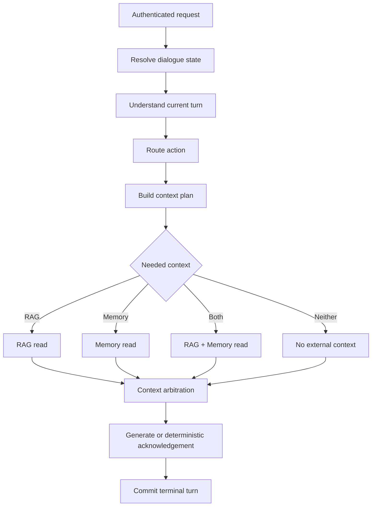

# Target-state Architecture

## Purpose

This document defines the intended future architecture for Travel Agent. It is
not evidence that a capability is implemented or enabled.

Use [Current-state Architecture](current-state.md) for runtime truth and
[Data Model](data-model.md) for Memory entities, lifecycle, and ownership.

## Baseline to Preserve

The target evolves the current authenticated standalone Chat system. It does not
restore removed product structures simply to support Memory.

The following remain architectural invariants unless this document is changed
explicitly:

- standalone Chat is the product container;
- PostgreSQL is canonical for conversation and tenant Memory state;
- Chroma is travel-knowledge retrieval infrastructure, not Memory lifecycle
  authority;
- RAG and Memory remain separate domains;
- authorization, persistence, lifecycle, deletion/suppression, and read
  eligibility stay under deterministic application policy;
- model output may interpret uncertain semantics but does not directly decide
  SQL, tenant ownership, retention, activation, suppression, or authorization;
- future retrieval indexes are rebuildable projections, never canonical Memory
  truth.

## Target Turn Flow

The intended synchronous turn stays bounded rather than becoming an unbounded
autonomous loop:



The context phase is read-only with respect to canonical Memory. Explicit Memory
mutations use their own governed write path and commit boundary.

## Target Component Boundaries

| Component | Owns | Does not own |
| --- | --- | --- |
| Chat orchestration | One bounded synchronous turn, action routing, context planning, generation/acknowledgement, terminal result | Background Memory lifecycle |
| Conversation store | Conversation/message persistence, deletion state, source outbox allocation/release, terminal transition | Memory semantics |
| Dialogue state | Ephemeral referents, topic, current goal, pending clarification | Durable Memory |
| Turn understanding | Typed interpretation of current-turn meaning | Durable mutation authority |
| Explicit Memory action handler | Closed-schema parsing/validation and typed proposals for remember/correct/forget | Transaction ownership |
| Explicit Memory commit | Atomic explicit Memory effect, source handling, idempotency result, acknowledgement, terminal transition | Semantic interpretation |
| Memory formation/consolidation | Candidate formation and deterministic relation/effect resolution | Chat response generation |
| Memory lifecycle policy | Formation/write/activation/read eligibility | RAG retrieval or free-form ranking |
| Memory Read/Use | Eligible/relevant selection and bounded structured projection | Canonical writes or RAG retrieval |
| Context arbitration | Response precedence and safe combination of Memory/RAG context | Canonical Memory storage |
| RAG domain | Travel-document retrieval, context evidence, citations | Personal Memory authority |
| Procedural publication | Offline-evaluated, versioned system behavior | Tenant/user Memory writes |

## Memory Families

The target has four conceptually different families:

| Family | Ownership | Primary role |
| --- | --- | --- |
| Semantic | Tenant/user-derived | Stable facts, preferences, and constraints |
| Episodic | Tenant/user-derived | Grounded past events/experiences |
| Working | Tenant/user-derived, conversation-scoped | Short-lived conversational state that helps continuity |
| Procedural | System-owned | Versioned system behavior published through an offline boundary |

The detailed entity/lifecycle model lives in [Data Model](data-model.md). The
families must not be collapsed into one generic Memory blob merely to share an
API or table shape.

## Explicit Memory Write Path

Explicit user actions such as `remember`, `correct`, and `forget` are different
from background inference.

Target flow:

```text
current user turn
-> high-precision explicit-intent corroboration
-> closed-schema payload parsing
-> registry/scope/sensitivity/lifecycle validation
-> deterministic effect proposal
-> atomic commit
   -> Memory state change
   -> idempotency result
   -> family-specific source-handling record
   -> deterministic acknowledgement
   -> terminal turn/outbox transition
```

Ambiguous explicit actions fail closed or ask for clarification. A model may
help interpret a bounded payload; it does not choose the persistence operation
or bypass policy.

## Background Inference Path

Background formation remains asynchronous and source-grounded:

```text
terminal chat turn
-> released conversation outbox event
-> family-specific source authority
-> bounded extraction/formation
-> registry + sensitivity + lifecycle checks
-> consolidation
-> shadow/pending state
-> activation only after the relevant gate is satisfied
```

No source-handling record means no background permission. Retries or repeated
processing of one source do not count as independent evidence.

## Memory Read and Use

Canonical Memory is never copied directly into a prompt just because a row is
active. Target selection applies:

```text
owner + scope
-> lifecycle / retention / source-validity / suppression eligibility
-> relevance
-> conflict and response-precedence filtering
-> bounded ranking/selection
-> prompt-safe structured projection
```

The resulting Memory context is not a citation channel. Raw source evidence is
excluded by default, and Memory text is treated as data rather than instructions.

RAG and Memory may be read independently or together. Their outputs meet only at
the orchestration/context boundary; neither domain imports the other's canonical
records.

## Forget, Deletion, and Source Validity

Product forget and privacy/source deletion are separate mechanisms.

Target product forget revokes the remembered state and advances a suppression
boundary so delayed older work cannot recreate the forgotten value. A later
explicit re-remember creates current-generation state; it does not reactivate an
old revoked version.

Conversation deletion invalidates evidence from that conversation. Whether a
normalized Memory value can remain usable depends on its persisted retention
mode and surviving valid evidence. Deleted raw source content must not reappear
through read, prompt, inspect, trace, summary, projection, or citation.

## Remaining Gaps from the Current Runtime

The target is intentionally ahead of the code. The major remaining gaps are:

1. extend the current one-key semantic write model into the governed target
   registry/lifecycle without weakening existing tenant/write invariants;
2. add chat-native explicit `remember`, `correct`, and `forget` with atomic
   commit semantics;
3. implement semantic Memory Read/Use and context arbitration before generation;
4. add explicit Memory inspection without exposing raw deleted/private source
   evidence;
5. add retention, suppression generation, revocation, and source-validity rules
   needed for deterministic forget/no-resurrection behavior;
6. introduce Episodic and Working Memory only as complete, testable vertical
   slices rather than schema-only placeholders;
7. add optional full-text/vector Memory retrieval only if exact structured
   retrieval becomes insufficient;
8. introduce Procedural Memory only through a separate system-owned publication
   boundary.

This section replaces a separate roadmap document. Task checklists and temporary
implementation notes should live in issue/task tooling or Git history, not in a
new documentation hierarchy.

## Rollout and Rollback Principles

Capabilities should be enabled independently so a higher-level consumer can be
disabled without destroying lower-level history.

Rollback must not:

- clear forget/suppression history;
- reactivate superseded or revoked state;
- restore SQLite as canonical state;
- restore removed Workspace/Planner/public Memory APIs;
- convert a failed lifecycle gate into permissive behavior.

The safe fallback for optional Memory use is ordinary Chat/RAG behavior without
personal Memory, not a bypass of Memory policy.
