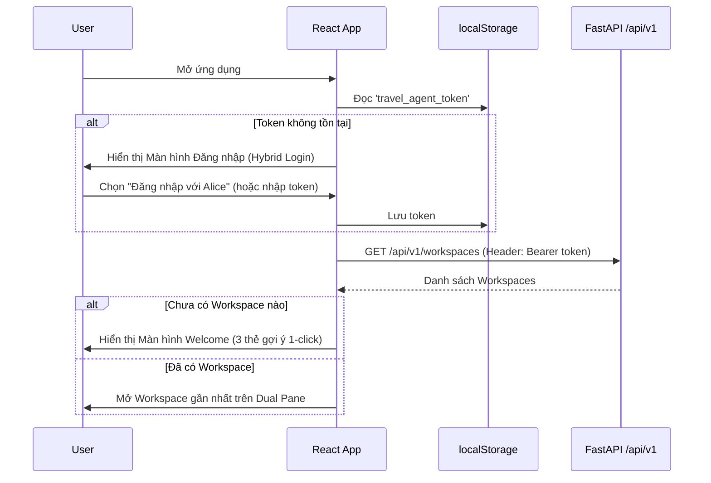
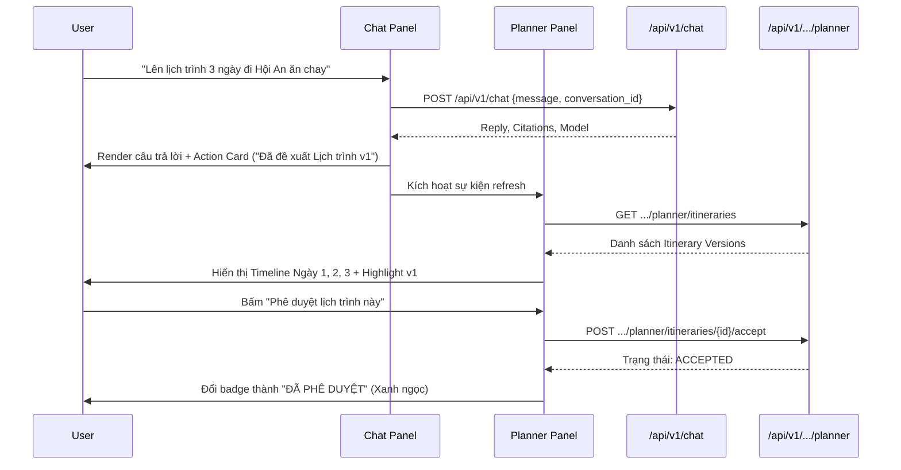

# Frontend Workspace Rebuild Design

| Field | Value |
| --- | --- |
| Status | Approved |
| Version | 0.1 |
| Date | 2026-09-06 |
| Change class | Level 2 - Feature Spec |
| Decision owner | Repository owner |
| Scope | `frontend/` (React/Vite SPA, design system, API service, UI components) |
| Related issue | Milestone R10 / Frontend Modernization |
| Superseded document | None |

---

## 1. Summary

This specification defines the complete overhaul of the Travel Agent frontend from a minimal single-turn chat prototype into a production-grade, workspace-centric web application. Built with **React 18, Vite, Tailwind CSS, and Lucide Icons**, the new frontend connects to all backend runtime capabilities delivered through Milestones R3–R9:
- Multi-workspace navigation (`TripWorkspace`)
- Multi-turn conversation persistence (`Conversation` & `Message`)
- Interactive itinerary versioning & trip decision tracking (`PlannerService`)
- Local bearer-token authentication & cross-owner isolation testing (`AuthenticatedPrincipal`)
- Evidence-grounded RAG chat with slide-drawer citation inspection
- Light-mode aesthetic theme: **Warm Heritage & Coastal Sunshine** (Hội An Terracotta & Coastal Teal)

---

## 2. Context & Current State

The current frontend under `frontend/` is a rudimentary prototype created during initial repository bootstrap:
- **Limited Scope:** Only interacts with `POST /api/v1/chat` in unbound mode (`conversation_id = None`).
- **No Workspace Awareness:** Cannot create, inspect, or switch between `TripWorkspace` containers ([ADR 0002](docs/adr/0002-trip-workspace-as-primary-product-container.md)).
- **No Planner Visibility:** Completely ignores the rich itinerary state, versions (`itv_...`), and trip decisions (`td_...`) implemented in Milestone R7 ([ADR 0008](docs/adr/0008-workspace-owned-planner-state-and-operation-log.md)).
- **No Authentication:** Sends no `Authorization: Bearer <token>` header, leaving R9 security and owner isolation unobservable in the browser ([ADR 0010](docs/adr/0010-local-identity-authorization-and-deletion-boundary.md)).
- **Basic Styling:** Ad-hoc raw CSS without a structured design system or tokenized color palette.

---

## 3. Users & Personas

1. **Traveler / End User:** Explores Vietnam destinations, converses with AI to build tailored itineraries, tracks decisions, reviews travel citations, and approves official itinerary versions.
2. **Developer / Repository Owner:** Tests and demonstrates the multi-module backend stack locally, switching between authenticated personas (`user_alice`, `user_bob`) to verify cross-owner isolation, citation grounding, and operation auditability.

---

## 4. Problem Statement

While the backend has evolved into an enterprise-grade agent architecture with strict transactional boundaries, privacy deletion cascades, and stateful planning, the user interface remains frozen at the initial prototype stage. Users cannot access or interact with 80% of the backend's delivered features through the browser.

---

## 5. Goals

1. **Workspace-Centric Dual Pane Layout (Desktop):**
   - Left Sidebar: Workspace management, new trip button (`+`), authenticated user badge, and logout.
   - Center Panel: Multi-turn RAG Chat with interactive action cards and clickable citation badges.
   - Right Panel: Interactive Itinerary Timeline (by Day 1, 2, 3...) with item badges (`activity`, `meal`, `lodging`, `transport`), version switcher (`v1`, `v2`...), and *"Phê duyệt lịch trình"* (`/accept`) button.
2. **Mobile & Tablet Adaptability (< 1024px):**
   - Header tab switcher: `[💬 Trò chuyện AI]` ⟷ `[📅 Lịch trình chuyến đi]`.
3. **Hybrid Authentication:**
   - Welcome login screen supporting custom Bearer Token input plus **Quick Login Presets** (`Alice` / `Bob`) for instant local testing.
   - Automatic token persistence in `localStorage` and request injection via Axios interceptor.
4. **Interactive Action Cards & Live Synchronization:**
   - Chat stream displays actionable cards when new itinerary versions or trip decisions are proposed.
   - Right-side Planner Panel auto-refreshes and highlights updated versions.
5. **Citations Slide Drawer:**
   - Clicking citation badges (e.g., `[📚 Nguồn 1: Cẩm nang Hội An]`) opens a side drawer displaying the source title, extracted passage, and external link to `vietnam.travel`.
6. **1-Click Onboarding Empty State:**
   - Displays 3 curated starter trip cards (*"Khám phá Hà Giang 3N2Đ"*, *"Food tour Đà Nẵng - Hội An 4N3Đ"*, *"Nghỉ dưỡng Phú Quốc 3N2Đ"*) that create a workspace and initiate AI planning in one click.
7. **Visual Aesthetic Contract:**
   - Pure **Light Mode** palette: Warm Terracotta (`#E05D38`), Golden Amber (`#F59E0B`), Coastal Teal (`#0D9488`), and warm ivory/cream background (`#FDFBF7` / `#F8F6F0`).

---

## 6. Non-Goals

1. **Dark Mode Toggle:** Explicitly excluded per owner decision in Round 2.
2. **Direct Manual Drag-and-Drop / Inline Text Editing in Timeline:** Itinerary modifications remain AI-driven via chat dialogue to protect operation log integrity and backend validation contracts.
3. **Backend API Modifications:** All required endpoints already exist; no changes to backend contracts or storage schemas are permitted in this scope.

---

## 7. User and System Flows

### Flow 1: Authentication & Workspace Entry


### Flow 2: Chat Turn & Planner Synchronization


---

## 8. Frontend Architecture & Component Map

```text
frontend/src/
├── index.css                     # Tailwind base + Warm Heritage custom tokens
├── main.jsx                      # App root mount
├── App.jsx                       # Master state machine (Auth, Active Workspace, Layout)
├── services/
│   ├── api.js                    # Centralized Axios client with Bearer interceptor
│   ├── auth.js                   # Token management & local presets
│   ├── workspaces.js             # /api/v1/workspaces calls
│   ├── chat.js                   # /api/v1/chat & /api/v1/conversations calls
│   └── planner.js                # /api/v1/.../planner calls
├── components/
│   ├── auth/
│   │   └── LoginModal.jsx        # Hybrid token form + Quick preset buttons
│   ├── layout/
│   │   ├── Header.jsx            # Mobile tab switcher, title, user profile badge
│   │   └── Sidebar.jsx           # Workspace list, new trip button, logout
│   ├── chat/
│   │   ├── ChatPanel.jsx         # Conversation scroll container
│   │   ├── ChatMessage.jsx       # Markdown rendering, action cards, citations
│   │   ├── ChatInput.jsx         # Textarea with auto-grow, send button
│   │   └── CitationDrawer.jsx    # Slide-over evidence preview drawer
│   ├── planner/
│   │   ├── PlannerPanel.jsx      # Version switcher, accept button, decision list
│   │   ├── ItineraryTimeline.jsx # Day-by-day structured activity list
│   │   └── ItineraryItemCard.jsx # Activity/meal/lodging/transport card
│   └── welcome/
│       └── WelcomeView.jsx       # 1-Click Starter Cards empty state
```

---

## 9. Visual Tokens (Warm Heritage & Coastal Sunshine)

```css
:root {
  --color-brand-terracotta: #E05D38;
  --color-brand-terracotta-hover: #C84B27;
  --color-brand-amber: #F59E0B;
  --color-brand-teal: #0D9488;
  --color-brand-teal-light: #CCFBF1;
  
  --color-surface-base: #FDFBF7;
  --color-surface-card: #FFFFFF;
  --color-surface-muted: #F8F6F0;
  --color-surface-border: #EADBCC;
  
  --color-text-primary: #1C1917;
  --color-text-secondary: #78716C;
  --color-text-muted: #A8A29E;
}
```

---

## 10. Verification Plan

1. **Build & Lint Verification:**
   - `cd frontend && npm run lint` ➔ Exit 0, 0 warnings.
   - `cd frontend && npm run build` ➔ Exit 0, production bundle builds cleanly.
2. **Automated Unit & Service Tests:**
   - `cd frontend && npm run test` ➔ Vitest suites for Axios interceptor, authentication storage, and component rendering pass.
3. **Manual Browser Acceptance Flow:**
   - **Login Flow:** Select "Alice" preset ➔ Authenticated session establishes with token in header.
   - **Onboarding Flow:** Click "Hà Giang 3N2Đ" starter card ➔ Workspace created (`tw_...`), chat begins automatically.
   - **Dual Pane Layout:** Send itinerary planning prompt ➔ Response renders with citation badges. Click citation ➔ Slide drawer displays extracted evidence.
   - **Planner Action Flow:** Itinerary timeline renders Day 1, 2, 3 with activity badges. Click "Phê duyệt" ➔ Version state switches to `ACCEPTED`.
   - **Cross-User Isolation Check:** Log out ➔ Log in as "Bob" ➔ Verify Alice's workspaces are not visible.

---

## 11. Approval Record

| Role | Status | Date |
| --- | --- | --- |
| Author (Agent) | Prepared | 2026-09-06 |
| Repository Owner | **Approved (Version 0.1)** | 2026-09-06 |
